= Manjaro Linux User Guide (deutsch)
Das Manjaro Development Team
// Time-stamp: <2020-10-27 23:30:01 mkgkris> 
:doctype: book
:lang: de
:doctype: book
:data-uri:
:icons:
:iconsdir: icons
:partpics: 

// ¶ 
// include::./cover.png[]
//    a2x: --dblatex-opts "-P latex.output.revhistory=0"
//    a2x: --dblatex-opts "-P term.breakline=0"
//    a2x: -v
//    a2x: -a lang=de
//    a2x: -dbook
//    a2x: --xsltproc-opts
//    a2x: "--stringparam part.autolabel 0
//    a2x: --stringparam chapter.autolabel 0
//    a2x: --stringparam section.autolabel.max.depth 0"

// a2x -v  -a lang=de -fepub -dbook manjaro-user-guide-2020-de*.adoc
// && 
// a2x -v -fpdf   -a lang=de -dbook  -v manjaro-user-guide-2020-de*.adoc
// a2x -v  -a lang=de -f text -dbook manjaro-user-guide-2020-de*.adoc
// while date  ; do inotifywait -e modify  manjaro-user-guide-2020-de*.adoc  ; nice asciidoctor-pdf -dbook -a lang=de -vv manjaro-user-guide-2020-de-6.adoc  ; done

// §include::cover.png[]

:chapter-label: Kapitel
:figure-caption: Abbildung
:note-caption: *  !  *
:important-caption: W I C H T I G
:table-caption: Tabelle
:tip-caption: TIPP
:warning-caption: Achtung!
:caution-caption: Vorsicht!
:toc-title: Inhalt
:appendix-caption: Anhang

:toc: macro

:makedate: Oktober 2020
:copyrights: Copyright (C) 2020

// include::replacements.emacs[]

{copyrights} the Manjaro Development Team.
(((Licence, documentation)))

ifdef::asciidoctor[[.text-left]]
Lizensiert unter der internationalen Lizenz Attribution-ShareAlike 4.0
 (die "`Lizenz`"); Sie dürfen diese Datei nur in Übereinstimmung mit der
 Lizenz verwenden.  Eine Kopie der Lizenz findet sich hier:
 +
link:url[https://creativecommons.org/licenses/by-sa/4.0/legalcode]

ifdef::asciidoctor[[.text-left]]
Sofern nicht durch geltendes Recht gefordert oder schriftlich
 vereinbart, wird die Software unter der Lizenz im
 Ist-Zustand verteilt, ohne Garantien oder Bedingungen jeglicher Art, weder
 ausdrücklich noch implizit.  Siehe die Lizenz für die jeweilige
 Sprache, die die Berechtigungen und Einschränkungen regelt.

ifdef::asciidoctor[[.text-left]]
Der Quelltext für diese Dokumentation kann hier herunter geladen werden:
 +
link:url[https://gitlab.manjaro.org/documentation/manjaro-user-guide]

image:images/cc-by-sa.png[scale=100]

:sectnums!:
== The Manjaro Development Team
:sectnums:
(((Manjaro Development Team)))

:sectnums!:
=== Core Team
:sectnums:

[horizontal]
Philip Müller:: Project Lead Developer

Bernhard Landauer:: Developer

Artem Grinev:: Developer

Guillaume Benoit:: Developer

Jonathon Fernyhough:: Community Lead | Sysadmin | Developer

Stefano Capitani:: Developer

Frede Hundewadt:: DevOps | Engineer | SysAdmin

Matti Hyttinen:: Developer

Dan Johansen:: ARM Lead Developer

Josh Josh:: ARM Developer

Vitor Lopes:: Web Developer

Helmut Stult:: Developer | Speaker

Bogdan Covaciuy:: Designer | Illustrator

Bogdan Covaciuy:: Designer | Illustrator

Oğuz Kağan Eren:: Developer

Tobias Schramm:: ARM Kernel Developer

Furkan Kardame:: ARM Developer

Ray Sherwin:: ARM Developer

:sectnums!:
==== Alumni
:sectnums:
[horizontal]
Roland Singer:: Founder, Designer, Developer, Web Developer, Administrator

Carl Duff:: Community, Documentation and Wiki Management, Scripting
and Configuration

Cumali:: Cinnamon and Gnome Community Editions Maintainer

Dan S.:: Openbox Editions Maintainer

Handy:: Global Moderator, Wiki Contributor, Community Support

Joshua Strot:: Developer, Graphics Developer

Ramon Buldó:: Developer, Packager

Rob McCathie:: Maintainer

Marcus:: Developer, Packager

Teo Mrnjavac:: Developer

Alexandre A. Arnt:: Developer, Moderation

Ringo de Kroon:: Community

Hugo Posnic:: Developer

David Linares:: Designer

Jonathon Fernyhough:: Editor of the User Guide 0.8.9-0.8.13, 15.09-15.12,
Community Management, Cover art of the User Guide

Sabras:: Wiki

Manuel Barrette:: Editor of the User Guide 16.08-18.0, French
translation of the User Guide 17.0-18.0

:sectnums!:
=== Deutsche Version dieses Dokuments
:sectnums:
[horizontal]
Karsten Günther:: deutsche Übersetzung und Ergänzungen, 2020

Jonathon Fernyhough:: Community Lead | Sysadmin | Developer (_Vielen Dank für das Schreiben der ursprünglichen Version dieses Leitfadens._)

:sectnums!:
==== Danksagung
:sectnums:

an die bemerkenswerte Community auf link:url[forum.manjaro.org] und link:url[#manjaro]

:sectnums!:
=== Vorwort zur deutschen Ausgabe 
:sectnums:

Diese Übersetzung entstand im {makedate} aus der englischen
Originaldokumentation. Sie wurde aktualisiert und um einige
Informationen ergänzt, die für deutschsprachige Anwender von Nutzen
sein können.

Das Buch richtet sich an Anwender, die Manjaro installieren und verstehen
wollen. Manjaro ist ein Linux-Betriebssystem, das sich problemlos neben Windows
installieren lässt. 

NOTE: Warum Linux? Für alle, die sich unabhängig von Microsoft Windows machen wollen, und vor
allem für die, die sich nicht länger gegen ihren Willen ausspionieren
lassen wollen.

[TIP]
--
Wer sich nicht sicher ist, ob er sich mit (Manjaro-) Linux anfreunden kann, sollte zunächst das _<<Live-System>>_ ausprobieren und/oder eine Installation auf einem älteren Rechner testen. Wahrscheinlich werden Sie erstaunt sein, wie gut es auch auf älterer Hardware funktioniert.

Und zur Daten-Rettung ist das Live-System ebenfalls ausgesprochen gut geeignet.
(((Live-System)))
--

Die Schritt-für-Schritt Anleitung finden Sie hier.

_Sie müssen dazu dieses Dokument nicht von vorn bis hinten
durcharbeiten._ Viele Teile dieser Dokumentation sind nur in
bestimmten, weniger häufigen Situationen erforderlich. Einige Anwender
überfliegen vermutlich nur die ersten Kapitel und fangen dann
vielleicht mit Abschnitt <<manjarobooten>>, an, wo es um die
Einstellungen vor dem Start des Rechners geht.

Ansonsten können Sie ja das Dokument auch jederzeit auf Stichworte hin
durchsuchen, wenn Sie spezielle Informationen benötigen.

Der __<<Glossar>>__ für die Erklärung wichtiger Begriffe wurde erweitert
und befindet sich nun am Ende.  Viele der *fett*, _kursiv_ oder als
Verweis hervorgehobenen Begriffe werden dort erklärt.

Finden Sie dort einen Begriff nicht, ist es meistens eine gute Idee,
in der Wikipedia nachzuschauen, was dort an Informationen vorhanden
ist. Eine Reihe englischer Begriffe wurde absichtlich nicht übersetzt,
beispielsweise "`Disk Image`", "`Distribution`" oder "`Repository`", da sie
als Fachbegriffe in allen Sprachen auftreten und im Glossar aufgeführt
sind.

Bei der deutschen Ausgabe dieses Handbuchs arbeiteten mehrere
langjährige Windows Anwender mit, die viele nützliche Hinweise
einbrachten. Vielen Dank dafür!

_Karsten Günther_

Karsten Günther arbeitet vielen Jahren als Autor für den LinuxUser(.de), wo er Artikel u.a. zu Manjaro und Arch-Linux, Bildbearbeitung, der Shell usw. veröffentlicht.

Anfang 2021 erscheint von ihm das  _Anwenderhandbuch Manjaro_, das viele hier nur kurz oder gar nicht angesprochene Themen zu Manjaro ausführlich behandelt. Verweise wie
ifdef::asciidoctor["`<<x,¶>>`"]
ifndef::asciidoctor["<<x,¶>>"]
markiert in diesem Dokument Stellen, die in dem Anwenderhandbuch behandelt werden.

<<<

:sectnums!:
=== Manjaro und Arch Linux
:sectnums:

*Manjaro Linux* basiert auf einer älteren Distribution namens *Arch Linux*.  Als
 solche kann sie auch Software Pakete aus den von der Community
 verwalteten **Arch User Repository** (_AUR_) verwenden.  Dabei ist zu
 beachten, dass Manjaro _nicht_ Arch Linux ist, und alle Fragen zum
 Manjaro Betriebssystem an die entsprechenden Manjaro Foren und
 // Internet Relay Chat (IRC)
 Official Manjaro Telegram Kanäle gestellt werden.  So wie **Ubuntu** ein
 Derivat von **Debian** ist – und beide vieles gemeinsam haben – gibt es
 signifikante Unterschiede zwischen Manjaro und Arch Linux.  
 Manjaro ist viel mehr als nur ein einfach zu installierendes oder
 vorkonfiguriertes Arch System.  Dies sind einige der wesentlichen
 Unterschiede zwischen Manjaro und Arch Linux:

ifdef::asciidoctor[[.text-left]]
* Manjaro wird unabhängig von Arch entwickelt, von einem völlig
anderem Team.

* Manjaro richtet sich an Linux-Einsteiger, während Arch für erfahrene User entwickelt wird.

* Manjaro verwaltet Software in eigenen, unabhängigen
  _Repositories_ (Paket-Servern, siehe <<Glossar>>). Diese können auch Software enthalten, die unter Arch
  Linux nicht zur Verfügung steht.

* Manjaro stellt eigene, spezielle Werkzeuge wie das Manjaro Hardware
  Detection (**MHWD**) Utility, und den Manjaro Settings Manager (**MSM**)
  bereit. Beide beschreibt <<x,¶>>.
 
* An vielen Stellen arbeitet Manjaro anders als Arch Linux.

Also, zusammengefasst: _Manjaro ist ein Arch-Derivat, aber nicht
Arch Linux!_ Und: _Manjaro wurde auf die Bedürfnisse von Einsteigern hin entwickelt._

toc::[]

== Einleitung
=== Über Manjaro
Manjaro ist eine anwenderfreundliche GNU/Linux Distribution, basierend  auf dem unabhängig entwickelten Arch Linux. In der Linux Community
gilt Arch als ausgesprochen schnelle, leistungsfähige und
leichtgewichtige Distribution, die stets die neueste Software zur
Verfügung stellt. Arch wendet sich traditionell an erfahrene oder
Technik-interessierte User. Damit liegt Arch oft außerhalb der
Reichweite vieler "`normaler`" Anwender.

Das weltweite Team der Manjaro Entwickler versucht Arch Linux mit
 einem Fokus auf Einfachheit und leichte Erlernbarkeit für jeden zugänglich zu
 machen.  Ursprünglich wurden sowohl 32- als auch 64-Bit Versionen
 bereitgestellt, um möglichst viel Hardware verwenden zu können.

[NOTE]
--
.Ende der *offiziellen* 32-Bit Unterstützung

ifdef::asciidoctor[]
[.text-left]
endif::[]
Ab Manjaro 17.1 werden 32-Bit Systeme nicht mehr offiziell unterstützt, sondern nur noch
Installationsmedien für 64-Bit Systeme bereitgestellt.

ifdef::asciidoctor[]
[.text-left]
endif::[]
32-Bit Systeme werden von einem neuen Projekt _Manjaro-32_ (link:url[https://manjaro32.org/])
unterstützt. Eine Liste mit Linux Distributionen, die noch auf 32-Bit Systemen funktionieren, gibt es hier:
 +
https://archived.forum.manjaro.org/t/list-of-distributions-for-32-bit-x86-hardware-wiki/31969.
 + 
Sehr informativ ist auch:
https://itsfoss.com/lightweight-linux-beginners/

--

Manjaro wendet sich sowohl an erfahrene wie ganz neue Linux User.  Für
 Anfänger steht ein einfacher und komfortabler Installer bereit und
 das System selbst ist so konzipiert, das es "`out-of-the-box`"
 funktioniert:

* Vorinstallierte _<<DesktopEnvironment,Desktop Environments>>_

* Vorinstalliertes grafisches Updateprogramm für die Softwareverwaltung

* Vorinstallierte Codecs, um Multimedia Dateien wiederzugeben

* Vorinstallierte Software für aktuelle Spiele, etwa via Steam

NOTE: Das auf einem Rechner installierte Desktop Environment legt den Anwender in keiner Weise fest. So ist es völlig problemlos möglich, mehrere Desktop Environments nebeneinander zu installieren und zur Laufzeit zwischen ihnen zu wechseln – ohne neu booten zu müssen. 
 + 
Noch wichtiger ist aber dies: Egal, welches Desktop Environment installiert ist, Sie können jederzeit Programme verwenden und zusätzlich installieren, die eigentlich für ein anderes Desktop Environment entwickelt wurden.
 + 
Die Wahl eines Desktop Environments spiegelt im Wesentlichen die persönlichen Vorlieben und den Geschmack des Anwenders wider. Manchmal sind auch der unterschiedliche Ressourcenverbrauch oder ganz bestimmte Eigenschaften – etwa spezielle Einstellungen – ausschlaggebend für die Wahl eines Desktop Environments.

=== Features
Manjaro verfügt über viele Features von Arch Linux:
(((Features)))

ifdef::asciidoctor[[.text-left]]
* hohe  Geschwindigkeit, Leistungsfähigkeit und Effektivität
 
* Zugriff auf die aktuellste Software (wenn auch _etwas_ später als bei Arch Linux)

* das "`Rolling Release`" Modell ermöglicht es, das System immer
aktuell zu halten und vermeidet Neuinstallationen

* Zugriff auf die __Arch User Repository__

* die Möglichkeit, das System auf die unterschiedlichsten Weisen an die eigenen Vorlieben und Bedürfnisse anzupassen

Manjaro verfügt jedoch zusätzlich über einige eigene Extras, darunter:

* einen vereinfachten, benutzerfreundlichen Installationsprozess

* die automatische Erkennung der Hardware des Computers (z.B. der Grafikkarten)

* die automatische Installation der notwendigen Software (z.B. Grafiktreiber) für das System

* eigene Software-Repositories, die vollständig getestete und stabile Softwarepakete liefern

* Unterstützung für die einfache Installation und Verwendung mehrerer **<<Kernel>>**

."`Welcome to Manjaro!`" begrüßt Sie das Live-System. 
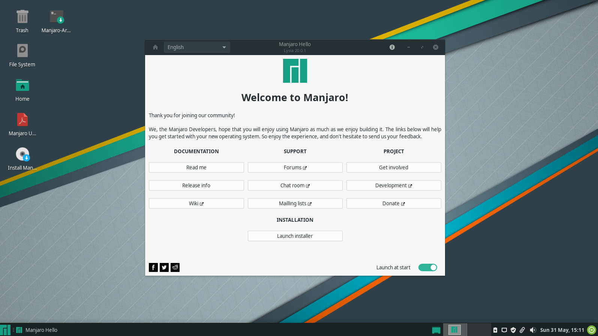

:thetitle: Manjaro beschaffen und installieren
:thetitle: Manjaro installieren
ifdef::asciidoctor[= Teil 1: {thetitle}]
ifndef::asciidoctor[= {thetitle}]

ifndef::partpics[image::images/de/12.png[pdfwidth=80%]]

== Manjaro Downloads
(((Download)))

[[ManjaroEditionen]]
=== Manjaro Editionen 

Es gibt derzeit ({makedate}) vier Varianten von Manjaro, die zur Installation verwendet werden können.
(((Editions)))
Weiterhin stehen noch zahlreiche inoffizielle "`Community`"-Editionen bereit.

Hier finden Sie die offiziellen Editionen:
 + 
link:url[https://manjaro.org/get-manjaro/]

Mit Ausnahme der _Architect_{zwsp}-Edition werden die Editionen komplett mit
der namensgebenden Desktop-Umgebung – die vorinstalliert ist – und
eine Auswahl beliebter Software-Anwendungen geliefert. Jeder, der
Manjaro auf einer Live-CD ausprobieren möchte, ohne sie fest zu
installieren kann sie ausprobieren, um zu sehen, was ihm am besten
gefällt!

[NOTE] 
-- 
Normalerweise erhalten Sie das Manjaro System auf einer CD oder einer
DVD.  Wenn Sie Manjaro aus dem Internet beziehen, laden Sie ein
sogenanntes __Disc Image__. Diese Datei enthält die Daten, die auf
einen Datenträger wie eine CD, DVD oder einen USB-Stick "`gebrannt`"
werden, um anschließend davon zu booten. Die von Manjaro angebotenen
System sind alles "`Live-CDs`".

Eine "`Live-CD`" enthält eine Version des Betriebssystem, das ohne explizite
Installation direkt vom Datenträger aus funktioniert.
Viele GNU/Linux und BSD-basierte Betriebssysteme bieten dieses Feature.
--

[horizontal]
Xfce:: Das __Xfce Desktop Environment__ ist als leichtgewichtiges,
 einfaches Desktop Environment designt, das den Schwerpunkt auf
 Effektivität und Funktionalität legt.  Im Zweifelsfall ist das immer eine gute Wahl. (Funktionell erinnert die Umgebung an WindowsXP.) Die Xfce Edition startet mit *manjaro-xfce*.

KDE:: Diese Version enthält das __K Desktop Environment__. Es
stellt eine hochintegrierte Umgebung mit sehr weitreichenden
Anpassungsmöglichkeiten und vielen Automatismen bereit und benötigt
entsprechend viele Ressourcen. Diese Umgebung fühlt sich anders als
die anderen an. Die KDE Edition Disc startet mit *manjaro-kde*.

GNOME:: Diese Edition von Manjaro basiert auf dem __GNOME__-Desktop, der
Teil des GNU-Projekts ist. Sie bietet einen unkonventionellen, aber
intuitiven Desktop mit dem Ziel, die Produktivität zu steigern. Das System bietet eine sehr vollständige und ästhetisch kohärente Gruppe von
Anwendungen, um die gängigsten Ansprüche zu erfüllen. Die
GNOME-Edition startet mit *manjaro-gnome*.

Architect:: Diese Ausgabe wird nicht mit einem vorinstallierten
Desktop ausgeliefert. Stattdessen bietet sie die Möglichkeit, die
Manjaro-Installation den eigenen Wünschen entsprechend anzupassen. Es
kann auch als Basis für eigene Varianten verwendet werden. Diese
Edition ist nicht für Anfänger gedacht, sondern wendet sich eher an
fortgeschrittene Benutzer. Die Architect-Edition startet mit
*manjaro-architect*.

ifdef::asciidoctor[]
[[fig1]]
[cols="2*^"]
|===
2+|
2+|Xfce edition
|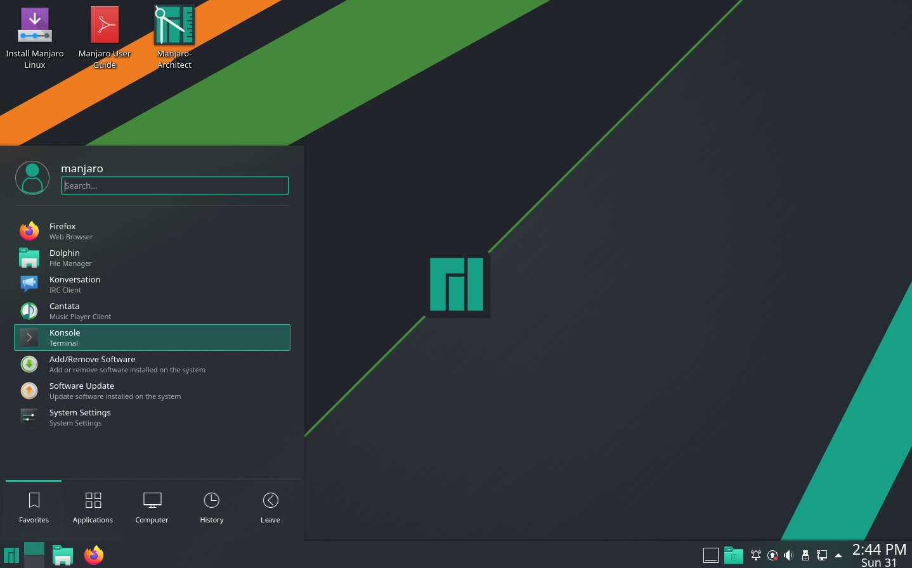
|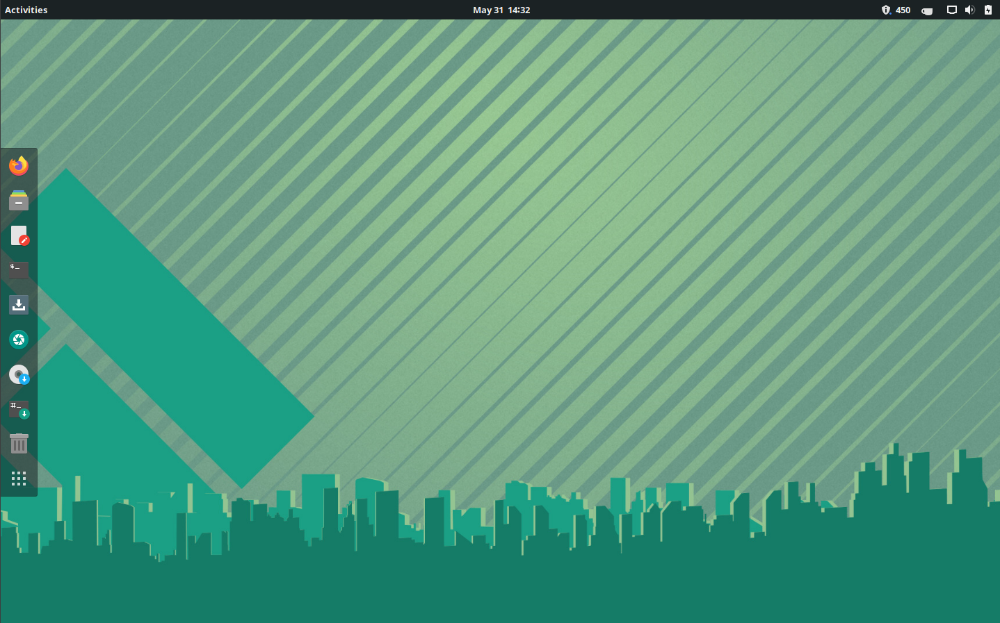
|KDE edition |GNOME edition
|===
endif::[]
ifndef::asciidoctor[]
.Die Desktops der Xfce-, KDE- und GNOME-Editionen
image::images/de/fig1.png[width=300px]
endif::[]

=== Manjaro Community Editionen

Zusätzlich zu den vier Manjaro-Haupteditionen  gibt es eine Reihe
(((Community Editionen)))
von Varianten, bei denen bestimmte Software oder Desktop-Umgebungen vorinstalliert sind.
*Dieses Benutzerhandbuch geht davon aus, dass Sie die Xfce-Version verwenden, und alle Screenshots
beziehen sich darauf.* Der Installationsprozess und die andere Software
funktioniert aber bei allen Varianten gleich.

Die Editionsnamen sollten einen klaren Hinweis auf die
Desktop-Umgebung geben (oder den __Windowmanager__), die sie
installieren. Wir empfehlen Ihnen, (zunächst) bei der Xfce-Version zu
bleiben. Sie können das natürlich später ändern, oder Sie installieren 
auch andere Desktop-Umgebungen zusätzlich und wechseln zwischen ihnen!

Es gibt momentan viele aktiv gepflegte Community Editionen, mit diesen
Desktop Environments, beispielsweise: Cinnamon, LXDE, Deepin, Budgie,
Mate, Fluxbox, Openbox, Enlightenment   ...

link:url[https://manjaro.org/download/#Community].

=== Ein Disc Image laden

Jede Version von Manjaro steht als Disc Image zum Download zur
Verfügung, sowohl die aktuelle stabile Version, als auch
Vorabversionen. Auf der Download-Seite finden sich Links zu jeder der
vier Manjaro Haupteditionen, sowie eine Prüfsummendatei für die Disk Images. Eine
Prüfsumme kann zur Überprüfung der Disc Image Datei verwendet werden,
um sicherzustellen, dass sie während des Herunterladens nicht
beschädigt wurde. Dies wird im nächsten Kapitel beschrieben.

[horizontal]
Stabile Versionen:: von Manjaro sind für die allgemeine Nutzung durch
 alle Anwender – also den "`produktiven Einsatz`" – vorgesehen. Die
 aktuelle stabile Manjaro findet sich immer hier:
+
link:url[https://manjaro.org/get-manjaro/]

Entwickler (oder: Development) -Releases:: Diese Varianten von Manjaro
geben einen Vorgeschmack auf die kommenden Versionen.  Sie sind
_nicht_ für den produktiven Einsatz gedacht, sondern sollen technisch
versierten und experimentierfreudigen Anwendern die Möglichkeit geben,
sich an der Entwicklung zu beteiligen. Melden Sie Fehler, wenn Sie
diese Versionen testen:
+
link:url[https://forum.manjaro.org/tags/c/announcements/releases/19/testers_wanted]

== Disc Image Dateien auf Fehler prüfen

NOTE: Sie _müssen_ diesen Schritt nicht ausführen, aber er dient Ihrer
Sicherheit und kann den Frust bei der Installation vermeiden, der durch
defekte Disc Images entsteht.

Vor dem Brennen eines Disc Image auf eine DVD oder einen USB-Stick
oder der Installation in einer virtuellen Maschine (beispielsweise der
VirtualBox, link:url[www.virtualbox.org/]) ist es ratsam, die
herunter geladene Datei auf Fehler zu überprüfen. Enthält das Disc Image
Fehler, misslingt die Installation im besten Fall.  Schlimmstenfalls
wird ein defektes System aufgesetzt...  

Um die Disc Image-Datei zu überprüfen, muss auch die dazu gehörende
Checksummendatei geladen werden. Sie befindet sich dort, wo auch die
Disc Images sind. Ein Beispiel: Die Datei
*manjaro-xfce-15.09-rc3-x86_64-sha256sum.txt* enthält Checksummen für
die bereitgestellten Disc Image-Dateien und sieht so aus:

[listing]
4464678318bbf418990c77cb7f6ed28c2bbfa337 manjaro-xfce-19.0-200224-linux54.iso

=== SHA-1

SHA und MD5 sind verschiedene Arten von Hashing- (Checksummen-)
Algorithmen; "`SHA"` steht für *Secure Hash-Algorithmus*. Diese
Algorithmen werden verwendet, um einen eindeutigen Code zu erzeugen,
der einzigartig für  die Disc Image Datei ist. Die Prüfsummendatei
selbst ist nur ein Textdokument, das diese Checksumme zu
Vergleichszwecken enthält.  Auf Ihrem Rechner erzeugen Sie mit den
gleichen Algorithmen, wie sie auch die Manjaro-Entwickler verwenden,
aus der geladenen Datei eine Checksumme und vergleichen diese mir der
von den Entwicklern errechneten. Sind beide identisch, ist die
geladene Datei unverändert, also heil.

Die Verwendung von MD5 ist weit verbreitet, allerdings sind die Algorithmen SHA-1 und SHA-256 neuer und sicherer; sie beginnen,  MD5 zu ersetzen. Zum Zwecke der Überprüfung
der heruntergeladenen Datei ist MD5 "`gut genug`", aber
SHA-1 ist eine bessere Lösung. Der Prüfprozess ist für beide 
Algorithmen gleich. Mehr über Hashing-Algorithmen steht in der Wikipedia:
 +
link:url[de.wikipedia.org/wiki/Secure_Hash_Algorithm]]

Im folgenden Beispiel wird die Datei *manjaro-xfce-19.0-200224-linux54.iso.sha1* verwendet.

=== Die Checksumme unter Linux prüfen

Beginnen wir mit dem besten, weil einfachsten Fall: Wir testen die geladene Disc Image Datei auf einem Linux-Rechner. Welche Distribution Sie benutzen, spielt keine Rolle.

Das Programm `sha1sum` kann die Prüfsumme der Disc Image Date  automatisch mit der Checksummendatei vergleichen.
Der Prozess erfolgt in einem Terminalfenster, ist aber sehr unkompliziert. Für den konkreten Fall ersetzen Sie die Beispieldatei mit dem Namen *manjaro-xfce-19.0-200224-linux54...* durch die aktuelle.

Zunächst wird ein Terminalfenster geöffnet und in das Verzeichnis mit der Disc Image- und der Checksummendatei – zu finden unter link:url[osdn.net/projects/manjaro/storage/] – gewechselt. Sie müssen hier für die aktuelle Version in das Unterverzeichnis link:url[osdn.net/projects/manjaro/storage/xfce/20.1/] wechseln, um die entsprechende Checksummendatei zu finden.

Der Befehl `ls` zeigt an, ob beide Dateien vorhanden sind:

----
jonathon@box:~$ cd download

jonathon@box:~ /download$ ls

manjaro-xfce-19.0-200224-linux54.iso.sha1  manjaro-xfce-19.0-200224-linux54.iso
----

Was _Sie_ eingeben steht rechts von ``jonathon@box:~$ ``. Das Leerzeichen gehört noch mit dazu. Also: +
`cd download` und `ls`. Die ENTER-Taste beendet die Eingabezeile.

In dem Beispiel wurde als Disc Image die Xfce-Version 19.0 mit einem Kernel Linux 5.4 geladen und dazu die entsprechende Checksummendatei.

Das Testen selbst ist sehr einfach, geben Sie nur diese Befehlszeile ein:

[listing]
jonathon@box:~ /download$ sha1sum -c manjaro-xfce-19.0-200224-linux54.iso.sha1

Die Ausgabe des `sha1sum`-Befehls zeigt an, dass alles funktioniert hat:

[listing]
manjaro-xfce-19.0-200224-linux54.iso: OK

Erscheint das nicht, müssen die Dateien erneut geladen werden.

=== Checksumme mit Microsoft Windows prüfen

Microsoft Windows liefert keine Programme zum Überprüfen von Checksummen mit. Sie müssen daher zunächst ein solches Programm installieren. 

Eine Internet-Suche wird mehrere Beispiele für freie Software liefern,
aber Sie können auch direkt auf der Website *Download.com* (link:url[https://download.cnet.com/]) nachsehen.

Eines der empfohlenen Programme ist *Raymond's MD5  & SHA Checksum Utility* (link:url[raylin.wordpress.com/downloads/md5-sha-1-checksum-utility/]), das im folgenden Beispiel verwendet wird.

.Checksummen mit Raymond's MD5  & SHA Checksum Utility überprüfen.
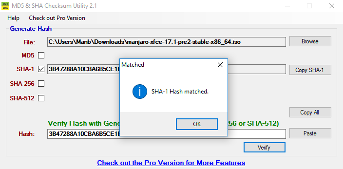

Nach der Installation des Programms geht es zügig voran. Mit *Browse* laden Sie die Disc Image Datei und *Open*berechnet die Checksummen.

TIP: Um die Bearbeitung zu beschleunigen, deaktivieren Sie alle nicht benötigten Checksummen.

Nun wird die so errechnete Checksumme mit derjenigen in der Checksummendatei
*manjaro-xfce-19.0-200224-linux54.iso.sha1* verglichen. Öffnen Sie die Checksummendatei und kopieren Sie die Checksumme in das  *Hash*-Feld.
*Verify* vergleicht beides.

== Disc Image Dateien brennen
Eine Disc Image Datei ist ein exaktes Abbild des Installationsmediums
und muss daher mit einem speziellen Programm auf einen Datenträger
geschrieben ("`gebrannt`") werden. Früher wurden dafür CDs bzw. DVDs
verwendet, heute kommen eigentlich nur noch USB-Sticks in Frage. Die
sind schneller und besser wiederzuverwenden.

NOTE: Eine Ausnahme ist es, wenn Sie  Manjaro in einer virtuellen Maschine wie etwa Oracle's
VirtualBox verwenden wollen. Hierbei können Sie die Disc Image Datei direkt einsetzen.

Sie erzeugen mit der nachfolgend beschriebenen Aktion ein
Live-System bzw. eine sogenannte Live-CD.  Dieses
Live-System ist gut geeignet, einen ersten Eindruck von Manjaro zu
vermitteln, aber reicht bei weitem nicht an ein fest installiertes
System heran. So ist es im Live-System nicht vorgesehen, Daten
dauerhaft zu speichern, auch Updates und die Installation zusätzlicher
Software ist nur begrenzt möglich...
Die folgende Tabelle gibt zur Orientierung einen Überblick über die
benötigten Größen der Datenträger. Ein 4GB-USB-Stick reicht also
allemal.
(((Live-System)))

.Größen der  Disc Image Dateien verschiedener Manjaro Editionen
[cols="1,3,1,1"]
|===
|*Edition* | *Dateiname* | *Größe* | *Medium*

| Xfce | manjaro-xfce-19.0-200224-linux54.iso  | 2.55GB | DVD
|KDE | manjaro-kde-19.0-200224-linux54.iso  | 2.82 GB | DVD
|GNOME | manjaro-gnome-19.0-200224-linux54.iso  | 2.51 GB | DVD
|Architect | manjaro-architect-19.0-200223-linux54.iso  | 699.62 MB | CD
|===

Im Folgenden beschränken wir uns auf das "`Brennen`" der Disc Image Datei auf einen USB-Stick.

NOTE: Es gibt _einen_ Grund, ein Manjaro-(Live)-System auf einer DVD vorzuhalten: Sie können von dort aus ein defektes System auf dem Computer reparieren, ohne erst einen USB-Stick brennen zu müssen, weil Sie den Stick gerade für etwas anderes verwendet haben...
// Verweis auf Anwenderhandbuch: wie man Daten rettet
<<x,¶>> beschreibt dies.

=== Eine CD/DVD brennen

Dies ist heute so einfach, dass es kaum einer Erläuterung mehr bedarf. Oft startet ein entsprechendes Programm schon, wenn Sie eine leere CD oder DVD in den CD/DVD-Brenner einlegen.
Unter Linux sind dies die am häufigsten eingesetzten Brennprogramme:

ifdef::asciidoctor[[.text-left]]
* *XFBurn* wird unter Xfce vorinstalliert. Das Programm ist einfach, effektiv und macht normalerweise genau dass, was es soll

* *K3b* ist das Pendant unter KDE. Es ist sehr komplex, sehr leistungsfähig, kann u.a. auch CDs und DVD auslesen und vieles mehr

* *Brasero* ist die GNOME-Variante. Es funktioniert ähnlich einfach wie XFBurn.

Unter Microsoft Windows steht als Standard Programm § zur Verfügung. Es funktioniert ähnlich wie XFBurn und Brasero. Als bessere Alternativen werden oft diese freien Programme empfohlen: 

.Freie Brennprogramme unter Microsoft Windows
[cols="1,2,3"]
|===
|*Name* | *Website* | *Video tutorial*

|Imgburn | link:url[http://imgburn.com/] | link:url[https://www.youtube.com/watch?v=XihCQgmeGV4]
|CDBurnerXP | link:url[https://cdburnerxp.se/en/] | link:url[https://www.youtube.com/watch?v=LxYkFdwn1qI]
|InfraRecorder | link:url[http://infrarecorder.org/] | 
|===

=== Disc Image Dateien unter Linux auf einen USB-Stick schreiben

Auch dies ist sehr einfach und dauert nur einige Minuten. Es gibt mehrere Möglichkeiten.
(((Disc Image)))

==== Mit dem SUSE Studio Imagewriter

Das geht sehr einfach. Einige Distributionen haben bereits
entsprechende Programme vorinstalliert, beispielsweise den USB-Creator
bei Ubuntu oder MintStick bei Mint-Linux. Beide stehen auch unter
Manjaro zur Verfügung... Hier verwenden wir aber den *SUSE Studio
Imagewriter*, weil er für viele Distributionen bereitgestellt wird.

.SUSE Studio Imagewriter link:url[https://en.opensuse.org/SDB:Live_USB_stick]
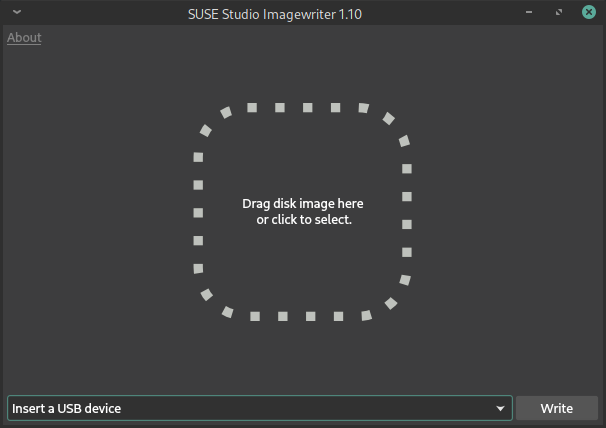

Der _SUSE Studio Imagewriter_ sollte sich über das "`Software Center`" / den "`Software / Package
Manager`" aus den Repositories installieren lassen. Als nächstes stecken Sie den für die Installation benötigten USB-Stick ein. Manchmal – je nach Einstellung des Systems – bewirkt dies, dass der Dateimanager automatisch den Inhalt des Sticks anzeigt. Die folgende Abbildung zeigt dies.

[[suse-imagewriter]]
.Disc Images mit dem SUSE Studio Imagewriter auf einen USB-Stick schreiben (nicht alle hier gezeigten Dialoge _müssen_ erscheinen)
image::images/de/imagewriter0-5.png[pdfwidth=85%,scale=80,position=center]

Dann erst starten Sie den _Imagewriter_.

Das Weitere ist ganz einfach:

ifdef::asciidoctor[[.text-left]]
* Klicken Sie auf die Fenstermitte.

* Die öffnet den Dialog zur Auswahl der Disc Image Datei.

* Schauen Sie, ob unten links das richtige USB-Gerät, der USB-Stick angezeigt wird.

* Sie können ihn dort auch manuell auswählen, falls Sie den Stick zu
  spät eingesteckt haben oder ihn das System nicht erkannte.

* *Write* startet das Schreiben der Disc Image Datei auf den Stick.

Sobald dies abgeschlossen ist, können Sie ihn zum Booten verwenden.

[[etcher]]
==== Mit Etcher

Ein ähnlich einfach zu bedienendes Programm – weil selbsterklärend – ist Etcher (link:url[https://etcher.io/]).
(((Etcher)))
Es lässt sich sowohl unter Linux wie auch unter Windows installieren. Bei diesem Programm ist es unter Linux manchmal notwendig, dass der USB-Stick erst _nach dem Programmstart_ eingesteckt wird. Etcher erkennt ihn dann automatisch.

.Etcher
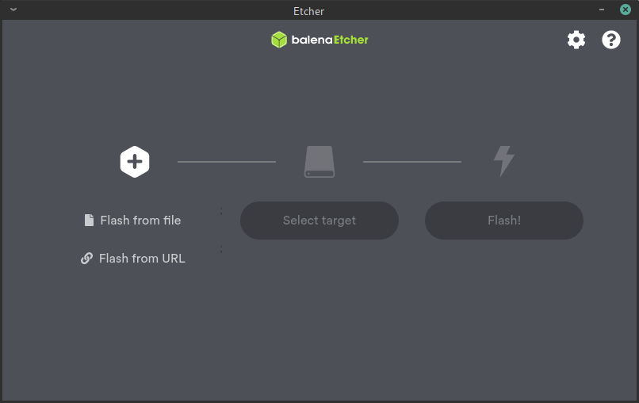

=== USB-Sticks unter Microsoft Windows beschreiben

==== Rufus

Für Windows-Anwender wird die Verwendung von Rufus (link:url[https://rufus.akeo.ie/]) angeraten.
In dem sich öffnenden Fenster füllen Sie die oberen Felder aus. Unter _Boot selection_ wird die Disc Image Datei mit _Select_ angegeben. *Start* aktiviert das Schreiben. In dem folgenden Dialog soll die Option 
*DD Image* aktiviert werden.
(((Rufus)))

.Rufus mit sinnvollen Einstellungen
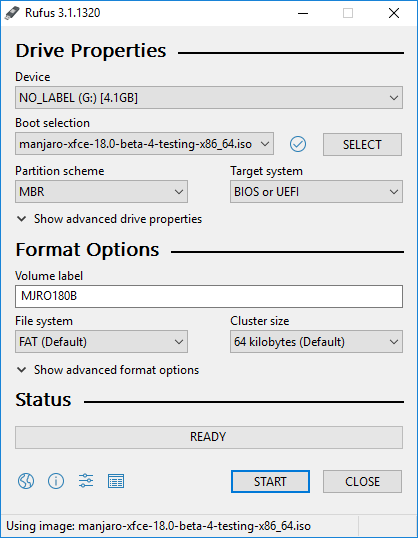
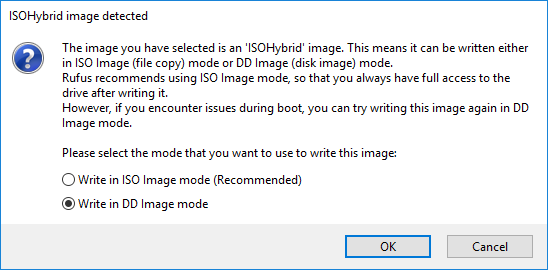

<<<

:thetitle: Manjaro installieren
ifdef::asciidoctor[= Teil 2: {thetitle}]
ifndef::asciidoctor[= {thetitle}]

ifndef::partpics[image::images/de/5.png[pdfwidth=80%]]

[[Live-System]]
== Das Live-System booten
Nachdem Sie ein bootfähiges Medium, sagen wir, einen USB-Stick (oder eine Boot-DVD) erstellt haben, erhalten Sie einen ersten Eindruck von Manjaro. 
(((Live environment)))

Am besten funktioniert alles, wenn der Rechner mit dem Internet verbunden ist. Falls Sie eine kabelgebundene 
(Ethernet-) Verbindung haben,  stellt Manjaro automatisch eine Verbindung her. Wenn Sie eine drahtlose
(Wi-Fi)-Verbindung können Sie das drahtlose Netzwerk einrichten, sobald der Manjaro-Desktop angezeigt wird.

Sie müssen normalerweise dem Computer zunächst mitteilen, dass Sie von dem Boot-Medium und nicht von der Festplatte aus booten wollen. Dazu sind – abhängig vom Computer – sehr unterschiedliche Strategien erforderlich. Meistens müssen Sie eine bestimmte Taste unmittelbar nach dem Anschalten drücken oder gedrückt halten, um das Boot-Gerät auswählen zu können. Dies sind die üblichen verdächtigen (Tasten):

* *<Esc>*, 

* *<Del>*, 

* *<F8>*, *<F9>*, *<F10>*, *<F12>*

Manchmal muss das Booten auch im BIOS/UEFI-Setup eingestellt
 werden. Eigentlich sollte das Handbuch des Computers genau erklären,
 was dafür erforderlich ist.  Oft ist es aber effektiver in Internet
 nach "`Rechnername +boot`" oder "`Rechnername +boot order`" zu suchen.

=== BIOS vs UEFI

[NOTE]
--
UEFI bezeichnet hier die zusammengeführten Standards EFI  & UEFI. UEFI ersetzt die früher verwendete BIOS-Firmware in den Computerern, siehe:

link:url[de.wikipedia.org/wiki/UEFI]
--

Neuere Hardware verwendet nicht das bekannte BIOS zum Booten. Stattdessen wird UEFI (Unified Extensible Firmware
Schnittstelle) verwendet. Es hat immer noch BIOS-ähnliche Menüs. UEFI geht oft Hand in Hand mit dem berüchtigten
Secure Boot-Option, die das Starten von Betriebssystemen erschwert, bis auf einige wenige ausgewählte. 

Wenn Ihr Computer mit Microsoft Windows 8 oder höher ausgeliefert
wurde, verwendet er wahrscheinlich UEFI und hat _Secure Boot_
standardmäßig aktiviert. Die Linux-Gemeinschaft reagierte auf UEFI und
entwickelte Mittel, um Linux auf diesen Systemen zu installieren und
booten zu können. Einige Installationsprogramme, wie z.B. _Calamares_,
das bei Manjaro eingesetzt wird, kann den Prozess sogar
automatisieren, so dass es praktisch keinen Unterschied für den
Benutzer macht, ob sein Rechner UEFI oder BIOS verwendet.

.Booten im UEFI Modus
NOTE: *Bei Computern, die via UEFI booten,ist es wichtig sicherzustellen, dass _Secure Boot_ nicht aktiviert ist.*
 Nur wenige Systeme werden mit aktiviertem _Secure Boot_ gestartet. Dann müssen Sie diese Option im UEFI/BIOS deaktivieren, bevor Sie von anderen Medien booten können. Wenn Sie nicht wissen, wie Sie dies tun sollen lesen Sie das Benutzerhandbuch Ihres Computers, da es für alle Computer unterschiedlich ist.

[[manjarobooten,Das Bootmenü von Manjaro]]
=== Das Bootmenü von Manjaro

Sobald Sie von einem mit Manjaro bespielten Datenträger booten, egal ob CD/DVD oder USB-Stick, sehen Sie zunächst ein spezielles Bootmenü. Dort werden einige Voreinstellungen getroffen, die es Ihnen erleichtert, später das Live-System zu nutzen. Dieses Bootmenü wird nun zunächst genauer beschrieben.
(((Bootmenü)))

ifdef::asciidoctor[]
[[fig2]]
[cols="2*^"]
|===
|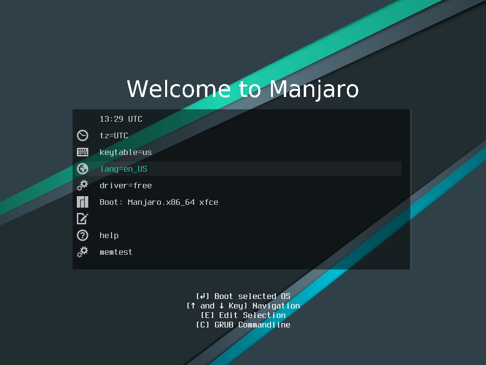
|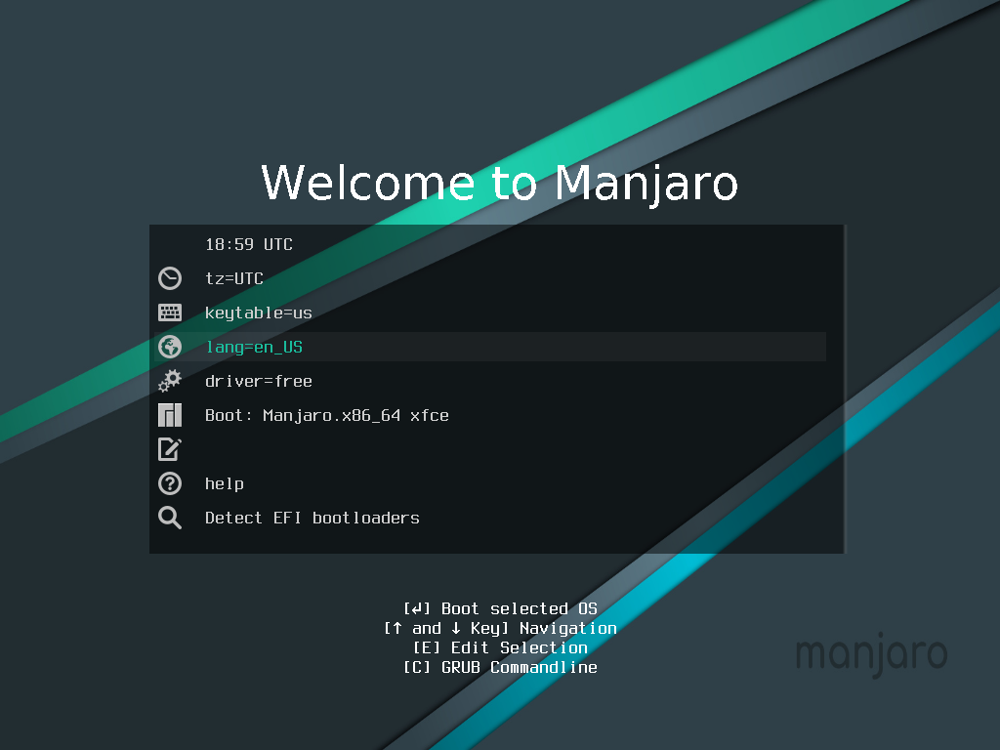
|Boot menu in BIOS mode |Boot menu in UEFI mode
|===
endif::[]
ifndef::asciidoctor[]
:tabsize: 12
.Boot menu in BIOS mode ___________ Boot menu in UEFI mode
image::images/de/media-boot-screen+uefi.png[pdfwidth=50%]
endif::[]

Die hier vorzunehmenden Einstellungen beziehen sich auf die
Besonderheiten unterschiedlicher Sprachen und wirken über den
Bootprozess hinaus. Sie stellen vorab ein, in welcher Sprache der
Desktop erscheint und auch, was bei einer nachfolgenden Installation
voreingestellt ist.

Die hier gemachten Einstellungen sind einfach und lassen sich schnell vornehmen.
Es geht nur um drei Angaben.

=== Die Sprache für das System und die Tastatur einstellen

NOTE: Die folgenden Einstellungen sorgen dafür, dass beim Start des
Live-Systems die Tastatur und die Meldungen den deutschen Gewohnheiten
entsprechen. Sie können auch beliebiges anderes auswählen.

.Die Voreinstellungen für das Booten zusammengefasst.
image::images/de/manjaro-booten.png[scale=75%,pdfwidth=100%,position=center]

Als Erstes werden Systemsprache und Tastatur eingestellt:

Mit den Pfeiltasten gehen Sie auf die Zeile  ``lang=en_US``
*<Enter>* führt in ein Untermenü mit den verfügbaren Sprachen.

// .Systemsprache auswählen
// image::images/boot/media-choose-language.png[scale=75%,pdfwidth=600px]

Wählen Sie dort mit *<Enter>* _Deutsch_ und dann *``lang=de_DE``* aus.

// .Sprachvariante einstellen
// image::images/de/manjaro-054.png[scale=75%,pdfwidth=75%]

Anschließend wird noch das Tastaturlayout festgelegt:
Mit den Pfeiltasten gehen Sie auf _keytable=us_
und wählen dann mit *<Enter>* _keytable=de_ für das deutsche Tastaturlayout aus.

// .Das Tastaturlayout auswahlen
// image::images/de/manjaro-02.png[scale=70%,pdfwidth=75%]

Nach der Installation können Sie die Variante des Tastaturlayouts noch genauer bestimmen.

=== Die Treiber wählen

Voreingestellt verwendet Manjaro nur freie Treiber für Ansteuerung der Hardware.

Normalerweise ist das eine gute Wahl. Allerdings gibt es problematische Hardware, die am besten mit proprietären Treibern der Hersteller funktioniert, etwa die Grafikkarten von Nvidia, die bei einigen Spielen benötigt werden.

[horizontal]
Free:: Freie Treiber sind Open-Source, wie auch Manjaro und werden von einer großen Community gepflegt. Für AMD- und Intel-basierte Grafikkarten ist dies die beste Wahl, für sehr alte Grafikkarten oft die einzige praktikable. Bei _älteren_ Nvidia Grafikkarten funktionieren diese oft auch sehr gut.

Non-Free:: Diese Treiber bieten zwar manchmal zusätzliche Funktionen, werden aber allein von den Herstellern betreut (oder auch nicht...), was immer wieder zu Schwierigkeiten führt, etwa bei NVIDIA.

// .Das Manjaro Live-System starten Sie über diese Zeile... Spezialisten können noch zusätzliche Parameter für den Kernel angeben. 
// image::images/de/manjaro-06.png[scale=75%,pdfwidth=600px]

=== Das Live-System startet: Willkommen bei Manjaro Linux!

Sobald Sie *Start* wählen, booted das Manjaro System.
Sie werden eine ganze Menge von Text über den Bildschirm laufen sehen, was Ihnen anzeigt, dass (hoffentlich) alles korrekt arbeitet. Nach kurzer Zeit – und wenn die Hardware kompatibel ist – sehen Sie die Live-Desktop Umgebung.
(((Live-System)))

[[Willkommensfenster]]
.Willkommen bei Manjaro Linux!

Das in der Bildmitte angezeigte Willkommensfenster enthält einige Links mit wichtigen Verweisen, wie der Originaldokumentation, aktuellen Informationen zu diesem Release, dem Wiki usw.

Sie finden dort auch einen Verweis auf das grafische Installationsprogramm __Calamares__. Dieses Fenster können Sie ruhig schließen, wenn es Sie beim Erkunden des Desktops stört. Es lässt sich über das Menü (unten links) wieder öffnen.

.Der Desktop des Live-Systems 
image::images/de/xfce-live1.png[scale=75%,pdfwidth=100%]

Sowohl dieses User Guide, wie auch das Installationsprogramm finden
Sie zusätzlich auch noch auf dem Desktop.  Ob Sie eine
Internet-Verbindung haben, sehen Sie ganz unten am Bildschirmrand
rechts. Links davon gibt es eine Übersicht der vorhandenen Fenster,
rechts davon werden viele weitere wichtige System-Informationen
angezeigt.

Es gibt auch einen Verweis auf den Manjaro Architect, der aber für fortgeschrittene Anwender vorgesehen ist und hier nicht weiter berücksichtigt wird.

[[keyboardlayout]]
==== Die Tastaturlayouts anpassen

In den meisten Fällen ist die Tastaturbelegung schon richtig eingestellt, wenn Sie beim Bootmenü das korrekte Layout ausgewählt haben.
Ist das nicht der Fall, können Sie es hier in allen Details anpassen.
Im Menü finden Sie unter _Einstellungen_ den Eintrag _Tastatur_, der das ermöglicht.

.Einstellungen der Tastatur in Menü
image::images/de/xfce-einstellungen.png[scale=55%,pdfwidth=400px]

Manchmal muss auch noch das _Tastaturmodel_ angepasst werden.

Testen können Sie die Einstellungen in einem Terminalfenster: Im Menü unten links finden Sie ein _Terminal_, in dem Sie spezielle Tasten, etwa <y> (hoffentlich erscheint kein "`z`", denn dann ist das Tastaturlayout englisch), <ö> (sind die Umlaute und Zusatztasten korrekt?), <µ>, <@>, ...

.Wählen Sie unter _Tastaturbelegung_ *Deutsch* aus.
image::images/de/keyboard-xfce-3.png[scale=55%,pdfwidth=400px,position=center]

== Vor der Installation auf der Festplatte

Manjaro verwendet ein ausgefeiltes Installationssystem, bei dem kaum etwas schief gehen kann. Die Installation besteht dabei – grob gesagt – aus diesen Schritten:
(((Installation,Vorbereitungen)))

ifdef::asciidoctor[[.text-left]]
* Sie geben über eine Reihe von Dialogen an, _was_, _wo_, _wie_ geschehen soll. Diese Dialoge werden in den folgenden Abschnitten genauer beschrieben und unterscheiden sich, abhängig vom Kontext.

* Es folgt die eigentliche Installation, die anhand der zuvor gemachten Angaben erfolgt. Hier brauchen Sie so gut wie nichts zu tun.

* Nach der Installation müssen einige Programme, wie beispielsweise das Email-Programm noch _konfiguriert_ werden, etwa um die Emails vom richtigen Server abzuholen. Das geschieht dann nach dem Booten des neu installierten Systems.

TIP: Bevor Sie nun mit der Installation beginnen, können Sie sich etwas
mit dem Live-System vertraut machen. Es entspricht in den meisten
Aspekten dem später installierten System und Sie können schauen, ob es
Ihnen gefällt.

NOTE: Die Installation eines neuen Betriebssystems kann Ihnen
abverlangen, sich mit einigen Konzepten auseinanderzusetzen, die Sie
kaum jemals zuvor gehört haben, wie zum Beispiel das _Partitionieren_ und
_Anlegen von Dateisystemen_. Das kann anfangs etwas beunruhigend sein, aber
verzweifeln Sie nicht, wir helfen, wo wir können!

Bei der automatisierten Installation müssen Sie sich nur mit ganz
wenigen Begriffen auseinandersetzen. Nur die manuelle Installation
erfordert weitergehende Kenntnisse.

Zuallererst erfordert die Installation eines neuen Betriebssystems, dass Sie (oder
das Installationsprogramm), einige Datenträgerverwaltungsaufgaben ausführen, um Platz für das neue System zu schaffen.

WARNING: Wollen Sie ihr Windows und die Daten behalten, müssen Sie sich im Klaren sein, wo – auf welchen Partitionen – sie sich befinden. Löschen Sie alles oder die falsche Partitionen, sind natürlich auch alle Daten weg...

Die nächsten Kapitel beschäftigen sich ausführlich mit dem Installationsprogramm _Calamares_, das von vielen Linux-Distributionen eingesetzt wird und das (zu Recht) als sehr sicher und leistungsfähig gilt. Es richtet Manjaro Linux so ein, dass Sie es direkt nach dem Booten verwenden können, ohne dass ein bereits vorher installiertes System, wie Microsoft Windows, beschädigt wird.

NOTE: Es wird aber auch berichtet, dass manchmal Windows – aus unbekannten Gründen – _nicht erkannt_ wird, obwohl es auf dem Computer installiert ist. *Brechen Sie dann die Installation ab* und starten Sie sie erneut, am besten, nach dem Sie das Live-System neu gebootet haben.

Einige Anwender gehen so vor: Sie bauen zunächst eine leere Festplatte zu Testzwecken in den Rechner, und installieren darauf ihn neues System. Wer den Aufwand nicht scheut, kann so ganz sicher gehen, dass sein "`Produktionssystem`" unverändert bleibt.

NOTE: Wenn das Live-System startet, können Sie davon ausgehen, dass Ihr Computer über ausreichend RAM (Hauptspeicher: mindestens 1GB) verfügt. Auf der Festplatte(((Festplattenplatz, benötigter))) muss für eine Installation mindestens 5,5 GB frei sein.
(((Hauptspeicher)))

TIP: Ein manchmal vermisster Hinweis zum *Abschalten* des Rechners, wenn das Live-System läuft, soll hier nicht fehlen: Im Menü – oben oder unten links – finden Sie eine Möglichkeit, sich _Abzumelden_. Dies erlaubt dann auch, den Computer herunterzufahren.
(((Abschalten des Rechners)))

[NOTE]
--
Es gibt einen interessanten und aufmunternden Erfahrungs- und Erlebnisbericht für User, die zwar viel Erfahrungs mit Windows aber noch keine mit Manjaro haben. Leider steht das Tutorial bisher nur auf englisch zur Verfügung; es ist aber unbedingt lesenswert.

Hier finden Sie den Text:

https://forum.manjaro.org/t/howto-become-a-manjaro-power-user-when-youre-a-wizard-at-windows-but-a-n00b-at-manjaro/13646
--

[[Dual-Boot]]
== Ein Dual-Boot-System mit Microsoft Windows 10 installieren

Ein häufiger Fall bei der Installation ist dieser: Auf einem Computer, der mit Windows ausgeliefert
wurde, soll Manjaro zusätzlich (als zweites System) installiert werden. Die vom Anwender gespeicherten Daten sollen von beiden Systemen aus genutzt werden können. Dies führt zu einem sogenannten *Dual-Boot-System*.
(((Microsoft Windows 10)))

Diese Kapitel beschreibt, wie Sie dies mit Calamares weitgehend automatisch einrichten.

Sie starten Calamares entweder direkt vom Desktop aus (_Manjaro Installieren_), über das Desktop-Menü oder aus dem Willkommensfenster, siehe Abbildung <<Willkommensfenster>>.

NOTE: Calamares gibt Ihnen in einer Reihe von Dialogen die Möglichkeit, alle wesentlichen Einstellungen für das neue System vorzunehmen. Dabei  versucht das Programm, anhand schon bekannter Fakten möglichst gute Vorgaben anzubieten, so dass es oft reicht, mittels  *<Weiter>* zum nächsten Schritt zu wechseln; mit *<Zurück>* lassen sich die Einstellungen im vorherigen Dialog korrigieren. 

[NOTE]
--
Die hier vorhandene Anleitung kann nicht _alle_ Eventualitäten bei der Installation abdecken, da es eine völlig unübersichtliche Anzahl von Mainboards, BIOS- und UEFI-Versionen gibt, die manchmal ganz spezielle Eigenschaften haben. Normalerweise deckt Calamares dies ab. In einigen Fällen kann auch dieses Tutorial, das es bisher leider nur auf englisch gibt, helfen:

https://forum.manjaro.org/t/root-tip-dual-boot-manjaro-and-windows/1164
--

=== Schritt 1 ("`Willkommen`"): Die Sprache einstellen
// section title out of sequence: expected level 2, got level 3

Normalerweise ist dieser Schritt nicht erforderlich, da sie durch die richtige Sprachauswahl im Bootmenü automatisch übernommen wird. Sollte dies nicht der Fall sein, weil beispielsweise keine Internet-Verbindung bestand, sollte die Sprache hier korrekt eingestellt werden. Diese Einstellung wirkt sowohl auf das Installationsprogramm, als auch auf das installierte System. 

.Dies ist der erste Dialog, den Calamares anzeigt. Sie können die Sprache einstellen.
image::images/de/calamares-1.png[]

=== Schritt 2 ("`Standort`"): Region und Zeitzone einstellen

.Eine *Region* und eine *Zeitzone* werden ausgewählt. *Europa* und *Berlin* sind normalerweise korrekt.
image::images/de/calamares-2.png[]

.Calamares bietet Ihnen hier unter *Die Systemsprache ändern* an, eine Sprachvariante auszuwählen. So lassen sich schweizer oder österreichische Voreinstellungen aktivieren.  
image::images/de/calamares-3.png[]

=== Schritt 3 ("`Tastatur`"): Tastaturlayout festlegen

Bei vielen Computern ist die Voreinstellung in diesem Schritt schon korrekt.

.Stellen Sie das Tastaturlayout ein. Testen Sie, ob Ihre Einstellung korrekt ist, indem Sie unten in das Testfeld einige Zeichen eingeben.
image::images/de/calamares-4.png[]

.Zahlreiche Tastaturmodelle stehen hier zur Verfügung!
image::images/de/calamares-5.png[]

=== Schritt 4: Die Partitionierung!

Dies ist ein *besonders wichtiger* Schritt. Sie legen hier fest, wie die Festplatte aufgeteilt werden soll, um Platz für das neue System zu schaffen.

[WARNING]
--
Die üblichen Empfehlungen _vor einer Partitionierung_ sind:

ifdef::asciidoctor[[.text-left]]
* Machen Sie vorher ein _Backup_, siehe <<x,¶>>.

* Seien Sie vorsichtig und sich im Klaren, was Sie gerade tun, was sich auf den verwendeten Partitionen befindet...
--

Bevor Sie diesen Schritt durchführen, schauen Sie sich das Fenster genau an.

In der ersten Zeile steht, wie Ihr Rechner momentan organisiert ist: EFI und GPT sind im <<Glossar>>
erklärt. Befinden sich mehrere Festplatten in dem Computer, schaltet der Button in der Mitte ("`Samsung SSD ...`")
// §: ist das noch aktuell in nächsten Bild: calamares-12ersetzen.png?
um, welche gerade ausgewählt und angezeigt wird.

Es folgen vier Varianten zur Installation:

ifdef::asciidoctor[[.text-left]]
* *Parallel dazu installieren* ist eine weitgehend automatisierte Variante, die wir hier zunächst beschreiben. Dies ist die einfachste Möglichkeit, Manjaro zu installieren.

* *Ersetze eine Partition* installiert Manjaro auf einer schon vorhandenen Partition, deren Daten dabei überschrieben werden. Das wird hier genauer erklärt: <<replace>>

* *Festplatte löschen* löscht die gesamte Festplatte und alle darauf vorhandenen Partitionen; das ist selten erforderlich. Vorhandene Windows Installationen oder Daten werden natürlich auch gelöscht.

* *Manuelle Partitionierung* gibt Ihnen alle Freiheiten bei der Partitionierung, und wird <<manuellePartitionierung,hier>> beschrieben. Linux-erfahrene User werden diese Methode verwenden.

NOTE: Die automatisierte Installation ist sehr sicher, da sie schon seit langen von vielen weniger erfahrenen Anwendern genutzt wird. Sie führt zu einer einfachen Installation – alles auf einer Partition – , die nicht die Vorteile der manuellen Partitionierung nutzt.

*Verschlüssele System* bewirkt, dass die zum Speichern der Daten verwendeten Partitionen verschlüsselt
werden. Vorteil: Bis heute kann niemand diese Daten lesen, wenn er den Schlüssel nicht hat. Nachteil: Verlieren Sie ihn, gilt das auch für Sie...
 +
Es ist vermutlich ganz gut, diese Möglichkeit nicht als erstes auszuprobieren, sondern sich zunächst mit einem unverschlüsselten System bekannt zu machen.
 +
Das Verschlüsseln von Partitionen beschreibt Kapitel <<encryption>>.
(((verschlüsseltes System)))

Im unteren Teil des Fensters zeigt Calamares zunächst den aktuellen Zustand der Festplatte ("`*Aktuell*`") an.
In dem Beispiel sind vier Partitionen ("`nvme0n1p1`", ...) und noch beträchtlicher freier Speicherplatz vorhanden. 

Darunter ("`*Nachher*`") stellen _Sie_ ein, wie der Festplattenplatz neu verteilt wird. Mit dem Mauszeiger verschieben Sie die Übergänge zwischen den Partitionen – und damit deren Größen – so, dass Sie Ihren Wünschen entsprechen. 

Unterste Zeile: Eine automatisch erkannte EFI-Partition (nvme0n1p3) wird direkt von Manjaro verwendet werden.

[[AutomatischeInstallation]]
==== Automatische Installation

In diesem Beispiel wird durch *Parallel dazu installieren* die
_automatische Partitionierung_
ausgewählt, die besonders einfach ist und schnell zu ganz anständigen Ergebnissen
führt. Was Calamares Ihnen dabei genau anzeigt, hängt vom Computer
ab. Wie der Dialog zu verstehen ist, zeigt das folgende Bild.
(((automatische Partitionierung)))

.Die automatische Partitionierung teilt die Festplatte so auf, dass beide Systeme ausreichend Platz finden.
//image::images/alongside-windows/partition-windows.png[scale=100]
image::images/de/calamares-win-partitionieren.png[]

In diesem Beispiel wird durch *Parallel dazu installieren* die Installation _neben dem bestehenden Windows System_ ausgewählt. Eine bestehende Partition muss dafür so verkleinert werden, dass genug Platz für das neue System entsteht.

WARNING: _Dies_ ist ein *besonders wichtiger* Schritt. Er legt fest, *wo* das neue System angelegt werden soll. Achten Sie darauf, dass die _richtigen Partitionen_ verwendet werden.

Klicken Sie in der unteren Zeile eine Partition an, ändert sich die Darstellung so, dass sie aufgeteilt werden kann. 

Manjaro wird auf dem rot markierten Teil der Festplatte installiert. Das Verkleinern von Partitionen ist nur in dem Umfang möglich, wie es die darauf vorhanden Daten zulassen. Um Manjaro installieren zu können, wird mindestens 5,5 GB Festplattenplatz benötigt.

Sie dürfen den Partitionsbalken zur Größenänderung an beiden Enden verschieben. Natürlich wirkt sich das auf die benachbarten Partitionen aus.

.Unterschiede zwischen BIOS- und UEFI-Systemen
[NOTE]
--
UEFI-Systeme benötigen zwingend eine kleine – wenige 100 MB – Partition für Dateien, die zum Systemstart erforderlich sind. Diese als "EFI" bezeichnet ist und unbedingt mit dem FAT32 Dateisystem formatiert sein muss. (Sie wird später unter `/boot/efi/` im Dateisystem erscheinen.)
--

Calamares erkennt, ob es eine solche Partition gibt und erstellt sie automatisch, wenn sie fehlt. Oft wird diese Partition als erste (unter dem Namen "++sda1++") angelegt. 

Auf UEFI-Systemen zeigt Calamares an, ob eine EFI-Partition gefunden wurde.
Der Bootloader GRUB wird sowohl bei BIOS als auch bei UEFI-Systemen eingesetzt und immer automatisch installiert.
(((Bootloader)))
(((GRUB)))

==== Schritt 5: Anwender anlegen

In diesem Schritt machen Sie einige grundlegende Angaben zu dem System. Wenn möglich 
bietet Calamares
Ihnen sinnvolle Vorgaben an. Übernehmen Sie diese, sofern Sie keinen guten Grund haben, 
anderes zu wählen.

Als Erstes legen Sie einen Account (siehe Glossar) für einen Anwender an. Sie können 
später immer noch weitere Anwenderaccounts einrichten. Geben Sie an dieser Stelle Ihren 
*Namen* an, wird dieser automatisch für die Email-Adresse und an weiteren Stellen – 
beispielsweise auf dem _Anmeldebildschirm_ – verwendet. Sie müssen hier nicht Ihren 
wahren Namen angeben, wenn Sie es nicht wünschen. "`Linus Torwalds`" (der Entwickler von 
Linux) geht auch. Oder "`Daisy Duck`".
(((Account anlegen)))
(((Anmeldebildschirm)))

Den nächsten *Namen*, den Sie zum *Anmelden* (und indirekt auch für Ihren Account) verwenden, den *Usernamen* sollten Sie ebenfalls mit Bedacht wählen. Es kann sein, dass Sie ihn öfter mal eingeben müssen... Genau wie das Passwort.
Wie Sie Ihren *Computernamen* wählen, bleibt Ihnen weitgehend überlassen. 
Buchstaben, Ziffern und der Unterstrich können für den "Hostnamen" eingesetzt werden. Mehr als 64 Zeichen-lange Hostnamen können in gemischten Netzwerken zu Problemen führen.
(((Usernamen)))
(((Hostname)))

Passwörter sollten so gewählt werden, dass sie sich nicht leicht erraten lassen. Auch sollten sie in keinem Wörterbuch stehen, da es ein häufiges Angriffsszenario ist, die Kombination aus sehr vielen Nutzernamen und Passwörtern auszuprobieren. Beide werden dafür aus Wörterbüchern  automatisch erzeugt... Groß- und Kleinschreibung _werden unterschieden_. Buchstaben, Ziffern und Sonderzeichen dürfen eingesetzt werden. Bedenken Sie aber, dass manche Zeichen bei nicht deutschen – insbesondere anglikanischen – Tastaturen nicht leicht zu finden sind.

[NOTE]
--
Eine Anmerkung zu Passwort und Benutzernamen: Nur mit ihnen schützen Sie Ihre Daten. Wählen Sie sie daher mit Bedacht... Auf einem _nicht verschlüsselten System_ können Sie auf Ihre Daten auch noch zugreifen, wenn Sie das Passwort vergessen haben (oder es zurücksetzen), solange Sie physischen Zugriff auf den Computer haben. <<x,¶>> erklärt dies.
(((Passwort)))
(((Benutzername)))

Sie sollten nicht zu kurz sein, und sich _nicht erraten lassen_. Das bedeutet insbesondere, sie sollten in der verwendeten Schreibweise in keinem Wörterbuch stehen.
--

Passwörter werden nicht angezeigt. Die Eingabe erfolgt doppelt, um Schreibfehler auszuschließen.

.Einige grundlegende Angaben zum System stellen Sie hier ein.
image::images/de/calamares-7.png[]

==== Schritt 6: Eine Office Suite auswählen

Möchten Sie eine Office Suite installieren? Wenn ja, welche? Oder keine? 
(((Büro-Software)))

.Die Auswahl der Office Suite...
image::images/de/calamares-8office.png[]

Tatsächlich gibt es noch _viel mehr_ Büro-Software für (Manjaro) Linux, die hier keine Erwähnung findet.
Sie können sie nachträglich mit dem <<InstallationneuerSoftware,Paketmanager>> installieren.

[[summary]]
====  Schritt 7: Die Übersicht bekommen und installieren

Bevor die Installation nun wirklich beginnt, zeigt Calamares die gemachten Angaben nochmals an und lässt sich bestätigen, dass alles richtig ist.  *Zurück* wechselt zu den eben angezeigten Dialogen.

// Sie können vor der endgültigen Bestätigung mit *Zurück* durch die eben angezeigten Dialoge gehen, um Angaben zu ändern.

.In der Übersicht werden alle Angaben zusammengefasst angezeigt.
image::images/de/calamares-9zusammenfassung.png[]

==== Die eigentliche Installation...

.Soll die Installation jetzt erfolgen? Ja!
image::images/de/calamares-10doit.png[]
(((Installation)))

Lehnen Sie sich zurück und schauen sich dabei die Präsentation an, die Ihnen einige Fakten über Manjaro erzählt. Der Fortschritt bei der Installation spiegelt sich an dem Balken wider.

// §bild

==== ... Fertig!

.Normalerweise läuft die Installation ohne irgendwelche Probleme innerhalb weniger Minuten ab.
image::images/de/calamares-11done.png[]

Mit *Jetzt Neustarten* beendet das Live-System und bootet den Rechner neu. Falls Sie die Boot-Reihenfolge im BIOS bzw. UEFI verändert hatten, sollten Sie sie nun wieder in die ursprüngliche Reihenfolge bringen.

=== Den GRUB Bootloader aktualisieren, oder "`Wo ist mein Windows geblieben?`"

Gelegentlich – aber selten – wird berichtet, dass beim Booten das Bootmenü nur noch Manjaro anzeigt und Windows nicht mehr als Option angeboten wird, obwohl beide Systeme auf der Festplatte vorhanden sind. Es scheint so, als ob der Bootloader ("`GRUB`") – das Programm, das das Bootmenü anzeigt und dann das ausgewählte System startet – Windows vergessen hat...
// Das lässt sich aus einem laufenden Manjaro-System heraus sehr schnell 
// in einem Terminal beheben. 
In einem Terminal beheben Sie es mit dieser Befehlszeile:
(((Bootloader aktualisieren)))

[listing]
$ sudo update-grub

Nach der Authentifizierung erfolgen einige Ausgaben, in denen auch das Windows erscheint. Beim nächsten Booten steht es dann auch wieder im Bootmenü. Auf diese Weise lassen sich die meisten Probleme mit dem Bootloader reparieren, siehe <<x,¶>>.

== Weitere Installationsmethoden
Neben der oben beschriebenen _automatischen Installation_ unterstützt Calamares noch eine ganze
Reihe weiterer Installationsvarianten. Fortgeschrittene Anwender verwenden diese, weil 
sie ihnen mehr Wahlmöglichkeiten bieten als eine automatische Installation. So ist es 
beispielsweise möglich, unterschiedliche Teile des Systems auf verschiedenen Partitionen 
unterzubringen, alles oder Teile davon zu verschlüsseln und vieles mehr.
(((BIOS)))
(((UEFI)))
(((Installationsmethoden)))

Warum man das tun sollte? Kurze Antwort: Tun Sie es nicht, wenn _Sie_ keinen Grund dafür haben. Die lange Antwort findet sich in den folgenden Abschnitten ... 

[NOTE]
--
_Sie_ __**müssen**__ _die folgenden Abschnitte nicht lesen, um erfolgreich mit Ihrem Manjaro System arbeiten zu können._

Die folgenden Abschnitte behandeln spezielle Aspekte von
Linux-Systemen, die einem das Leben (als Administrator) leichter
machen.

Ab Kapitel <<DerManjaroDesktop>> kommen wieder für alle Anwender wichtige Informationen...
--

Calamares bietet drei weitere Installationsvarianten an, die hier noch beschrieben werden.
Die manuelle Installation unterscheidet sich etwas, abhängig davon, ob Sie einen BIOS- oder UEFI-Rechner verwenden.

=== Unterschiede zwischen BIOS- und UEFI-Systemen

UEFI-Systeme benötigen zwingend eine kleine – wenige 100 MB – Partition für Dateien, die zum Systemstart erforderlich sind. Diese als "`EFI`" bezeichnet ist und unbedingt mit dem FAT32 Dateisystem formatiert sein muss. (Sie wird später unter `/boot/efi/` gemountet.)

Calamares erkennt, ob es eine solche Partition gibt und erstellt sie automatisch, wenn sie fehlt. OFt wird diese Partition als erste ("`sda1`") angelegt. 

Auf UEFI-Systemen zeigt Calamares an, ob eine EFI-Partition gefunden wurde.
Der Bootloader GRUB sowohl bei BIOS als auch bei UEFI-Systemen eingesetzt und immer automatisch installiert.
(((Bootloader)))
(((GRUB)))

[[replace]]
=== Eine bestehende Partition ersetzen ...

\... ist ganz einfach. Die Daten (oder ein bestehendes System) auf der ausgewählten Partition wird durch Manjaro ersetzt. Das überschreibt natürlich die dort vorhandenen Daten. Sinnvoll kann das sein, wenn Sie bereits eine Partition für ein anderes System haben, das Sie nicht mehr verwenden.

Wenn Sie sich mit GParted (siehe <<gparted>>) auskennen, werden Sie vermutlich mit diesem Programm zunächst die Partitionierung durchführen, um dann die so vorbereiteten Partitionen für die Installation verwenden.

.Eine Partition ersetzen.
image::images/de/calamares-12ersetzen.png[]

Weiter erfolgt die Installation so, wie es unter <<Dual-Boot>> beschrieben ist.

Zusätzlich erscheint am unteren Fensterrand eine Auswahl für den Installationsort von GRUB ("*Installationsziel des Bootloaders*").
Damit legen Sie fest, wo GRUB installiert werden soll. Normalerweise ist die Voreinstellung gut. Gibt es aber schon von einem anderen System einen GRUB, kann dieser auch das neue System booten.
(((Bootloadermenü)))

<<x,¶>> beschreibt auch den GRUB-Customizer, ein Programm, um das Bootmenü manuell zu beeinfussen.

=== Festplatte löschen

Das ist eigentlich die einfachste Möglichkeit, wird aber selten verwendet, da die gesamte Festplatte dabei neu formatiert wird. Klar, wenn Sie endgültig die Nase von Windows voll haben, kann das eine gute Lösung sein, da dann auch Backup- und Rettungssysteme gleich mit wegputzt ...

Der weitere Prozess entspricht dem unter <<Dual-Boot>> beschriebenen.

[[advancedInstall]]
== Manuelle Installation auf einem BIOS-System

Eine besonders oft verwendete Methode ist die _manuelle Installation_. Sie erlaubt Ihnen alles so
einzustellen, wie Sie es wünschen. Insbesondere erlaubt diese Methode vorhandene Partitionen zu nutzen, ohne das diese Verändert werden müssen. Die unter Windows genutzte Musiksammlung kann dann genau so wie die Bilder unter Manjaro verwendet werden.
(((BIOS)))
(((manuelle Installation)))
(((Installation, manuell)))

Das Schlüsselwort dazu heißt *Mount Points*. Mount Points sind leere Verzeichnisse, die dazu verwendet
werden, Partitionen "`einzuhängen`". Nach dem Einhängen erscheint der Inhalt der Partition _in_ dem als Mount Point verwendeten Verzeichnis.
Eine Daten-Partition kann beispielsweise nahtlos als `/daten/` in das Dateisystem eingebaut werden. Oder in das Homeverzeichnis des Anwenders unter `/home/`{zwsp}__anwender__{zwsp} `/daten`.
(((Mount Points)))

[[manuellePartitionierung]]
=== Alles aus Calamares heraus einstellen

Bei der manuellen Partitionierung ändert Calamares das Dialogfenster erst, nachdem Sie es mit *Weiter* verlassen haben. 

.Manuelle Partitionierung
image::images/de/calamares-12manuell-1.png[]

.Die Zielpartition auswählen.
image::images/de/calamares-12manuell-2.png[]

[[WelchePartitionenbrauchtman,Welche Partitionen braucht man?]]
==== Welche Partitionen braucht man?

Linux-Systeme, die aus mehreren Partitionen aufgebaut sind, haben einige Vorteile gegenüber "monolithischen" Systemen auf einer Partition – wie sie die automatische Installation erzeugt.
(((Partition, im System)))

ifdef::asciidoctor[[.text-left]]
* Die Partitionen lassen sich einzeln sichern.

* Die Partitionen lassen sich einzeln bearbeiten, reparieren, vergrößern, ersetzen.

* Beim Reparieren spart es Zeit, wenn nur kleine Partitionen bearbeitet werden müssen.

Es ist eine fast schon philosophische Frage, welche Partitionen man anlegen sollte und hängt ganz wesentlich vom Einsatzbereich ab. Oft wird aber für "normale" Systeme dies vorgeschlagen:

* Root (`/`): zwingend erforderlich, da hier Manjaro installiert wird, 10-50 GB sind zeitgemäß

* `/home/`: unbedingt sinnvoll, beliebige Größe, abhängig von den Anwenderdaten

* *swap*: anhängig vom Hauptspeicher (RAM) und den Anwendungen; etwa 1-2 fache RAM-Größe, benötigt _kein_ Dateisystem

* `/EFI`: bei UEFI-Hardware, 50-500 M(!)B, sie _muss_ FAT32-formatiert sein und unter `/boot/efi/` gemountet werden

* `/usr/`: abhängig von den installierten Anwendungen (hat _nichts mit den Anwendern zu tun_), bei
professionell genutzten System oft recht groß (>100 GB); auf PC meistens nicht erforderlich

* `/boot/`: bei RAID- und verschlüsselten Systemen, klein, wenige GB, für Spezialisten

NOTE: Auch _nach der Installation_ Ihres Betriebssystems können Sie immer noch neue Partitionen erzeugen, bestehende verändern, neue in das Dateisystem einbinden ("mounten"), siehe <<mounten>>. 

[[WelcheDateisystemewelcheDaten,Welche Dateisysteme für welche Daten?]]
[NOTE]
--
.Welche Dateisysteme für welche Daten?

Bis heute ist das Standard-Dateisystem von Linux _EXT4_. Es ist bewährt, relativ schnell, robust.
Vermutlich wird _Btrfs_ es in der Zukunft ablösen.

Einige professionelle Linux-Varianten setzen auf bewährte UNIX Dateisysteme wie _XFS_ und _ZFS_, die auch unter Manjaro (ZFS nur eingeschränkt) zur Verfügung stehen, siehe:
 +
 https://www.thomas-krenn.com/de/wiki/Linux_Dateisysteme

Dateisysteme werden – wie vieles unter Linux – permanent weiter entwickelt. Was momentan als der letzte Schrei gilt, kann in zwei Jahren schon überholt sein. Wenn Sie keine _speziellen Anforderungen_ an Ihr Dateisystem haben, können Sie die Voreinstellung von Calamares (derzeit _ext4_) verwenden. Falsch machen Sie damit nichts.
--

==== Platz schaffen

Wählen Sie die zu bearbeitende Partition durch Anklicken aus.

.Im Dialogfenster erscheint die ausgewählte Partition farbig unterlegt. 
image::images/de/calamares-12manuell-3.png[]

.Über den Button *Ändern* aktivieren Sie einen neuen Dialog, der die Größe und andere Eigenschaften für die ausgewählte Partition festlegt.
image::images/de/calamares-12manuell-4.png[]

Der Dialog *Ändern* ist einfach aufgebaut:
(((Partition ändern)))

ifdef::asciidoctor[[.text-left]]
* Die Größe lässt sich wieder per Schieberegler (oder über das Zahlenfeld) einstellen. Bereits mit Daten gefüllte Teile der Partition sind dunkel dargestellt, leere hell.

* Wollen Sie den Inhalt der Partition _löschen_, ist *Formatieren* die richtige Entscheidung, ansonsten *Beibehalten*.

* Unter *Dateisystem* stehen alle für die Formatierung vorhandenen Dateisysteme zur Verfügung.

* *Einhängepunkt* sind Mount Points für die Partition. `/` (Root) _muss_ definiert werden. Siehe "<<WelchePartitionenbrauchtman>>" und "<<WelcheDateisystemewelcheDaten>>".

* *Markierungen*: Das BIOS bzw. UEFI einiger Rechner – beispielsweise von HP – benötigt unbedingt eine _bootfähig_-Markierung, um zu Booten. Bei vielen Rechnern ist diese zwar nicht erforderlich, stört aber auch nicht weiter. 

[[esp]]
IMPORTANT: EFI-PArtitionen erhalten die Markierung "`esp`", unter `/boot/`
eingehängte Partitionen "`bootfähig`". Gibt es keine 
`/boot/`-Partition, setzen Sie es bei der Root-Partition (`/`).

Die anderen Button unter der Partitionsübersicht haben diese Funktionen:

ifdef::asciidoctor[[.text-left]]
* *Neue Partitionstabelle* erstellt eine _ganz neue_
   Partitionstabelle, löscht dabei alle auf der Festplatte vorhandenen
   Partitionen und Dateisysteme. Sowohl MBR als auch GPT werden
   unterstützt. _Meistens ist dies nicht erforderlich, da Sie die
   aktuelle Partitionstabelle ja auch anpassen
   können._
(((Partitionstabelle)))

* *Löschen* entfernt nur die ausgewählte Partition. Der freie Platz kann dann mit

* *Erstellen* für eine neue Partition verwendet werden.

* *Neue Volumengruppe* (und damit zusammenhängende Button): Diese sind für große, professionell betriebene Systeme vorgesehen, die mit mehreren Festplatten gleichzeitig arbeiten, um die Geschwindigkeit und Ausfallsicherheit zu erhöhen.

Als letztes lässt sich wieder mit *Installiere Bootloader auf:*
die Festplatte einstellen, auf der Calamares GRUB installiert.
(((Bootloader installieren)))

NOTE: Alle hier definierten Aktionen werden erst ganz am Ende der Konfiguration (in Schritt 7) tatsächlich durchgeführt. _Bis dahin können Sie alle vorgemerkten Änderungen verwerfen und das Dateisystem unverändert lassen._

==== Neue Partition anlegen
Das Anlegen von Partitionen ist mit Calamares einfach und entspricht in vielen Punkten den von *Ändern*.
Legen Sie eine neue Partition an, wenn Sie keine vorhandene nutzen wollen und freier Platz vorhanden ist.
(((Partition anlegen)))

.Eine neue Partition anlegen.
image::images/de/calamares-12manuell-5.png[scale=75%,pdfwidth=400px]

Unter *Partitionstyp* definieren Sie bei einer MBR-Partitionstabelle, ob eine primäre oder erweiterte Partition erstellt wird.
(((primäre Partition)))
(((erweiterte Partition)))

IMPORTANT:  MBR unterstützt nur vier primäre Partitionen, so dass die vierte eigentlich immer als erweiterte Partition erstellt wird. In der erweiterten Partition lassen sich weitere Partitionen anlegen, die sich unter _Linux ohne Einschränkungen_ nutzen lassen.

*Dateisystem* definiert das verwendete Dateisystem; *Verschlüsseln*, ob es verschlüsselt wird. Zu den *Einhängepunkten* siehe "`<<WelchePartitionenbrauchtman>>`" und "`<<WelcheDateisystemewelcheDaten>>`".

Auch hier lassen sich die *Markierungen* aktivieren, von denen _bootfähig_ auf mancher Hardware wichtig ist. Swap-Partitionen werden mit *Auslagerungsspeicher* markiert.
(((Auslagerungsspeicher)))
(((Swap-Partition)))

[NOTE]
--
.Eine EFI-Partition erstellen
(((EFI-Partition)))
Um eine EFI-Partition zu erstellen, schaffen Sie zunächst etwa 1-200MB freien Platz auf der Festplatte. Diesen formatieren Sie mit FAT32. Als Mount Point wird `/boot/efi/` verwendet.

.Eine EFI-Partition erstellen
image::images/de/make-efi.png[scale=75%,pdfwidth=400px]

Fertig.
--

[[gparted]]
=== GParted: Verändern von Datenträgern
GParted kann Datenträger, beispielsweise Festplatten, SSDs oder USB-Sticks, partitionieren, formatieren,
Dateisysteme darauf anlegen und überprüfen, bestehende verändern oder löschen. Kurz: Ein Schweizer-Taschenmesser für Datenträger. Sie finden das Programm sowohl im Manjaro Live-System, als auch in den Repositories vieler Linux-Distributionen.
(((GParted)))

Die Anwendung dieses Programms ist recht einfach, weil es sich an der bei Calamares verwendeten Darstellung orientiert und intuitiv zu bedienen ist.

GParted kann Dateisysteme verkleinern – sofern sie nicht zu voll sind – oder vergrößern, wenn es noch ausreichenden Platz auf dem Datenträger gibt. Normalerweise verlaufen diese Aktionen problemlos. Es ist dennoch sinnvoll, auf den zu bearbeitenden Partitionen enthaltene Daten vorab zu sichern, obwohl normalerweise keine Daten verloren gehen.

// TIP: GParted untersucht beim Start alle vorhandenen Festplatten, auch externe. Das kann, abhängig von der Hardware etwas dauern. Wissen Sie beispielsweise, dass Sie nur die erste interne Festplatte – sie heißt unter Linux "sda" bearbeiten wollen, so lässt sich der Start von der Befehlszeile aus mit `gparted /dev/sda` deutlich beschleunigen.

Das Startfenster von GParted besteht aus mehreren Teilen:

.Startfenster von GParted
image::images/de/gparted1.png[]

ifdef::asciidoctor[[.text-left]]
* Das normale Menü enthält wesentliche Funktionen von GParted. Im *Ansichts*-Menü können zusätzliche Informationen eingeblendet werden.

* Die Werkzeugleiste darunter stellt einige, besonders oft verwendete Funktionen bereit.

* Am rechten Rand können Sie die aktuell bearbeiteten Datenträger wechseln.

* Das Kontextmenü (rechte Maustaste) enthält die Funktionen, die für die gerade ausgewählte Partition möglich sind.

Über das Kontextmenü lassen sich alle Funktionen direkt auf die entsprechende Partition direkt anwenden. Hier finden Sie u.a. eine Möglichkeit, das Dateisystem auszuhängen, falls es gerade gemountet ist. Es wird dadurch für die Bearbeitung mit GParted freigegeben.

TIP: Viele Funktionen lassen sich – vernünftigerweise – nicht auf eingehängte Dateisysteme oder Partitionen anwenden. In Kontextmenü haben Sie mit *Aushängen* die Möglichkeit, die Partition aus dem Dateisystem zu lösen. Später bietet das Kontextmenü dann die Funktion *Einhängen auf* an, um sie wieder einzuhängen.

.Funktionen für nicht gemountete Dateisysteme.
image::images/de/gparted2.png[]

Dann kann das auf der Partition vorhandene Dateisystem auch *Überprüft* werden
oder einen neuen Namen erhalten (*Dateisystem bezeichnen*).
(((Dateisystem,bezeichnen)))
(((Dateisystem,überprüfen)))

GParted arbeitet dabei wie Calamares: Zunächst werden die Aktionen gesammelt und erst tatsächlich angewendet, wenn dies durch einen Mausklick auf den *Ausführen*-Button image:images/de/doit.png[height=12] bestätigt wurde. 

== Spezielles

=== Eine SWAP-Partition ("Auslagerungsspeicher") anlegen

Eine SWAP-Partition ist eine spezielle Partition, auf die Linux momentan ungenutzte Teile des Hauptspeichers auslagert, wenn dieser nicht für alle gerade laufenden Anwendungen ausreicht. Diese Partition enthält kein klassisches Dateisystem – dessen Nutzung wäre zu langsam – sondern der Kernel nutzt eine spezielle Partition dafür. Werden Teile des ausgelagerten Speichers wieder benötigt, "`swappt`" der Kernel diese Teile zurück in RAM und lagert andere stattdessen aus. Da diese Umlagerung Zeit in Anspruch nimmt, verlangsamt das Swappen die Ausführung aller laufenden Programme.
(((SWAP-Partition)))
(((Auslagerungsspeicher)))

Es ist also ratsam, für ausreichenden Hauptspeicher zu sorgen, wenn viele Daten gleichzeitig – wie bei der Bildbearbeitung oder dem Videoschnitt – im Speicher gehalten werden müssen, auch wenn das Swappen es _prinzipiell_ ermöglicht, mit weniger Hauptspeicher noch zu arbeiten. <<x,¶>> beschreibt dies genauer.

Die Möglichkeit, eine SWAP-Datei im Dateisystem zu verwenden, wird heute kaum noch genutzt, da sie noch lagsamer als eine SWAP-Partition ist.

[[advancedInstallUEFI]]
=== Manuelle Installation auf einem UEFI-System 
Auf UEFI-Systemen unterscheidet sich die Installation von der auf BIOS-Systemen kaum.

Natürlich muss hier die FAT32-formatierte EFI-Partition zusätzlich angelegt werden und als Mount Point wird `/boot/efi/` angegeben. Auch ist es eine gute Idee, diese Partition mit den *Markierungen* _bootfähig_ und _esp_ zu versehen, was sowohl Calamares als auch GParted anbieten.
(((UEFI)))
(((Manuelle Installation)))

// §bild?

[[encryption]]
=== Partitionen verschlüsseln

_Dieser Abschnitt wendet sich an erfahrenere Anwender._
Um die Daten auf einem Rechner zu schützen, falls der einmal in falsche
Hände kommt, werden die Daten auf verschlüsselten Partitionen
gespeichert. Selbst der Systemverwalter kann auf die Daten ohne den
richtigen Schlüssel _nicht zugreifen_.
(((Verschlüsseln)))

Unter Linux wird zum Verschlüsseln LUKS (_Linux Unified Key Setup_)
eingesetzt.  Calamares unterstützt LUKS direkt und erlaubt so, die
Verschlüsselung schon bei der Installation einzurichten.

Auf BIOS- und auf UEFI-Systemen ist die Vorgehensweise gleich.

==== Verschlüsselung bei der automatischen Installation

Die automatisierte Installation bietet Ihnen mit dem Button *Verschlüssele System* schon bei der Auswahl der Partitionen an, die Verschlüsselung zu installieren und aktivieren.

.Wie bei der Nutzernamen/Passwort-Vergabe wird das Passwort für die Verschlüsselung verdeckt und doppelt eingegeben. 
image::images/de/encrypt.png[]

IMPORTANT: Wenn Sie dieses Passwort vergessen, gibt es keine realistische Möglichkeit, wieder an Ihre Daten zu gelangen.

Das Dateisystem wechselt nun zu LUKS, was anzeigt, dass die Verschlüsselung aktiv ist. Der Rest der Installation unterscheidet sich nicht von den unverschlüsselten Varianten.

.Beim Booten erscheint nun eine Eingabeaufforderung. Eingaben werden dabei _nicht angezeigt_. Bei korrektem Passwort erscheint das Bootmenü. Sie haben bei jedem Booten nur _einen Versuch_. Viel Glück.
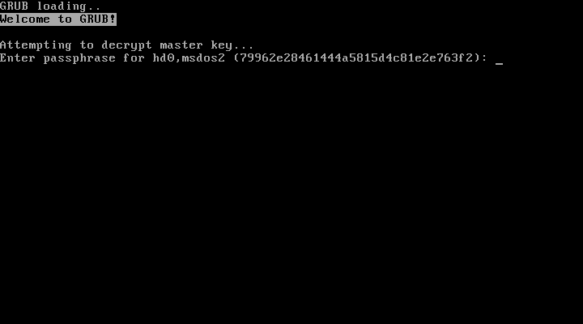

==== Verschlüsselung bei der manuellen Installation

Auch diese unterscheidet sich nur minimal von der eines unverschlüsselten Systems.

.Hier erfolgt wieder die doppelte, verdeckte Eingabe des Passwortes.
image::images/de/encrypt-2.png[scale=55%,pdfwidth=400px]

[[WelcometoManjaro]]
:thetitle: Willkommen im installierten System!
ifdef::asciidoctor[= Teil 3: {thetitle}]
ifndef::asciidoctor[= {thetitle}]

Die nächsten Kapitel beschreiben die ersten Schritte in dem neu installierten System. Insbesondere geht es um den Desktop, einige Einstellungen und darum, Hilfe zu bekommen.

ifndef::partpics[image::images/de/HHangler.jpg[pdfwidth=90%]]

[[DerManjaroDesktop]]
== Der Manjaro Desktop

Die folgenden Abschnitte beziehen sich auf den Xfce(4)-Desktop. Haben Sie eine andere Manjaro-Variante (siehe <<ManjaroEditionen>>) installiert, wird es bei Ihnen etwas anders aussehen, aber die Unterschiede sind eher im Detail als grundsätzlicher Natur.
(((Desktop)))

[[Geschafft]]
=== Geschafft!

Nach dem Start des installierten System begrüßt Sie Manjaro wie zuvor das Live-System. Insbesondere wird auch jetzt wieder das Willkommensfenster angezeigt. Sie finden es auch als "`Manjaro Hello`" im Desktop-Menü.
(((Manjaro Hello)))

[[Willkommensfenster1]]
.Manjaro Hello: Das Willkommensfenster.
image::images/de/Willkommensfenster.png[scale=55%,pdfwidth=400px]

Der Desktop erscheint automatisch bzw. nach dem Anmelden, abhängig davon, was Sie bei der Installation angegeben haben.

Schauen Sie sich dieses Fenster in Ruhe an. Es enthält viele nützliche Informationen:

ifdef::asciidoctor[[.text-left]]
.Dokumentation
* _Lies mich_ ist eine ziemlich technische Zusammenfassung der Manjaro Systeme, enthält aber auch eine Reihe für weniger versierte Einsteiger wissenswerte Informationen.

* _Versionshinweise_ fasst die Neuerungen der aktuellen Version zusammen.

* Das _Wiki_ führt zu der derzeit noch sehr übersichtlichen Wissensbasis. Das meiste ist auf Englisch. 

.Unterstützung
* Das _Forum_ dagegen ist auf Deutsch (suchen Sie nach "`deutsch`") und englisch. 

* ein _Chatroom_

* mehrere (englische) _Mailing_ Listen

.Projekt
* _Mitmachen_: für alle, die sich gern beteiligen möchten...

* _Entwicklung_: GIT-basierte Entwicklung aller Komponenten

* _Spenden_: gern gesehen...

Sehr interessant ist auch die Liste der Applikationen, unter *Applications*. Hier finden Sie
eine Übersicht der (oft verwendeten) Applikationen, sortiert nach Themen. Ein Häkchen zeigt an, ob die Anwendung installiert ist, oder nicht.

.*Applications*: Eine Liste wichtiger Anwendungen
image::images/de/Applications.png[scale=55%,pdfwidth=400px]

Mit dem Schalter *Beim Systemstart ausführen* steuern Sie, ob dieses Fenster automatisch erscheint.

.Einige Bereiche auf dem Manjaro Xfce Desktop haben besondere Funktionen...
image::images/de/xfce-desktop.png[]

ifdef::asciidoctor[[.text-left]]
* *1*: Die Icons auf dem Desktop. Der _Inhalt_ des Verzeichnisses `./Schreibtisch/` im Homeverzeichnis des Anwenders wird hier angezeigt.

* *2*: Benachrichtigungen des Systems erscheinen hier.
(((Benachrichtigungen)))

* *3*: Das Desktop- oder Applikations-Menü ist die einfachste Methode, ein bestimmtes Programm zu _finden_ und zu _starten_.
(((Desktop-Menü)))
(((Applikations-Menü)))

* *4*: Hier finden sich die auf dem Desktop angezeigten Fenster.

* *5*: In die Leiste – das sogenannte "`Panel`"
– abgelegte Programmstarter.
(((Panel)))
* *6*: Der Arbeitsflächenumschalter.
(((Arbeitsflächenumschalter)))
* *7*: Systemicons, sie steuern und signalisieren wichtige Funktionen, wie eine aktive Netzwerkverbindung, die Lautstärke, Datum und Uhrzeit und den Ausschalter
(((Ausschalter)))

NOTE: Der Xfce-Desktop von Manjaro lässt sich an _vielen_ Stellen anpassen und so einstellen, wie _Sie_ es wünschen.

TIP: Mit der "`Windows`"- oder "`Super`"-Taste kann das Desktop-Menü ebenfalls aufgerufen werden. Praktisch! Und _Sie_ können die Funktionen dieser Tasten selbst festlegen, wie <<x,¶>> erklärt.

.Installierte Programme finden Sie im Desktop-Menü. Probieren Sie es aus!
image::images/de/xfce-menu.png[]

Besonders oft benötigte Programme können Sie als "`Favoriten`" markieren und damit besonders schnell zugänglich machen. Suchen Sie dazu den gewünschten Eintrag im Menü und platzieren Sie den Mauszeiger darüber, ohne zu klicken. Mit der rechten Maustaste rufen Sie das Kontextmenü auf, wo *Zu Favoriten hinzufügen* das Programm in die Favoritenliste aufnimmt.
(((Favoriten)))

.*Zu den Favoriten* hinzufügen mach besonders wichtige Programm schnell erreichbar.
image::images/de/favoriten.png[]

Genauso einfach – über das Kontextmenü – lassen sich Favoriten wieder aus der Liste löschen.
Als Nächstes schauen Sie sich einmal die schon in der Liste enthaltenen Programme an:

* Terminal

* Dateiverwaltung

* Internetnavigator

* E-Mail-Programm

// * Softwareverwaltung

=== Terminal (Emulator)
*Terminal* oder *Terminal Emulator*, ist ein Programm, dass Ihnen eine Befehlszeile zur Verfügung stellt.
Was sollen Sie damit bloß machen? Die Antwort besteht aus zwei Teilen:
(((Terminal Emulator)))

ifdef::asciidoctor[[.text-left]]
* *Anfangs*: wenig bis gar nichts. Bei Problemen ist es oft eine gute Idee, ein Programm über das Terminal zu starten, weil Sie dort oft zusätzliche Informationen erhalten. Tippen Sie den Programmnamen ein und starten Sie es dann mit *ENTER* oder *RETURN*. (Beides hat die gleiche Funktion.)
 + 
Erscheinen nun auf dem Terminal Textausgaben, so stammen die von dem gestarteten Programm. Sie können diese bei _gedrückter linker_ Maustaste markieren und mit der _mittleren Maustaste_ beispielsweise in eine Email einfügen. 
 + 
Oft werden Sie bei Problemen im Forum aufgefordert, dies zu tun, weil sich die Lösung Ihrer Probleme manchmal schon hier findet...

* *Später* werden Sie erkennen, wie extrem leistungsfähig und effektiv die Befehlszeile ist. Besonders administrative Aufgaben lassen sich dort meistens _viel schneller und besser_ lösen, als mit den grafischen Werkzeugen, die natürlich auch ihren Wert haben.

// image::images/welcome-to-manjaro/terminal.png[scale=100]

NOTE: Notwendig ist es _nicht_, die Befehlszeile zu beherrschen, aber _sehr sinnvoll_. Lassen Sie sich Zeit, sich damit zu beschäftigen.

Hier finden Sie viele Informationen zur Befehlszeile (allerdings auf englisch): + 
link:url[http://linuxcommand.org/]!

=== Dateimanager ("`Dateiverwaltung`")

Der *Dateimanager* ist ein grafisches Programm, um mit den unterschiedlichen Programmen in Ihrem System zu
arbeiten. Bei Xfce heißt dieses _Thunar_ (nach dem nordischen "`Donner`"-Gott Thor) und kommt sehr bescheiden daher...
(((Dateimanager)))

.Der Dateimanager *Thunar*.
image::images/de/thunar.png[]

Unter der Oberfläche bietet er aber alles, was ein Dateimanager benötigt und noch einiges mehr. Tatsächlich lässt er sich über Plugins so erweitern, dass er für spezielle Dateitypen besondere Funktionen erhält und beispielsweise auch als Archivmanager fungieren kann.
 + 
https://de.wikipedia.org/wiki/Thunar + 
https://docs.xfce.org/xfce/thunar/start

=== Internetnavigator  (Web Browser)

Wofür *Web Browser* bzw. der "`Internetnavigator`" alles eingesetzt werden, wissen Sie vermutlich ebenso gut
wie wir... Bei Manjaro wird voreingestellt der Firefox installiert, aber es gibt zahlreiche Alternativen, die sich ebenfalls verwenden lassen.
(((Web Browser)))
(((Internetnavigator)))
(((Firefox)))

ifdef::asciidoctor[[.text-left]]
* _Abrowser_ (anonymere Version des Firefox) 

* _Brave_: neuer, schneller Browser, mit integriertem Tor-Browser
(((Tor-Browser)))

* _Iridium_ (anonymere) Chromium-Variante

* _Dillo_: kleiner, schneller, einfacher Browser

* _(e)links_, _lynx_, _w3m_: Textbrowser

* _Eolie_, _Epiphany_: Browser aus dem GNOME-Projekt

* _Falkon_: Browser für KDE

...

* _Opera_, _Vivaldi_: große, alternative Browser

* _Pale Moon_, _Waterfox_: entschlackte Firefox-Varianten

* _Tor-Browser_: _Der_ Browser für anonymes Surfen
(((Tor-Browser)))
(((anonymes Surfen)))

Die meisten dieser Browser müssen Sie erst noch installieren, bevor Sie sie verwenden können.

.Neue, schnelle Browser stehen ebenso wie die Klassiker Firefox und der Tor-Browser zur Verfügung.
image::images/de/brave.png[]

=== E-Mail-Programm
Bis heute ist die – inzwischen klassische – E-Mail das wichtigste Kommunikationsprogramm für Computer.
Entsprechend groß ist die Vielfalt der zur Verfügung stehenden Programme.
(((Mail Reader)))

Voreingestellt installiert Manjaro den Thunderbird, der neben dem Firefox aus der Open-Source Software-Schmiede Mozilla stammt. Das Programm ist sehr einfach zu konfigurieren, und recht komfortabel in der Anwendung.

Es gibt aber auch _viele_ Alternativen zu diesem Programm. Hier einige ausgewählte Beispiele:

ifdef::asciidoctor[[.text-left]]
* _claws-mail_: leichtgewichtiges E-Mail-Programm, über Plugins erweiterbar
 + 
https://de.wikipedia.org/wiki/Claws_Mail
 +
 https://wiki.ubuntuusers.de/Claws_Mail/
 

* _Evolution_ ist ein Pendant zu Outlook: E-Mail-Programm, Kontaktverwaltung, Kalender, Aufgaben- und Notizbuch
 +
https://de.wikipedia.org/wiki/Evolution_(Software)
 + 
https://wiki.ubuntuusers.de/Evolution/

* _Kmail_: komfortables, leistungsfähiges E-Mail-Programm des KDE

* _mutt_: unglaublich leistungsfähiges Text-basiertes E-Mail-Programm

.Sylpheed ist ein einfaches, leicht zu bedienendes E-Mail-Programm...
image::images/de/mail.png[]

== Hilfe bekommen
Manjaro ist ein typisches "`Community`"-Projekt. Es "`lebt`" von der Mitarbeit der Anwender. Da gibt es viele
Möglichkeiten, sich zu engagieren und Hilfe zu bekommen. Die wichtigsten Kanäle führt schon das <<Willkommensfenster1>> auf.
(((Help)))

Melden Sie sich beispielsweise im Forum an, dann können Sie dort Fragen stellen und beantworten.

link:url[https://forum.manjaro.org/]

In den Mailing-Listen erhalten Sie darüber hinaus zusätzliche Informationen zu unterschiedlichen  Themen.

Der Chatroom bietet oft die schnellste Möglichkeit, eine Frage loszuwerden.

Wie auch immer: _Die Community freut sich, neue Mitglieder kennenzulernen und aufzunehmen!_

=== IRC und inoffizielle Telegram Gruppen
Chatten ist eine schnelle Methode, Fragen beantwortet zu bekommen.
Drei Programme werden besonders häufige eingestzt: _Weechat_, _Hexchat_, oder _Konversation_. Aber es geht auch über den Web-Browser: + 
https://webchat.freenode.net/?#manjaro
(((Chatten)))

Seit einiger Zeit gibt es auch – inzwischen "`offizielle`" – Gruppen, die über den Telegram Messenger
kommunizieren. Sie können dort via Browser,  Desktopprogramm (installieren Sie das Paket "`telegram-desktop`") oder Smartphone teilnehmen.
(((telegram)))

 @manjaro_official:: https://t.me/manjaro_official

Hier finden Sie weitere Informationen zum Chatten über Manjaro: +
https://wiki.manjaro.org/index.php?title=Manjaro_IRC

.@Manjaro Chat.
image::images/de/irc-channels1.png[]

Weitere Telegram-Gruppen gibt es:
@manjarobrasiloficial
[br], @manjarolinuxes [es], @manjarolinux [ru], @manjaro [it], @manjaroID [idn] and @manjarozhihu[ch].

=== Mailing list
Mailing Listen sind das klassische Mittel zur Kommunikation von Teilen der Community zu einzelnen
Themenbereichen. Die Umgangssprache ist Englisch.
(((Mailing list)))

Derzeit gibt es diese Mailing Listen:

* `manjaro-dev`: für die Manjaro-Entwicklung

* `manjaro-general`:  allgemeine Diskussionen

* `manjaro-mirrors`: Manjaro-Spiegelserver

* `manjaro-security`: Sicherheitsfragen

* `manjaro-testing`: für die Testversionen von Manjaro

link:url[https://lists.manjaro.org/listinfo/manjaro-general]

.Langsam verliehren die Mailing-Listen an Bedeutung, die das Forum und Telegram-Gruppen übernehmen.
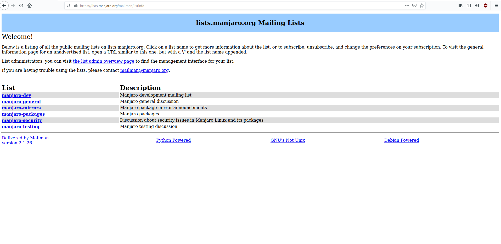

[[wiki]]
=== Wiki
Wikis sind heute viel mehr als reine Wissensspeicher. Sie ersetzen für erfahrene Anwender –
zumindest teiweise – die Dokumentation.
(((Wiki)))

link:url[https://wiki.manjaro.org/index.php/Main_Page]

.Das Wiki lebt von der Mitarbeit der Anwender!
image::images/de/wiki.png[scale=100]

[NOTE]
--
Manchmal ist ein Blick über den Tellerrand hinaus sinnvoll. So
finden Sie auch viele für Manjaro nützliche Informationen in den Wikis
von Arch Linux +
link:url[https://wiki.archlinux.org/index.php/Main_page]
 + 
und Ubuntu  + 
link:url[https://wiki.ubuntuusers.de/Startseite/].
--

[[administration]]
== Das System verwalten

Es gibt einige Aufgaben, die Sie beim Umgang mit Manjaro unbedingt noch wissen sollten, um den Spaß an der Sache zu behalten. Hier geht es zunächst um die <<InstallationneuerSoftware,Installation neuer Software>> und das <<AnpassendesDesktopEnvironment,Anpassen des Desktop Environment>> sowie die <<InbetriebnahmeneuerHardware,Inbetriebnahme neuer Hardware>>.
(((System verwalten)))

[[InstallationneuerSoftware]]
=== Aktualisieren und die Installation neuer Software
[NOTE]
--
Die Software von Manjaro ist in sogenannten "`Paketen`" organisiert. Sie enthalten oft nur kleine Teile
komplexer Software und lassen sich einzeln aktualisieren und von anderen Programmen ebenfalls verwenden.
(((Software installieren)))

Über implizite Anhängigkeiten sorgen die Pakete dafür, dass die Software weiter laufen kann, auch wenn einzelne Teile noch nicht aktualisiert wurden.

Die in den Repositories von Manjaro enthaltenen Programme sind alle kostenfrei, so dass Sie sie problemlos ausprobieren können.

Mehr dazu finde Sie hier: <<x,¶>>.
--

Schon im normalen Betrieb meldet sich der Paket-Manager von Manjaro – er heißt Pamac-Manager – gelegentlich, wenn es aktualisierte Software in den Repositories gibt. Das entsprechende Icon in der _Statusleiste_ (dem "`Panel`") verfärbt sich und zeigt es so an.

.Es gibt Aktualisierungen! (Ausschnitt aus dem Panel)
image::images/de/aktualisieren.png[scale=100%,pdfwidth=200px]

Klicken Sie nun auf das Icon, startet der Pamac-Manager. Sie können ihn aber auch aus dem Desktop-Menü unter "`Software-Aktualisierungen`" und "`Software Hinzufügen/Entfernen`" aufrufen.

.Der "`Pamac-Manager`" zeigt Aktualisierungen an. *Übernehmen* startet die Aktualisierung.
image::images/de/aktualisieren1.png[]

.Pamac-Manager als universelles Installationsprogramm.
image::images/de/Pamac-Manager.png[]

[[Programmeinstallieren]]
In drei Modi _Duchstöbern_ (Software suchen), _Installiert_ (Software entfernen) und _Aktualisierungen_ (Software updaten) zeigt Pamac-Manager jeweils vorhandene Software an. Abhängig von den Einstellungen zeigt der Pamac-Manager auch Pakete aus den AUR an.
(((Software updaten)))
(((Software suchen)))
(((Software entfernen)))

Unter *Kategorien* befinden sich die Pakete nach Themenbereichen sortiert. Mit der oben links vorhandenen Lupe suchen Sie nach Paketnamen.
(((Pakete suchen)))
(((Software suchen)))

Am rechten Rand der Fenster finden Sie einen Button zum *Installieren* bzw. *Entfernen* installierter Software. *Übernehmen* startet die Installation. Natürlich müssen Sie sich für diese administrative Aufgabe zunächst authentifizieren...

.Bevor Sie etwas installieren, erhalten Sie unter *Details* zusätzliche Informationen zu dem ausgewählten Paket.
image::images/de/details.png[]

Scrollen Sie in diesem Fenster einmal nach unten, dort befinden sich manchmal noch zusätzliche Informationen.

Das gilt auch für *Abhängigkeiten*. Dieses Fenster zeigt an, wie das ausgewählte Paket mit anderen Paketen interagiert. Unter *Hängt ab von* sind die Pakete aufgeführt, die notwendig sind und gegebenenfalls automatisch mit installiert werden. Unter *Optionale Abhängigkeiten* stehen Pakete, die zusätzliche Funktionen bereitstellen und eventuell auch noch installiert werden sollten. Das muss der Anwender aber selbst entscheiden.

._Was_ nun _genau_ im System installiert wird, finden Sie unter *Dateien*.
image::images/de/pamac-dateien.png[]

.Mit dem kleinen, nach rechts zeigenden Pfeil, wechseln Sie in ein neues Fenster, in dem der Pamac-Manager die Details der Installation zeigt.
image::images/de/pamac-Pfeil.png[]

Sie müssen sich dies nicht ansehen, wenn Sie nicht wollen. Geht mal etwas schief, finden Sie hier aber zusätzliche Informationen, die Ihnen helfen können, die Ursachen zu ergründen.

Es gibt eine Reihe von interessanten Alternativen zu dem Pamac-Manager, die ihre Stärken in anderen Bereichen haben.<<x,¶>> beschreibt sie.

==== Pamac und die Mirrors
Eine Liste mit den Servern, von der Pakete für Ihren Computer geladen werden können, heißt
"`Mirror-List`". Sie wird nach der Geschwindigkeit sortiert, mit der die Server die Pakete ausliefern können. Dies verändert sich immer wieder und eine aktuelle Mirror-List stellt sicher, dass die derzeit schnellsten Server verwendet werden. 
(((Mirror-List)))

.Pamac kann diese Liste automatisch aktualisieren. In den Einstellungen von Pamac findet sich eine entsprechende Option.
image::images/de/pamac-mirrors.png[]

Mehr zur Konfiguration von Pamac-Manager finden Sie hier: <<x,¶>>.

[[AnpassendesDesktopEnvironment,Anpassen des Desktop Environment]]
=== Anpassen des Desktop Environment

Das Xfce Desktop Environment wird bei Manjaro mit gut gewählten Voreinstellungen ausgeliefert.
Dennoch gibt es gute Gründe, das Eine oder Andere noch anzupassen. Es gibt überraschend viele Möglichkeiten. Die wichtigsten lassen sich mit dem Werkzeug *xfce4-settings-manager* (im Menü unter dem Namen _Einstellungen_ zu finden) vornehmen.
(((Settings)))

NOTE: Die anderen Desktop Environments und sogar eine Window Manager verfügen über ähnliche, vergleichbar funktionierende Programme.

[[XfceSettingsManager]]
==== Der "`Xfce Settings Manager`" ("`Einstellungen`")
Anstatt auf ein komplexes Programm für die Konfiguration aller Aspekte eine Xfce Desktops zu setzen, wurde ein anderer Weg gewählt: In einem Übersichtsfenster, dem  "`__Xfce Settings Manager__`" – *Einstellungen* im Desktop-Menü – finden sich viele kleine Programme, die jeweils nur einen speziellen Aspekt der Umgebung anpassen können. 

.Der  "`*Xfce Settings Manager*`" besteht aus vielen kleinen Programmen.
image::images/de/xfce-settings-manager1.png[]

Was die jeweiligen Programme genau machen, können Sie dem Icon und der Kurzbeschreibung entnehmen, die Xfce anzeigt, wenn Sie den Mauszeiger über einem Icon platzieren, ohne zu klicken.

Alle Xfce Desktop Environments bei allen Linux-Distributionen – beispielsweise auch unter Ubuntu – lassen sich mit diesem Werkzeug anpassen.
Viele Details dazu enthält <<x,¶>>.

[[ManjaroSettingsManager]]
==== Der "`Manjaro Einstellungs-Manager`"

Von besonderer Bedeutung für Manjaro ist der  "`Manjaro Settings Manager`". Sie finden ihn unter "`Manjaro Einstellungen`" _im_ "`Xfce Settings Manager`". Er wurde speziell für Manjaro entwickelt und sollte immer verwendet werden, wenn das möglich ist, da er direkt auf Manjaro abgestimmt wurde.

.Sprachpakete
Für einige Programme befinden sich die Spracheinstellungen in gesonderten Paketen, um die eigentlichen Programmpakete nicht unnötig aufzublasen. Diese Sprachpakete müssen gesondert installiert werden, etwa für die Bildbearbeitung GIMP oder Firefox-Browser. Mit dem Programm *Sprachpakete* aus dem Manjaro Einstellungs-Manager lassen sich diese Pakete gezielt installieren oder auch löschen.

.Der *Manjaro Einstellungs-Manager* enthält bisher nur eine kleine Anzahl von besonders wichtigen Einstellungen
image::images/de/ManjaroSettingsManager.png[scale=100]

Im ersten Schritt – unter _Verfügbare Sprachpakete_ finden Sie die für die auf Ihrem System installierte Software relevanten Sprachpakete. Mit dem Häkchen legen Sie fest, welche Sprachpakete sie installieren wollen. So ist es beispielsweise nicht erforderlich, sowohl die englische als auch die deutsche Version der Sprachpakete für den Firefox-Browser zu installieren, eine Sprache reicht normalerweise. Der Button *Pakete installieren* führt die Installation durch.

In einem zweiten Reiter _Installierte Sprachpakete_ zeigt Ihnen das Programm im Detail an, welche Sprachpakete derzeit installiert sind.

NOTE: Sprachpakete sind teilweise recht umfangreich. Daher sollten Sie nur die wirklich benötigten Pakete installieren und gegebenenfalls nicht mehr benötigte löschen, um den Festplattenplatz zu schonen.

Die weiteren Einstellungen in diesem Manager erklärt <<x,¶>>.

[[InbetriebnahmeneuerHardware]]
=== Einen Drucker konfigurieren

Lange Zeit war es unter Linux nicht ganz einfach, einen beliebigen Drucker dazu zu bringen, dass er
halbwegs gut funktionierte. Heute ist es eher das Ziel, dass er optimale Ergebnisse liefert. Glücklicherweise hat sich das durch bessere Unterstützung der Hersteller mit Treibern inzwischen geändert. Dazu kommt, dass Manjaro eine gute Hardware-Erkennung besitzt, die Ihnen viele Aufgaben abnimmt.
(((Drucker konfigurieren)))
(((Drucker)))

Installieren Sie mit dem Pamac-Manager die Pakete "`manjaro-printer`" und "`system-config-printer`". Über "`Abhängigkeiten`" ziehen diese Pakete eine ganze Reihe zusätzlicher Pakete nach sich, so dass die Installation einen Moment dauert. 
(((system-config-printer)))
(((manjaro-printer)))

Anschließend finden Sie im Desktop-Menü unter *Einstellungen* nun den neuen Eintrag *Druckereinstellungen*.

.Einen neuen Drucker einrichten geht über *Druckereinstellungen*. Rufen Sie das Programm als normaler Anwender auf, müssen Sie es zunächst mit Ihrem Passwort *Entsperren*, um diese administrative Aufgabe ausführen zu können.
image::images/de/printer-0.png[scale=75%,pdfwidth=300px]

.Das Programm startet mit einem fast leeren Fenster, da noch keine Drucker in das System eingebunden sind. *Hinzufügen* startet den Vorgang.
image::images/de/printer-1.png[scale=75%,pdfwidth=300px]

Sobald ein Drucker angeschlossen wurde, kann Manjaro diesen suchen. Mit wenigen Schritten nehmen Sie dann die erforderlichen Einstellungen vor. Zunächst wählen Sie das Drucker-Modell aus.

Bei der Wahl eines Treibers haben Sie oft mehrere Möglichkeiten. Erfahrungsgemäß sind die Treiber des _Gutenprint_-Projekt recht gut, weil sie schnell und mit guter Qualität arbeiten.
(((Gutenprint)))

NOTE: Sollte ein Drucker einmal nicht erkannt werden – was anscheinend manchmal bei sehr billigen Modellen der Fall sein kann – , scheuen Sie sich nicht, im Forum nachzufragen, ob es dafür eine Lösung gibt.

.Am Ende der Konfiguration fragt das Programm nach, ob eine Testseite gedruckt werden soll. Ein fertig konfigurierter Drucker erscheint dann in der Druckerübersicht.
image::images/de/printer-fertig.png[scale=75%,pdfwidth=600px]

Mit der rechten Maustaste können Sie weitere Einstellungen für die hier aufgeführten Drucker vornehmen.

Hier finden Sie mehr dazu: <<x,¶>>.

.Einen neuen Drucker konfigurieren
image::images/de/printer-configurieren.png[]

=== Pacman
Die Befehlszeile ist bei vielen Anwendern zunächst sehr unbeliebt. Zu Unrecht, wie wir finden. Anhand der
Paket-Managers _Pacman_ zeigen wir hier, wie einfach die Anwendung ist. <<x,¶>> erklärt die Befehlszeile im Detail.
(((Pacman)))
(((Befehlszeile)))

NOTE: Viele Befehle sind implizite Wortspiele oder Spielereien. _Pacman_ entstand aus den Worten "`**pac**kage **man**ager`". _Pamac_ kehrt die Reihenfolge der Buchstaben um (und verkürzt das Wort, typisches Wortspiel unter Linux)

==== Synchronisieren

Die Pakete in den Repositories werden ständig erneuert. Fehler werden korrigiert, neue Features kommen
hinzu. Um festzustellen, welche auf dem lokalen System vorhandenen Pakete erneuert werden müssen, erfolgt eine Synchronisation, bei der der Paket-Manager die Informationen über die neuen Pakete – nicht die Pakete selbst – mit denen auf den Computer vergleicht.
(((Synchronisieren)))

[listing]
sudo pacman -Sy

Dies synchronisiert die Informationen. Um das Laden der Informationen zu erzwingen, wird die Option `y` verdoppelt.

[listing]
sudo pacman -Syy

==== Software updaten
Das Synchronisieren kann direkt mit einem Update verbunden werden:
(((Updaten)))

[listing]
sudo pacman -Syu

Diesen Vorgang sollten Sie regelmäßig ausführen, um Ihr System aktuell zu halten. (Pamac-Manager macht das aber auch automatisch.)

==== Software suchen
Um Pakete zu suchen, wird die Option `-Ss` verwendet:
(((Software suchen)))

[listing]
sudo pacman -Ss leafpad

==== Software installieren
Die Information ist noch einfacher:
(((Software installieren)))

[listing]
sudo pacman -S leafpad

NOTE: Pacman löst dabei alle Abhängigkeiten automatisch auf und lädt alle benötigten Pakete.

==== Software löschen

Analog zur Information lassen sich Pakete unter Angabe ihres Namens löschen:

[listing]
sudo pacman -R leafpad

Die als Abhängigkeiten mit installierten Pakete verbleiben dabei im System. Um dies zu verhindern und sie mitzulöschen, wird `-Rs` verwendet:

[listing]
sudo pacman -Rs leafpad

Hat ein Paket Konfigurationsdateien angelegt, die der Anwender vielleicht noch verändert hat, sollen diese eventuell behalten werden, um bei einer späteren Neuinstallation die Konfiguration nicht nochmals durchführen zu müssen. Daher verbleiben diese Konfigurationsdateien normalerweise im System (genauer gesagt: Im Homeverzeichnis des Anwenders). Sollen sie auch mit entfernt werden, geschieht das so:

[listing]
sudo pacman -Rns leafpad

Um sicherzustellen, dass nur solche Pakete im System vorhanden sind, die auch wirklich explizit vom Anwender installierten wurden, lassen sich alle anderen so löschen:

[listing]
sudo pacman -Rns $(pacman -Qtdq)

WARNING: Das ist ein Befehl mit weitreichenden Konsequenzen. Wenden Sie ihn nur an, wenn Sie sich der Folgen bewusst sind.

==== Weitere Pacman Aktionen

Pacman ist ein mächtiger Befehl, der _vieles_ kann. Was alles, verrät ein Blick in die Originaldokumentation, die sogenannte "`ManPage`" (für: **man**ual). Das Anzeigeprogramm für diese Seite heißt: ... `man`. So zeigt es die Seiten zu Pacman an:

[listing]
--
man pacman

To exit, press q.
--

=== Die Mirror-List aktualisieren
Um die Mirror-List zu aktualisieren wird Pacman-Mirrors so eingesetzt:
(((Mirror-List)))

[listing]
$ sudo pacman-mirrors -f 0
::INFO Using default mirror file
::INFO Querying mirrors - This may take some time
  0.205 Australia      : https://manjaro.lucassymons.net/
  0.239 Austria        : http://mirror.inode.at/manjaro/
  0.249 Austria        : http://mirror.easyname.at/manjaro/
  0.729 Austria        : ftp://mirror.easyname.at/manjaro/
...
::Sweden          : https://mirror.zetup.net/manjaro/stable
::China           : https://mirrors.tuna.tsinghua.edu.cn/manjaro/stable
::United_States   : https://mirror.dacentec.com/manjaro/stable
::China           : https://mirrors.tuna.tsinghua.edu.cn/manjaro/stable
::INFO Mirror list generated and saved to: /etc/pacman.d/mirrorlist

Dies bewirkt automatisch, dass Pacman ab nun die Pakete von den schnellsten Servern holt. 
(((Pacman-mirrors)))

==== Mirrors manuell auswählen

Manchmal möchte man die Server selbst auswählen, von denen die Pakete geholt werden. Das ist mit 
`sudo pacman-mirrors -i` möglich.

.`sudo pacman-mirrors -i`
image::images/de/manuell-mirror.png[scale=100]

Wollen Sie dann wieder die automatisch erstellte Mirror-List verwenden:

[listing]
sudo pacman-mirrors -f

==== Vorab- und Test-Systeme ausprobieren
Von Manjaro gibt es Vorab- und Test-Versionen. Die sind aktueller als die "`normalen`" Varianten,
aber dafür weniger stabil. Wer mithelfen möchte, diese Version zu testen, kann die Pakete aus speziellen Repositories laden. 
(((Switching branches)))
(((Branches)))

Eine entsprechende Mirror-List wird so erstellt:

[listing]
sudo pacman-mirrors -f -a -B testing

Die dort vorgehaltenen Pakete wurden schon von den Entwicklern getestet, sollten also funktionieren. 
Einen Schritt weiter geht "`unstable`". Diese Pakete sind brandneu und weitgehend ungetestet. So werden sie ins System eingespielt:

ifdef::asciidoctor[[.text-left]]
* Eine Mirror-List erstellen:
+
[listing]
sudo pacman-mirrors -f -a -B unstable

* Dann werden die Pakete aktualisiert:
+
[listing]
sudo pacman -Syyu

Wer die Nase voll davon hat, wechselt zurück zu den Repositories mit den stabilen Paketen:

[listing]
sudo pacman-mirrors -f -a -B stable

Damit die zuvor eingespielten unstabilen Pakete wieder durch ihre stabilen Varianten ersetzt werden, ist dieser Befehlsaufruf notwendig:

[listing]
sudo pacman -Syyuu

=== Probleme beim der Paketverwaltung

Überraschend selten geht bei der Paketverwaltung etwas schief. Aber natürlich kann es vorkommen, dass beim Update von Paketen irgend etwas nicht so läuft, wie es sollte. 

Ein typisches Problem sieht beispielsweise so aus:

[listing]
:: Synchronising package databases...
error: failed to update core (unable to lock database)
error: failed to update extra (unable to lock database)
error: failed to update community (unable to lock database)
error: failed to update multilib (unable to lock database)
error: failed to synchronise any databases
error: failed to init transaction (unable to lock database)
error: could not lock database: File exists
  if you're sure a package manager is not already running,
  you can remove /var/lib/pacman/db.lck

In diesem Beispiel läuft bereits irgendwo ein Pacman Programm, möglicherweise in einem anderen Terminal, oder der automatische Update-Service ist gerade im Hintergrund aktiv, oder, oder, oder....

Damit verschiedene Pacman Programme ("`Instanzen`") sich nicht in die Quere kommen, wird ein Mechanismus verwendet, der verhindert, dass ein neu aufgerufenes Pacman Programm startet, bevor das schon laufende beendet wurde. Die Datei `/var/lib/pacman/db.lck` wird direkt beim Programmstart erzeugt und am Ende wieder gelöscht. Existiert sie bereits, erkennt das Pacman und beendet sich mit einer Fehlermeldung.

Es könnte aber auch sein, das ein Pacman Programm einmal nicht mehr in der Lage war, diese Datei zu löschen und nun keine Updates mehr möglich sind.

Diese Datei einfach zu löschen, ohne sicher zu sein, dass keine Pacman Instanz mehr läuft, würde den Sicherheitsmechanismus außer Kraft setzen und wäre töricht...

Testen wir, ob noch eine Pacman Instanz läuft:

[listing]
ps x | grep pacman

Der erste Teil (`ps x`) schaut nach, welche Prozesse (bzw. Programme) gerade laufen. Der zweite (`grep pacman`) findet heraus, ob Pacman dabei ist. Das Pipe-Symbol verbindet die Ausgaben des ersten mit der Eingabe des zweiten.

// ----
// ps x | grep pamac

// ps x | grep octopi
// ----

Ist das nicht der Fall, kann die Datei gelöscht werden:

[listing]
sudo rm /var/lib/pacman/db.lck

Nun sollten Updates wieder möglich sein.

In manchen Fällen hilft aber nur eine rabiatere Methode:

----
sudo rm -f /var/lib/pacman/db.lck <1>
sudo pacman-mirrors -g            <2>
sudo pacman -Syyuu                <3>
sudo pacman -Suu                  <4>
----

<1>  die Lock-Datei entfernen
<2>  die Mirror-Liste erneuern
<3>  Paketlisten zwingend erneuern, Pakete aktualisieren
<4>  alle Pakete mit den aktuellen Repositories synchronisieren

=== Mehr Informationen

Vergessen Sie nicht... Das Wiki enthält viele nützliche Informationen:
 +
 link:url[https://wiki.manjaro.org/]

Und im Forum kann man Fragen  stellen:
 +
 link:url[https://forum.manjaro.org/]. 

Hier findet sich auch eine noch umfangreichere Installationsbeschreibung für Window 10 Anwender, die auf zusätzliche Probleme mit diesem Betriebssystem eingeht:

https://forum.manjaro.org/t/root-tip-dual-boot-manjaro-and-windows/1164

Und ein Ausblick, wie es vielen Windows 10 Anwendern geht: Die ersten sechs Monate sind hart, aber dann kommt der Spaß...:

https://forum.manjaro.org/t/howto-become-a-manjaro-power-user-when-youre-a-wizard-at-windows-but-a-n00b-at-manjaro/13646

[appendix]
include::glossar.adoc[]

:sectnums!:
[[x,¶]]
== ¶: Anwenderhandbuch Manjaro

Karsten Günther: _Anwenderhandbuch Manjaro_, 2021, NeoBooks.de

Ein Ausschnitt aus dem Buch:

include::mounten.adoc[]

:sectnums:

[index]
== Index

//////////////////////////////////////////////////////////////// 
[[Glossar]]gart
[[Paketmanager]]e
[[x]]x
[[DesktopEnvironment]]x
[[Kernel]]a

////////////////////////////////////////////////////////////////
//* Local Variables: */
//* time-stamp-pattern: "4/static char const \\*ts = \"%f %:y/%02m/%02d %02H:%02M:%02S \";" */
//* End: */
