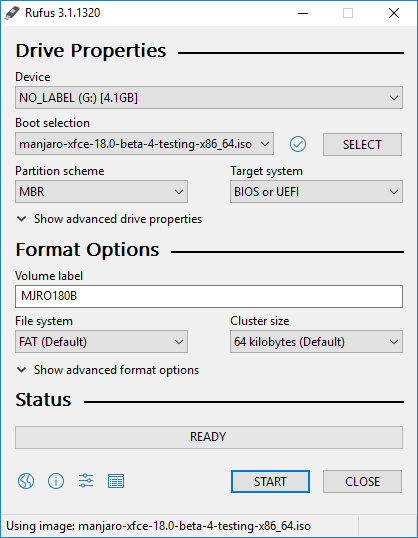
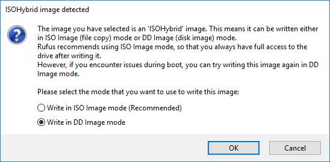
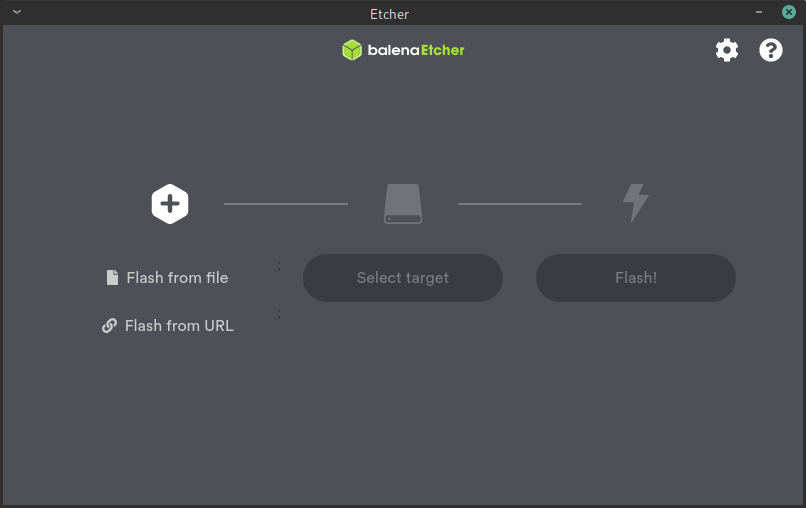
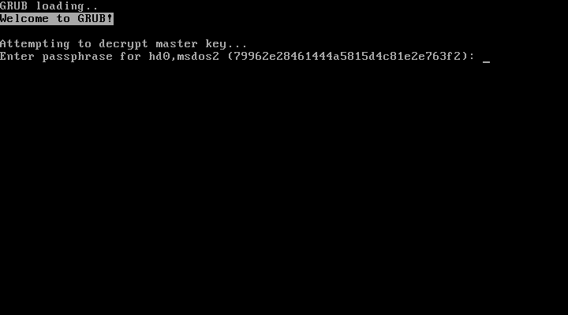
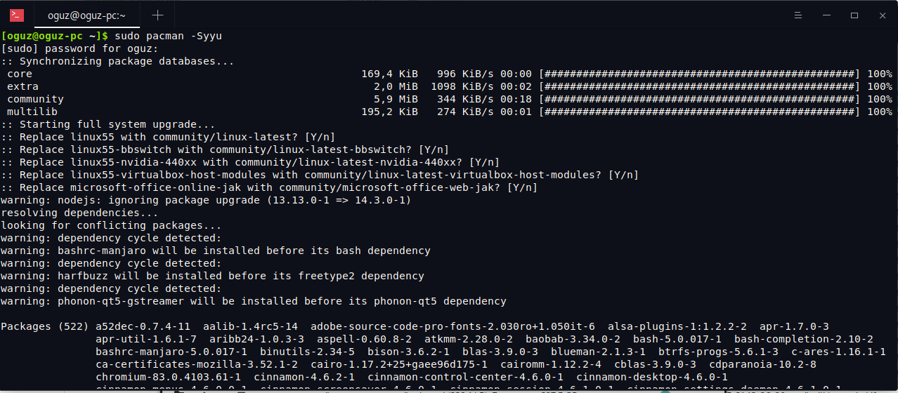

= Manjaro Linux User Guide
 The Manjaro Development Team
:toc: macro
:doctype: book

flushleft [.text-left]

Copyright (C) 2020 the Manjaro Development Team.
(((Licence, documentation)))

// [.text-left]
Licensed under the Attribution-ShareAlike 4.0 International Licence
(the "`Licence`"); you may not use
this file except in compliance with the License. You may obtain a
copy of the Licence at: +
link:url[https://creativecommons.org/licenses/by-sa/4.0/legalcode]

// [.text-left]
Unless required by applicable law or agreed to in writing, software
distributed under the Licence is distributed on an "`as is`" basis,
without warranties or conditions of any kind, either express or implied.
See the Licence for the specific language governing permissions and
limitations under the Licence.

// [.text-left]
The source code for this documentation can be downloaded from:+
link:url[https://gitlab.manjaro.org/documentation/manjaro-user-guide]

image:images/cc-by-sa.png[scale=100]

:sectnums!:
== The Manjaro Development Team
:sectnums:
(((Manjaro Development Team, The)))

:sectnums!:
=== Core Team
:sectnums:

Philip Müller:: Project Lead Developer

Bernhard Landauer:: Developer

Artem Grinev:: Developer

Guillaume Benoit:: Developer

Stefano Capitani:: Developer

Frede Hundewadt:: DevOps | Engineer | SysAdmin

Matti Hyttinen:: Developer

Dan Johansen:: ARM Lead Developer

Josh Josh:: ARM Developer

Vitor Lopes:: Web Developer

Helmut Stult:: Developer | Speaker

Bogdan Covaciuy:: Designer | Illustrator

Oğuz Kağan Eren:: Developer

Tobias Schramm:: ARM Kernel Developer

Furkan Kardame:: ARM Developer

Ray Sherwin:: ARM Developer

:sectnums!:
==== Alumni
:sectnums:

Roland Singer:: Founder, Designer, Developer, Web Developer, Administrator

Carl Duff:: Community, Documentation and Wiki Management, Scripting
and Configuration

Cumali:: Cinnamon and Gnome Community Editions Maintainer

Dan S.:: Openbox Editions Maintainer

Handy:: Global Moderator, Wiki Contributor, Community Support

Joshua Strot:: Developer, Graphics Developer

Ramon Buldó:: Developer, Packager

Rob McCathie:: Maintainer

Marcus:: Developer, Packager

Teo Mrnjavac:: Developer

Alexandre A. Arnt:: Developer, Moderation

Ringo de Kroon:: Community

Hugo Posnic:: Developer

David Linares:: Designer

Jonathon Fernyhough:: Editor of the User Guide 0.8.9-0.8.13, 15.09-15.12,
Community Management, Cover art of the User Guide

Sabras:: Wiki

Manuel Barrette:: Editor of the User Guide 16.08-18.0, French
translation of the User Guide 17.0-18.0

Karsten T. Günther:: German Translator

Jonathon Fernyhough:: Community Lead | Sysadmin | Developer *(Thanks a lot to him for starting to write the guide)*

:sectnums!:
=== Acknowledgements
:sectnums:

The awesome community on link:url[forum.manjaro.org] and link:url[#manjaro]

:sectnums!:
=== A note about Manjaro and Arch
:sectnums:

Manjaro is based on another distribution called Arch Linux. As such,
it is also able to draw software packages from the community-maintained
Arch User Repository (AUR). However, please note that Manjaro is not
Arch, and any enquiries about the Manjaro operating system should
be directed towards the Manjaro forums and Official Manjaro Telegram
channels alone. For example, although Ubuntu is derived from Debian
- and therefore shares some similarities with its parent - there are
still substantial differences between these operating systems and
how they work. Such is the case with Manjaro, which is far from just
being an "`easy to install`" or "`pre-configured`" Arch operating
system. Here are some of the key differences between the Manjaro and
Arch operating systems:

* Manjaro is developed independently from Arch, and by a completely
different team.

* Manjaro is designed to be accessible to newcomers, while Arch is aimed
at experienced users.

* Manjaro draws software from its own independent repositories. These
repositories also contain software packages not provided by Arch.

* Manjaro provides its own distribution-specific tools such as the Manjaro
Hardware Detection (MHWD) utility, and the Manjaro Settings Manager
(MSM).

* Manjaro has numerous subtle differences in how it works when compared
to Arch.

To reiterate, although Manjaro is indeed an Arch-derivative, it is
not Arch!

toc::[]

== Introduction
(((Introduction)))

=== About Manjaro

*Manjaro* is a user-friendly *GNU/Linux* distribution
based on the independently developed *Arch Linux*. Within the
Linux community, Arch itself is renowned for being an exceptionally
fast, powerful, and lightweight distribution that provides access
to the very latest cutting-edge software. However, Arch is also traditionally
aimed at more experienced or technically-minded users. As such, it
is generally considered to be beyond the reach of many, especially
those who lack the technical expertise (or persistence) required to
use it.

Developed by a worldwide team, Manjaro aims to provide all of the
benefits of Arch Linux combined with a focus on user-friendliness
and accessibility. Manjaro is suitable for newcomers as well as experienced
Linux users. For newcomers, a user-friendly installer is provided,
and the system itself is designed to work fully"`straight out of
the box`" with features including:

* Pre-installed desktop environments

* Pre-installed graphical applications to easily install software and
update your system

* Pre-installed codecs to play multimedia files

* Pre-installed access to the latest games

=== Features
(((Features)))

Manjaro shares many of the same features as Arch, including:

* Speed, power, and efficiency

* Access to the very latest cutting- and bleeding-edge software

* A "`rolling release`" development model that provides the most up-to-date
system possible without the need to regularly install a new operating
system release

* Access to the Arch User Repositories

* The versatility to be shaped and moulded in every respect to suit
personal taste and preference.

However, Manjaro boasts a few extra features of its own, including:

* A simplified, user-friendly installation process

* Automatic detection of your computer's hardware (e.g. graphics cards)

* Automatic installation of the necessary software (e.g. graphics drivers)
for your system

* Dedicated software repositories that deliver fully tested and stable
software packages

* Support for the easy installation and use of multiple kernels

.Welcome to Manjaro!
image::images/boot/welcome-live.png[scale=100]

=== Important note: End of 32-bit support

Starting with Manjaro 17.1, 32-bit support has been dropped and only
64-bit builds of the disc images will be released. If you are using
a 32-bit system, a new project called _Manjaro-32_{blank}footnote:[link:url[https://manjaro32.org/]]
has recently been started, but is still in development. For a list
of some Linux distributions that still support 32-bit systems, please
see this page: link:url[https://archived.forum.manjaro.org/t/list-of-distributions-for-32-bit-x86-hardware-wiki/31969].

= Getting Manjaro

== Downloading  Manjaro
(((Downloading)))

=== Manjaro editions
(((Editions)))

There are four official editions of Manjaro available for download, as
well as a number of unofficial "`community`" 
editions.

NOTE:To download Manjaro go to this web
address:link:url[https://manjaro.org/get-manjaro/]

With the exception of the _Architect_ edition, they come complete with
a pre-installed desktop environment and a selection of popular
software applications, and either of these would be a great choice for
anyone who wants to try out Manjaro on a Live-CD without having to
install it first. If you have the time it's worth taking each for a
test run to see which you like best!

NOTE:When you purchase retail software it generally
comes on a disc, whether a CD or a DVD. A "`Live-CD`"  has a version of
the operating system that will run without needing to be
installed. This is a feature of most GNU/Linux and BSD-based operating
systems.

Xfce:: The Xfce desktop environment is designed to be lightweight
while retaining a familiar desktop interface. If you're not sure which
edition to choose, this one is a good bet. Xfce edition disc image
files start with *manjaro-xfce*.

KDE:: This version includes the K Desktop Environment. It offers
a highly integrated environment with plenty of functionality and options.
It is also highly customizable and offers a slightly different feel
than the other editions. KDE edition disc image files start with 
*manjaro-kde*.

GNOME:: This edition of Manjaro includes the GNOME desktop, which
is part of the GNU project. It offers an unconventional but intuitive
desktop aiming to help productivity. It comes with a very complete
and aesthetically coherent set of applications to fill the most common
needs. GNOME edition disc image files start with *manjaro-gnome*.

Architect:: This edition does not come with a preinstalled desktop
like the other three. Instead, you are offered the opportunity to
tailor your Manjaro installation the way you want it to be by choosing
which packages to install. It can also be used to install any of the
other available editions, either official or community ones. This
edition is not meant for beginners, but more for intermediate and
advanced users. Architect edition disc image files start with
*manjaro-architect*.

[[fig1]]
[cols="2*^"]
|===
2+|image:images/boot/welcome-live.png[width=500px,pdfwidth=600px]
2+|Xfce edition
|image:images/getting-manjaro/kde.png[width=300px]
|image:images/getting-manjaro/gnome.png[width=300px]
|KDE edition |GNOME edition
|===

=== Manjaro community editions

In addition to the four main Manjaro editions, there are a number
of editions that have certain software or desktop environments preinstalled.
This user manual assumes you are using the Xfce version, and all screenshots
will be from this. However, the installation process and other software
works in exactly the same way!

The edition names should give a clear indication of the desktop environment
(or window manager) they install. Unless you have a strong preference,
we suggest you stick with the Xfce version. You can of course change
later, or install other desktop environments too!

There are many community editions to choose from, including Cinnamon,
LXDE, Deepin, Budgie, Mate and many others The complete list is available
at link:url[https://manjaro.org/download/].

=== Downloading a disc image

Every release of Manjaro is available for download, whether the current
stable release or upcoming preview releases. When you visit the download
page you will find a link to each of the four main editions , as well
as a checksum file for each. A checksum can be used to check the integrity
of the disc image file you download to make sure it hasn't been corrupted
during the download. This will be covered in the next chapter.

Stable releases:: of Manjaro are intended to be used by the general
public, so this will be the appropriate choice for the majority of
users. The current Manjaro release can always be downloaded from the
Get Manjaro page.footnote:[link:url[https://manjaro.org/get-manjaro/]]

Development releases:: of Manjaro give you a glimpse of what is
to come soon in the stable release. Do keep in mind that it is not
as solid as the stable release and should not be used on a production
machine. It is mainly intended for testing purposes. The latest development
release available can be downloaded from the Manjaro Preview Releases
page.footnote:[link:url[https://forum.manjaro.org/tags/c/announcements/releases/19/testers_wanted]]

== Checking a downloaded disc image for errors
(((errors, Checking for)))

Before burning your downloaded disc image (or using it as a virtual
disc in VirtualBox{blank}footnote:[link:url[https://www.virtualbox.org/]]) we
strongly recommend that you first check that it hasn't been corrupted.
The potential result of not checking first, especially if you want
to install Manjaro as your main operating system, should be obvious.
In the best case, the installation will fail. In the worst case a
corrupted image will result in a corrupted installation.

To verify the integrity of the disc image you have to download the
appropriate checksum file, checksum files can be found at footnote:[link:url[https://osdn.net/projects/manjaro/storage/]].
For example, the file *manjaro-xfce-19.0-200224-linux54.iso*
contains the SHA-1 checksum hash for a preview realease of the Xfce
disc image and will have content similar to this:

[listing]
4464678318bbf418990c77cb7f6ed28c2bbfa337  manjaro-xfce-19.0-200224-linux54.iso

=== SHA-1

SHA and others like MD5 are different types of hashing algorithms;
the "`sha`" part of the checksum file name stands for *Secure
Hash Algorithm*. These algorithms are used to generate a hash code
unique to the disc image file. The checksum file itself is just a
text document that contains hash codes that should match the code
generated by the MD5 or SHA algorithms. Copies of the file can be
checked to make sure they are exactly the same - if the file is changed
in any way, either intentionally or by corruption, the code generated
will be different.

Whilst MD5 is commonly used, SHA-1 and SHA-256 are newer and more
secure and are beginning to replace MD5. For the purpose of checking
the integrity of the downloaded file MD5 is "`good enough`" but
SHA-1 is a better solution. The checking process is the same for both
algorithms. For more about hashing algorithms Wikipedia has lots of
information.footnote:[link:url[https://en.wikipedia.org/wiki/Secure_Hash_Algorithm]]

If the code generated from the disc image matches that contained in
the checksum file, then the disc image file is fine. If the two codes
don't match then it means that the disc image file has changed in
some way, most likely due to being corrupted. You can think of it
like someone using a password to identify who they are: if they provide
the wrong password, then something is probably wrong.

From this point on we'll assume you are using the file *manjaro-xfce-19.0-200224-linux54.iso.sha1*.

=== Checking in Linux

==== Automatic verification

The program `sha1sum` can automatically compare the checksum
of the disc image you downloaded against the value in the text file.
The process should be very straightforward!

For this example, I first open a terminal and change to the directory
where I downloaded the disc image file and checksum file, checksum
files can be found at footnote:[link:url[https://osdn.net/projects/manjaro/storage/]].
I use the command `ls` to check which files are present:

----
jonathon@box:~$ cd download

jonathon@box:~ /download$ ls

manjaro-xfce-19.0-200224-linux54.iso.sha1  manjaro-xfce-19.0-200224-linux54.iso
----

As you can see I have downloaded the 64-bit Xfce edition. Next, I
run the `sha1sum` program to check against the value in the
checksum file:

[listing]
jonathon@box:~ /download$ sha1sum -c manjaro-xfce-19.0-200224-linux54.iso.sha1

The line below shows the result of the checks. In this case, it shows
that `sha1sum` has successfully verified the disc image I downloaded
against the checksum value in the file.

[listing]
manjaro-xfce-19.0-200224-linux54.iso: OK

If it failed, I'd need to download the image again...

==== Manual verification

To manually check the integrity of your downloaded file, first open
the downloaded *manjaro-xfce-19.0-200224-linux54.iso.sha1*
checksum file using a text editor such as Gedit, checksum files can
be found at footnote:[link:url[https://osdn.net/projects/manjaro/storage/]].
Once the checksum file has been opened, and the code is visible, open
up your terminal and change to the directory where your downloaded
disc image is stored.

For example, if your disc image file is located in a directory named
`download`, you would first change to that directory:

[listing]
jonathon@box:~$ cd download

Then you can generate an SHA-1 hash code for the disc image using:

[listing]
jonathon@box:~ /download$ sha1sum manjaro-xfce-19.0-200224-linux54.iso

This command generates a hash code for the 64-bit Manjaro Xfce disc
image which can then be manually compared to the code contained in
the checksum file.

=== Checking in Microsoft Windows

Unlike Linux, Microsoft Windows does not have any suitable built-in
tools so you will need to download and install a checksum utility
application. A web search will turn up several examples of free software,
or you can look on the *Download.com* website.footnote:[link:url[https://download.cnet.com/]]
Another free checksum utility which has positive reviews is *Raymond's MD5  & SHA Checksum Utility*.footnote:[link:url[https://raylin.wordpress.com/downloads/md5-sha-1-checksum-utility/]]
This is the program we will use in the following example.

.Verifying the checksum in Microsoft Windows using Raymond's MD5  & SHA Checksum Utility.
image::images/getting-manjaro/windows-checksum.png[scale=100]

Once you have downloaded the checksum utility, the checking process is
very straightforward. Simply *Browse* to the downloaded disc image,
select it, and click *Open*. The program will then calculate the
checksums for the disc image
file.

TIP: To speed up the process it's probably a good idea to
deselect the hashes you are not verifying.

To verify if the checksum is correct, open the
*manjaro-xfce-19.0-200224-linux54.iso.sha1* file in a text editor such
as Notepad, copy the checksum for the disc image file you have
downloaded, and paste it into the *Hash* verification box. Then click
*Verify*. If there are no problems with the disc image file the
program will inform you that the hash matched.

== Writing a disc image
(((Writing a disc image)))

A disc image is not a copy-and-paste duplication of files: it's a
bit-for-bit copy of the raw data that makes up the files and folders
of that disc. This is why just copying a disc image file to a disc
(or USB flash drive) to begin installing won't work: you'll need to
use a disc burning or image writing application to translate that
raw data into the files and 
folders.

NOTE: There is an exception to this rule. If you intend
on installing Manjaro in a virtual machine environment using Oracle's
VirtualBox, then there will be no need to burn the image as VirtualBox
will be able to read from the disc image file directly as a virtual
disc.

Once converted, the files can be used to run Manjaro in Live-CD mode
without having to install it to your system, and/or install Manjaro
on your system. It's important to note Manjaro will not have full
functionality when run in Live-CD mode. For example, you will not
be able to save any changes to the system.

Due to the amount of software included on the full edition disc images
you may need to use a DVD instead of a CD. Check the following table
as a guide if you're not sure:

.Manjaro Edition disc image file sizes

|===
|*Edition* | *Filename* | *Size* | *Media*

| Xfce | manjaro-xfce-19.0-200224-linux54.iso  | 2.55GB | DVD
|KDE | manjaro-kde-19.0-200224-linux54.iso  | 2.82 GB | DVD
|GNOME | manjaro-gnome-19.0-200224-linux54.iso  | 2.51 GB | DVD
|Architect | manjaro-architect-19.0-200223-linux54.iso  | 699.62 MB | CD
|===

Many people routinely use a DVD rather than a CD even for the smallest
disc image files. Not only is a DVD faster to burn but they allow
higher data access rates so the Live-CD loads faster and the installation
completes sooner.

However, with the increasing capacity and decreasing cost of USB flash
media{blank}footnote:[If your system will boot from a USB device, and you
have one of sufficient capacity that you can erase, we recommend the
use of a USB flash drive over traditional CD/DVD media.]
this presents an even more attractive method than the traditional
burning process; it is far faster and more flexible than using optical
media. Both CD/DVD burning and USB flash media installation methods
are covered in this guide.

=== Burning to a CD/DVD in Linux
(((Burning to a CD/DVD)))

If not already installed, several different software burning applications
should be available for installation from your distribution's Software
Center / Software Manager / Package Manager / repositories. Popular
burners include *XFBurn*, *K3b*, and 
*Brasero*.

NOTE: Xfce environments tend to include XFBurn. KDE
environments tend to include K3b. GNOME environments tend to include
Brasero.

Which one you choose is entirely down to personal choice, though
your operating system will usually install one suitable for your desktop
environment. To simplify things a little, the following steps for
burning your downloaded Manjaro disc image use Brasero.

==== Burning using Brasero

. Insert a blank CD/DVD. 
+
TIP: It's a good idea to use a rewriteable disc
(e.g. CD-RW or DVD-RW).  Although slightly more expensive individually
than a write-once disc you can reuse the disc again and again, for
example when the next version of Manjaro is released!

. Start the *Brasero* software burner.

. Click the *Burn Image - Burn an existing CD/DVD image to disc*
button to open the *Image Burning Setup* window.

. Click the button beneath the title *Select a disc image to
write* to open up your file manager. Locate and double-click the downloaded
disc image file to load it. Upon automatically returning to the 
*Image Burning Setup* window, note that the disc image file is now
listed as the disc image to write.

. The blank CD/DVD you inserted should be automatically listed underneath
the title *Select a disc to write to*. If not, click the button
to select it manually.

. Click the *properties* button to open the properties window,
and then click the button beneath the title *Burning Speed*.
We strongly recommend you select the slowest speed available. Once
selected, click the *Close* button.
+
NOTE: We strongly recommend you select the slowest speed
available when burning to disc in order minimise the possibility of
corruption during the burning process. +
It's also a good idea to avoid using any applications which make
intensive use of system resources while burning, and in particular
avoid heavy disc access. If the burner software can't read the disc
image file quickly enough the burning process can be interrupted.

. Click the *Burn* button to start the burning process. If necessary,
follow any on-screen instructions provided.

=== Burning to a CD/DVD in Microsoft Windosw

Newer versions of Microsoft Windows (Windows 7 and later) include
a disc image burner. If you do not have a newer version of Microsoft
Windows you will need to download one of the many free disc burning
software utilities.

==== Burning using Windows Disc Image Burner

Right-clicking on the disc image file and selecting *Burn disc
image* will start the *Windows Disc Image Burner* program.
This makes the process of burning to a disc very straightforward:

. Insert a blank CD/DVD into your disc drive.
. Start *Windows Disc Image Burner*.
. Select your CD/DVD drive in the *Disc burner* menu.
. Click *Burn*.

.Windows Disc Image Burner in Microsoft Windows 10

==== Burning using a third-party application

For versions of Microsoft Windows earlier than Windows 7 (e.g. Windows
XP) you may need to download and install third-party disc burning
software. There are many free examples available that will be found
by a web search, but here are some of the most popular:

.Third-party disc burning software for Microsoft Windows
|===
|*Name* | *Website* | *Video tutorial*

|Imgburn | link:url[http://imgburn.com/] | link:url[https://www.youtube.com/watch?v=XihCQgmeGV4]
|CDBurnerXP | link:url[https://cdburnerxp.se/en/] | link:url[https://www.youtube.com/watch?v=LxYkFdwn1qI]
|InfraRecorder | link:url[http://infrarecorder.org/] | 
|===

The burning process for each of these applications is similar, with
small differences in user interface. The websites listed above will
provide information about features and screenshots of the applications
themselves. Of course, it might also be worthwhile to take the time
to read around and choose one for yourself!

=== Writing to a USB flash drive in Linux
(((USB flash drive)))

To take advantage of the faster access times and much quieter nature
of a USB flash drive, there are a number of methods of writing the
disc image file. One of the easiest is to use *SUSE Studio
Imagewriter*.

.SUSE Studio Imagewriter link:url[https://en.opensuse.org/SDB:Live_USB_stick]
image::images/getting-manjaro/imagewriter-linux.png[scale=100]

_SUSE Studio Imagewriter_ should be available for installation
from your distribution's Software Center / Software Manager / Package
Manager / repositories. Once _SUSE Studio Imagewriter_ has been
downloaded and installed, ensure that your USB flash drive is plugged
in before starting the application.

The process of using _SUSE Studio Imagewriter_ is very straightforward:

. Click on the centre icon.
. Navigate to where you downloaded the disc image file, and select it.
. Ensure that your USB flash drive has been selected from the drop-down
menu.
. Click on the *Write* button.
. Once it has finished, reboot your system, making sure to select the
USB flash drive as the boot device in the BIOS menu (or its UEFI equivalent).

==== Using the CLI

If you don't want to install extra software, and you are comfortable
using the command line, there's an even easier way of writing a disc
image to a USB device.

. Connect the USB flash drive to your PC, open a terminal and `cd`
to where you downloaded the disc image.
. Check the device identifier with:` sudo fdisk -l`.
. Write the image with: +
`sudo dd if=manjaro-xfce-19.0-200224-linux54.iso of=/dev/(Device
identifier from above) bs=4M` +
 +
My USB drive is at `/dev/sdc` so I would use: +
`sudo dd if=manjaro-xfce-19.0-200224-linux54.iso of=/dev/sdc bs=4M` +
  +
To view how the writing process progresses, use the option `status=progress:` +
`sudo dd if=manjaro-xfce-19.0-200224-linux54.iso of=/dev/sdc bs=4M status=progress`

. Once completed reboot your system and boot from the USB drive by selecting
it as the boot device in the BIOS menu (or its UEFI equivalent).

=== Writing to a USB flash drive in Microsoft Windows

==== Rufus

For Windows users using USB media, Rufus{blank}footnote:[link:url[https://rufus.akeo.ie/]] is highly recommended.

Select the USB key to be used in the _Device_ menu. Then, on
the line beginning with _Boot selection_, click on _Select_
to select your downloaded disc image, and then _Start_. After
doing so, select *DD Image* in the window that appears.

.Rufus with recommended settings

==== Etcher

Another recommended piece of software is Etcher.footnote:[link:url[https://etcher.io/]]
It is incredibly simple to use. All you have to do is select the disc
image, the USB drive, and start flashing the image!

.Etcher

= Installing Manjaro

== Booting the Live environment
(((Live environment)))

Booting the Live environment, whether from CD/DVD or USB flash drive,
will give you an overview of the Manjaro Linux environment and let
you test how well it will run on your machine. This is very useful
to check before committing to install a new operating system!

For best results you should be connected to the Internet. If you have
a wired Ethernet connection, and plug in before booting the Live environment,
Manjaro will automatically set up a connection. If you have a wireless
(Wi-Fi) connection you can set up the wireless network once you have
reached the Manjaro desktop.

The method of selecting the boot device varies considerably across
machines. You may need to hold one key, for example *<Esc>*,
*<Del>*, or *<F10>*, to select the boot device. Or,
you may need to set the option in your BIOS. If you're not sure, your
machine's user guide will have detail of the method you need, alternatively
a web search will also quickly turn up the answer.

=== BIOS vs UEFI

NOTE:
UEFI is the commonly agreed on name for both the EFI  & UEFI standards
which merged. It does not include the old EFI v1, or Apple's own non-standard
version of EFI.

Some newer hardware do not use the well-known BIOS to manage boot
options. Instead, a new one named UEFI (Unified Extensible Firmware
Interface) is used. It still has BIOS-like menus and often has a legacy
mode, which uses BIOS. UEFI often goes hand in hand with the infamous
Secure Boot option that makes it more difficult to boot operating
systems outside of a select few. If your computer came with Microsoft
Windows 8 or later installed, your computer probably uses UEFI and
has Secure Boot enabled by default. However, the Linux community reacted
to this and developed means to install and boot Linux on those systems
as well. Some installers, such as _Calamares_ which is used by
Manjaro, can even automate the process so it makes virtually no difference
to the user whether their machine uses UEFI or BIOS.

==== Booting in UEFI mode

*The most important step is to ensure that your machine does
not have Secure Boot enabled.* Only a very limited number of operating
systems will boot with this enabled. You must disable Secure Boot
in your UEFI/BIOS before proceeding; if you don't know how to do this
please refer to your computer's user manual, as it differs for all
computers.

=== The boot menu

When you boot from your installation media (CD/DVD or USB flash drive)
you should be presented with the Manjaro boot screen. This screen
provides several options to help get the best experience from the
Live environment.

[[fig2]]
[cols="2*^"]
|===
|image:images/boot/media-boot-screen.png[width=300px]
|
|Boot menu in BIOS mode |Boot menu in UEFI mode
|===

It is possible at this stage to set your preferred language and keyboard
layout before using Manjaro. This means that you will be able to use
and install Manjaro in your native language straight away.

=== Setting your language and keyboard layout

First, set your preferred language by moving the selection to _lang=en_US_
entry using the arrow keys and pressing the *<Enter>* key.
A list of available languages will appear.

.Language selection

Use the arrow keys to select your language and press *<Enter>*
to confirm and to be taken back to the boot menu.

Next, to select your keyboard layout, select the _keytable=us_
entry and press *<Enter>*.

.Keyboard layout selection

In the menu that appears, each entry refers to a different layout.
The last two letters indicate the country or language in which they
are used, or a combination of the two. Select the one appropriate
for you and press *<Enter>*. If you cannot find the one you
are used to, do not worry, you will be able to select it once in the
Live environment (see subsection  *<<keyboardlayout>>*).

=== Choosing the drivers

There are two main sets of drivers that can be used by Manjaro:
*Free* and *non-Free*. The differences are not minor, and your
choice can depend on your computer hardware. Some of the drivers are
used for display. The one associated with your graphics card will
be selected in both of these 
categories.

TIP: If in doubt, choose *Free* drivers. If you want
to play games with an Nvidia graphics card, choose *non-Free*
drivers.

Free:: drivers are open-source, like Manjaro itself, written and
updated by a large community. For AMD graphics cards and hardware
with Intel-based integrated graphics, this is the best choice.

Non-Free:: drivers are closed-source, written and updated only
by the hardware manufacturers. This is generally the best choice for
newer Nvidia dedicated graphics. For older Nvidia hardware the *Free*
drivers work very well.

To select which drivers to use, select the _driver=free_ entry
and press *<Enter>*. In the menu that appears, select the desired
driver type using the arrow keys and press *<Enter>*.

Finally, to start the Manjaro Live environment with the chosen parameters,
select the entry starting with _Boot_ and press *<Enter>*.

.Start Manjaro Linux

=== Welcome to Manjaro

Once you select Start, Manjaro will boot up. You may see a lot of
scrolling text - don't worry, this shows the system is working! After
a little while, assuming your hardware is compatible, you will be
presented with a Live desktop environment and a nice friendly welcome
screen.

.Welcome to Manjaro!
image::images/boot/welcome-live.png[scale=100]

The welcome screen gives some links to common tasks, documentation
and the support channels. There is also a link to the Calamares graphical
installation program. Don't worry if you close the welcome screen:
you can load it again, and all the links are also present elsewhere
in the menus.

.Live desktop

This user guide as well as the installer, Calamares, can be found
on the desktop. Internet access can be configured from the bottom
right of the screen.

On the desktop, a shortcut to the Manjaro Architect installer is also
available, although it is not aimed at beginners. It is the same that
is available in the Architect edition.

[[keyboardlayout]]
==== Change the keyboard layout
If you could not find your keyboard layout in the boot menu, there
are still other ways to set it.

.The keyboard layout can be changed in the Calamares installer. It will instantly be applied to the Live environment. However, you can also change it in the *Xfce settings*. They can be found through the applications menu.
image::images/keyboard/xfce-settings.png[scale=100]

.In the window that opens, choose the *Keyboard* settings.

.Once there, go to the *Layout* tab, select the *English(US)* language and click on *Edit*.

.Find your language in the list, select it and click *OK*. Once this is done, you can close the window. The layout of your keyboard has been changed!

[[words]]
== Some useful definitions
(((Partition)))(((File system)))(((Partition table)))(((Mount point)))(((BIOS)))(((UEFI)))(((Boot loader)))

If you sometimes feel like saying "`_What do these words mean,
is he just making them up?_`", this chapter is for you. Installing
a new operating system may force you to face some concepts you have
barely even heard of before, such as _partitions_ and _file
systems_. This can be a bit overwhelming at first, but do not despair,
as this short chapter is here to help you! Most of these terms will
only be important if you choose to manually install Manjaro. In the
three different assisted installation options, the installer will
do almost all the work for you.

First of all, installing a new operating system will require you (or
the installer) to perform some disc management tasks in order to free
some space on your drive to be able to install it. You will most likely
encounter the following terms.

Partition:: A partition is a portion of a drive which stores data
(files) using a certain format named file system. It may be part of
an operating system installation, or simply be used for storing files.
A drive may be split into multiple partitions, each acting as its
own separate entity and using its own file system. All drives, be
they hard drives or flash drives such as USB keys, contain one or
more partitions. An example of a partition is the famous C: drive
used by Microsoft Windows.

File system:: A file system is a format used to write files in
a partition. Some popular file systems are *ntfs* (used by
Microsoft Windows), *ext4* (used by Linux), *fat32*,
*btrfs* and *xfs*. Each one is used in a different context
and has its own strengths and weaknesses. For instance, fat32 can
be read by about any operating system, but each file stored must be
smaller than 4 GB.

Partition table:: A partition table is a list of all the partitions
existing on a drive. The two main types are *Master Boot Record*
(MBR) and *GUID Partition Table* (GPT). Different partition
tables allow for different types of partitions on them, such as primary
and extended. MBR partition tables are generally used on older BIOS
systems and can only contain a limited number of primary partitions,
while GPT is generally used on newer UEFI systems and do not have
such a restriction. This is not always the case though.

Directory:: A directory is what is often called a folder on Windows.
You can treat them as one and the same.

Directory Tree:: The directories on Linux are arranged in the
form of a tree, originating from the / directory, called the "`root`"
directory. Each one has a specific use. For example, the /home directory
stores the users' personal files, while the /etc directory stores
system-wide configuration files. A complete description of the directory
tree can be found on Wikipedia: link:url[https://en.wikipedia.org/wiki/Filesystem_Hierarchy_Standard].

Mount point:: A mount point represents the directory from which
a partition is accessible. Just like clicking on the C: drive in your
file manager on Windows allows you to see the contents of this partition,
clicking on a directory where a partition is mounted will allow you
to view its contents.

Moreover, several programs are used when booting your computer, from
starting the hardware to logging in the operating system.

Live-CD:: A Live-CD is a version of an operating system that runs
in the computer's memory, without needing to access the hard drive.
It is generally loaded from a CD, DVD or USB key that was used at
boot. Changes made to the Live environment are not saved. Live-CDs
are often used to give a preview of an operating system and include
tools to install it. They can also be used to manage the hard drive's
partitions and rescue lost data.

BIOS:: The *Basic Input/Output System* (BIOS) is a firmware
used when booting to initialize hardware. It offers various settings
in menus accessible when pressing a specific key during boot. Systems
using BIOS often have a MBR partition table. It can be used to boot
on a USB stick, start a Live environment and install Manjaro.

UEFI:: The *Unified Extensible Firmware Interface* (UEFI)
is the successor of the BIOS. It is often used on newer computers.
It still has BIOS-like menus and often has a legacy mode, which uses
BIOS. The partition scheme used by operating systems on a computer
using UEFI is slightly different from the one used on a BIOS system.
For instance, a small fat32 partition is needed to contain some files
used when booting. Systems using UEFI often have a GPT partition table.

Boot loader:: A boot loader is a program which enables you to
choose which operating system to boot when you turn on your computer.
At boot, a list of all detected operating systems on the computer
is displayed. One of the most widely used boot loaders is *GRUB*.
It is the one installed by Calamares, the installer used by Manjaro.

Feel free to come back to this short list if you ever need it! Some
links are scattered throughout the guide for quick access.

== [[windows10]]Dual-booting with Microsoft Windows 10
(((Microsoft Windows 10)))

The graphical installer used by Manjaro is called Calamares. If you
are installing Manjaro on a computer which already has Windows installed,
chances are you will want to dual-boot between the two of them. This
section will show you how to accomplish this without going through
the trouble of partitioning the disk yourself. This part will be handled
automatically by the installer.

=== Choose your language
// section title out of sequence: expected level 2, got level 3
.You can select your language from the *Language* menu. Also, if you differ from the recommended settings, such as not being connected to the Internet or not being plugged in, this is where you will receive a warning.
This screen is the first one you will see when starting the installer.

==== Choose your location

.You can select your time zone by either clicking on the map close to your location or by browsing the *Region* and *Zone* menus.

.When clicking on one of the *Change...* buttons, a menu will pop up, allowing you to respectively choose the system language and the format of the numbers and dates. Choosing the ones corresponding to your language and country is best.
image::images/alongside-windows/cal-locale.png[scale=100]

==== Choose your keyboard layout

.Next, you will be able to choose your keyboard layout. Choose your language in the list to the left and then the desired subcategory in the list to the right. This will ensure the characters you type are the same on the screen as they are on your keyboard.

.You can also choose your keyboard model from the *Keyboard Model* menu. The list is very extensive, so yours will likely be listed there!

==== Select the partitioning method

.It will then be time to decide which method to use to partition your hard drive. The selected hard drive is displayed at the top of the window. Left of it is an indication stating if it uses BIOS or UEFI. The partition table type, MBR or GPT, is indicated at the right of the disk. The current state of your drive is displayed at the bottom of the window. Several partitioning options are available. The options presented depend on the state of your drive and may not all be available at the same time. For instance, you will not have the option to replace a partition on an empty hard drive.

In this section, we will choose to *install* Manjaro *alongside*
an existing operating system, namely Windows, by shrinking a partition
to make room for Manjaro. For a refresher on partitions, see chapter
<<words>>. _Keep in mind that changes will only
be applied at the very end of the installation process, so do not
be shy to look around._

.When selecting the option to install Manjaro alongside another operating system, the bottom of the window will display a bar representing the current state of the hard drive and another representing its state after modifications, which at first is identical.
image::images/alongside-windows/alongside_1.png[scale=100]

.We will choose to shrink the partition used as the C: drive by Windows. It should be the biggest one. When clicking on a partition in the bar representing the current state, the bottom bar will change to show this partition split in two. 

.Click and drag the separation between the two parts to change the amount of space that will be freed to install Manjaro. On this picture, Manjaro will be installed on the part indicated in red. Please note that you cannot shrink the existing partition to a size smaller than the space needed to store the data on it. This limits how much the separation can be moved to the left. However, you must also free enough space to be able to install Manjaro. This limits how much the separation can be moved to the right.

You can also choose to encrypt your Manjaro partition. That way, anyone
trying to access to the data it contains will have to enter a password
of your choosing. For more information, see chapter <<encryption>>.

==== Set user information

.Next, you will be asked for your *name*, which will be used by some programs to greet you, a *username* to log in the system, the *name of your computer* as it will be seen by others on the same network as you, and a *password*. The password must be entered twice to make sure there are no typos. Finally, you can decide whether or not you want to be asked your password when logging in and if you want to use the same password for the administrator account. Recommended settings are already selected. Unless you really prefer it another way, we suggest you leave it as is.

==== [[summary]]Look back at your choices and confirm

.As the last step before the installation takes place, you will be presented with a short summary of all the choices you made in the other sections. Make sure the partition scheme is to your liking, as this is the point of no return. When clicking *Next*, a dialog will appear asking if you wish to proceed with the installation. *Once you click on Install now, you will no longer be able to edit the partition scheme and all data stored on the partitions you chose to overwrite will be lost.* If you changed your mind, you can go *Back* a few times to choose another setup. The information stored in other filled fields will be kept, so you will not need to write it again. Once you are satisfied with the summary, continue the installation.

==== Installation...

.You can now kick back and let the installation proceed! While the installation takes place, a slideshow will present you some key features of your new operating system, Manjaro. The installation should take but a few minutes. The progress bar will fill up slowly at first but it will soon pick up speed.

==== ... complete!

.The installation is now done! To restart your system immediately and boot into your new operating system, select *Restart now* and then click *Quit*. If you want to continue exploring the Live version of Manjaro, click *Quit* without selecting *Restart now*. When restarting, if you changed the boot order to boot on the Live media, you will need to put it back as it was to boot on your hard drive.

=== Update the GRUB boot loader, or "`Where did Windows go?`"

Sometimes the boot loader GRUB2 does not detect an existing Microsoft
Windows installation when installing. This means that only Manjaro
Linux will appear in the list of installed operating systems when
you boot the machine.

To solve this problem, run the command:

[listing]
sudo update-grub

in a terminal after booting into Manjaro and it will detect Windows
and add an entry to the boot menu.

== Assisted installation methods
(((BIOS)))(((UEFI)))(((Assisted installation)))

Calamares offers a choice of three different assisted installation
options, which we will cover here one by one. The manual installation
is presented in chapter <<advancedInstallBIOS>> for
a BIOS system and <<advancedInstallUEFI>> for a UEFI
system.

=== Differences in the partition setup between BIOS and UEFI systems

The key difference in the way the partitions are arranged on a UEFI
system compared to the case with BIOS is that a small partition of
a few hundred MB must be created to house some of the files used when
booting the system. This partition must use the fat32 file system.
Luckily, in all assisted installation options, Calamares handles the
creation of this partition if it does not already exist and writes
the necessary files to it. If the partition already exists, it is
detected and used to write the files. In this chapter, for UEFI systems,
it is on partition _sda1_. Also, on UEFI, no matter which method
you choose to install Manjaro, you won't be asked whether you want
to install the GRUB boot loader or not. It will be installed automatically.

.BIOS system

.UEFI system

Other than that, the process involved in each assisted installation
option is the same whether you are on a UEFI or BIOS system. Calamares
takes care of the differences for you. For specific instructions about
dual-booting with Windows, see chapter <<windows10>>.
Also, note that some installation options may not be available if
they are not necessary. For instance, you will not have the option
to replace a partition on an empty hard drive.

=== Install Manjaro alongside an existing operating system

When clicking on a partition in the bar representing the current state,
the bottom bar will change to show this partition split in two. Drag
the demarcation to adjust the size of the new partition, as shown
in section <<windows10>>. On a UEFI system, the suggested
partition setup will mention if an existing EFI partition was detected.

.BIOS system

.UEFI system

=== [[replace]]Replace an existing partition 

Another option would be to select an existing partition and overwrite
it to install Manjaro. This could be useful if you are already dual-booting
two different operating systems and want to replace one of the two
instead of installing a third one. You may also wish to prepare an
empty partition yourself beforehand and select it during the installation.
This will be covered in section <<gparted>>.

.When selecting the option to *replace* an existing partition with Manjaro, the bottom of the window will display a bar representing the current state of the hard drive and another representing its state after modifications, which at first is identical.

When clicking a partition in the bar representing the current state, the bottom bar will change to show this partition overwritten by Manjaro. On a UEFI system, the suggested partition setup will mention if an existing EFI partition was detected.

.BIOS system

.UEFI system

 

The rest of the process is similar to the one presented earlier
in section <<windows10>>. The *Boot loader
location* menu allows you to choose whether or not to install a boot
loader, and if so where to install it. A boot loader is a program
which enables you to choose which operating system to boot when you
turn on your computer. If you are unsure what to do, we recommend
keeping the default choice.

=== Erase the disk and let Calamares choose a partition scheme

The simplest installation method is to overwrite the entire hard drive
and let the installer suggest you a partition scheme for your new
operating system. This is a suitable method if you want to start from
scratch, since you will lose all data stored on your disk. If you
want to preserve your data, you can back it up on an external hard
disk before the installation and copy it back after.

When selecting the option *Erase disk*, the bottom of the window
will change to display your current hard drive setup and the one proposed
by the installer, which will be applied at the very end of the installation
process, when accepting the summary shown in subsection <
>.

.BIOS system

.UEFI system

The rest of the process is similar to the one presented earlier in
section <<windows10>>.

== [[advancedInstallBIOS]]Manual installation on a BIOS system

(((BIOS)))(((Manual installation)))

NOTE: The windows decorations displayed in the following chapter
may differ from the ones currently used. It does not affect the methods
shown.

This option is the one that gives you the most control. You will get
the chance to adjust yourself the partition scheme of your hard drive
using the built-in partition manager and make it exactly the way you
want it.

=== Setting everything from within Calamares

.Unlike in other scenarios, selecting *Manual partitioning* will not change the information displayed at the bottom of the window. Click *Next* to start partitioning.

==== Free some space

.The next screen displays the disk being edited and its state, both in the form of a bar and a list of partitions. Both represent the same thing, only in a different form. You can use whichever form you prefer! The button *New Partition Table* allows you to create a new partition table, either of type MBR or GPT. This will erase all data and destroy all partitions on the drive. You can also keep your existing partition table and only edit the partitions on it.

For a refresher on partitions and partition tables, see chapter <<words>>.

.Clicking on a partition either in the bar or in the list will highlight it. The options to *Edit* or *Delete* the partition will become available.

.Clicking on *Edit* will bring up another window indicating information about the partition, such as its size, what to do with its content, its file system, its mount point if you want to use it for your Manjaro installation and its flags. The portion of the partition that has data on it is located on the left side of the bar and has a slight 3D effect.

.Click and drag the edges of the partition to resize it. It cannot be made smaller than the size required to store the data on it. Clicking *OK* will close the window and update the diagram and the list of partitions. *Please note that no actual modifications to your hard drive will take place until you accept the summary later on.*

==== Create partitions

.You can then select the space freed and click on *Create* to create a new partition using all of the empty space, or just a fraction of it.

.A new window will pop up here as well with information about the partition you wish to create. Adjust its size as you wish and choose a file system. For Linux, *ext4* is usually a good choice. Then, choose a mount point for the partition. This represents under which directory each partition will be accessible. *The only obligation is that you must have a partition mounted under /, which is the root directory of the Linux directory tree, to which all others connect directly or indirectly.* You can arrange the rest to your liking. For a refresher on file systems, see chapter <<words>>.

.Here I chose to create a separate partition for the */home* directory, which is used to store user files such as music, pictures and videos. Once everything is done, take a moment to verify if the setup is to your liking. *All partitions that have a mount point specified will be used during the installation of Manjaro.*

You can abandon all changes by clicking the *Revert All Changes*
at the top right of the window. The *Install boot loader on*
menu at the bottom of the window allows you to choose whether or not
to install a boot loader, and if so where to install it. Not installing
one is useful if you already have one installed and you wish to keep
using it.

In this case a swap partition was already created. This partition
will be used if you ever run out of RAM to complete operations. If
you want or have to create a new one, create a partition as was done
for the other ones and choose *linuxswap* as the file system.
You do not have to select a mount point for it.

==== Look back and confirm

.The rest of the process is similar to the one presented earlier in section <<windows10>>. You will once again enter your user information and get a summary of your choices. Once you click *Next* and then *Install now* in the dialog, the installation will begin. This is your last chance to make changes.

=== [[gparted]]Using GParted to create, delete and modify partitions

GParted is a graphical program used to modify partitions on drives.
It is very powerful and yet has a very user-friendly interface. GParted
allows you to create and delete partitions, as well as change their
attributes, such as their size, their location on the disk and their
file system. It can also create partition tables of type MBR and GPT.
For a refresher on partitions and partition tables, see chapter <<words>>.

In this section, we will demonstrate how to reduce the size of an
existing partition and use the freed space to create two new partitions,
which will be used to install Manjaro later on!

.First things first, let's fire it up! You can find GParted in the menu of the Live version of Manjaro. It can also be found in the repositories of most Linux distributions.

.After authenticating, a window similar to the one presented on the picture will appear. A bar shows a diagrammatic representation of your drive, which is indicated on the button at the top-right of the window. If you have multiple drives, you can select another by clicking on this button. Each partition is represented by a rectangle in the bar. The coloured part shows the portion that contains data. All partitions are also presented in the form of a list with information about them.

.Clicking on either a partition in the list or the rectangle in the bar representing it will select it and offer options as to what to do with it.

==== Shrink an existing partition

.In the top panel are several buttons each representing a different action. The first one is disabled for now as it creates a partition from empty space, the second deletes the selected partition and the third one allows to resize the selected partition. This is the one we are interested in.

.Clicking it will bring up another window showing the partition up close at the top as well as the size of the partition. To reduce the size of the partition, click and drag the edges of the rectangle. Alternatively, you can write how much space you want to free on each side of the partition in the fields below. Once some space has been freed, you can also drag the partition around to position it in the space it used to fill. Click the *Resize/Move* button once you are done. *Before resizing a partition, it is strongly suggested to back the data stored on it.*

==== Create new partitions

.Once some space has been freed on the drive, you can use it to create a new partition! Select it and click on the first button in the top bar.

.In the window that pops up, you will get the chance to set the size of the new partition you will create. By default, it takes all of the available free space, but you can change that in the same manner as when resizing the partition earlier. You can also, among other options, choose the file system used by the partition. For Linux partitions, *ext4* usually works fine, though other choices such as xfs and btrfs are also available. You can also give a label to your partition, which will make it easier for you to identify it. Clicking the *+ Add* button will close the window. For a refresher on file systems, see chapter <<words>>.

If your new partition does not take all of the available space, you
can repeat this step to create other partitions.

==== Apply changes

.After all of this work, still no actual changes have been made to your drive. Instead, your modifications have been recorded into a list, visible at the bottom of the window. To apply the changes, click the checkmark button at the top of the window. This is your last chance to make changes. *Once you click the checkmark button, the modifications will be applied to the drive.*
image::images/calamares-manual-BIOS/gparted/gparted-apply.png[scale=100]

.A new window will pop up indicating the operations being worked on...

.{sp} ... and at the end if the modifications were applied successfully!

.Congratulations, you have now successfully created new partitions which you will be able to use to install Manjaro! This is especially useful when partitioning manually or when replacing an existing partition (<<replace>>).

== [[advancedInstallUEFI]] Manual installation on a UEFI system
(((UEFI)))(((Manual installation)))

NOTE: The windows decorations displayed in the following chapter
may differ from the ones currently used. It does not affect the methods
shown.

The manual installation option is the one that changes the most if
you are using a UEFI system compared to one with BIOS. The following
steps will walk you through the process of creating a partition scheme
suitable for your system in three different scenarios. The first one
(<<efifromscratch>>) will show you how to create
your partition scheme from within Calamares without using existing
partitions. The second one (<<efi-gparted>>) will
show you how to create the partitions with GParted and then put them
to use in the installer. Finally, the third one (<<existing-efi>>)
will show you how to use a EFI partition previously created and used
by another operating system.

=== [[efifromscratch]] Creating partitions from scratch

This scenario will assume that you do not wish to use a single existing
partition. We will thus start with a completely empty hard drive.
This will also be the case if you are using a brand new drive or are
using a virtual machine.

==== Create a partition table

.Once you select the *Manual partitioning* option and click on *Next*, the first thing to make sure is that the partition table is of type GPT. To create a new partition table, click on the *New Partition Table* button and select *GUID Partition Table (GPT)*}. For a refresher on partitions and partition tables, see chapter <<words>>.

==== Create the EFI partition

.Then, select the empty space and click on *Create* to make a new partition. The first one we will create will be the EFI partition, which will house some files used when booting.

.In the window that appears, select a size of a few hundred MB. Here I chose 500 MB. Then, select *fat32* as the file system. For a refresher on file systems, see chapter <<words>>.

.Next, choose */boot/efi* as the mount point. The contents of the partition will be accessible from this directory once Manjaro is installed. Be careful not to accidentally choose /boot!

.Finally, select the *boot* flag from the list. Once this is done, click the *OK* button.

==== Create the swap partition

.The next partition we will create is the swap. This partition will be used if you ever run out of RAM to complete operations. The suggested size for this partition is a few GB. Here I chose 4 GB. Choose *linuxswap* as the file system.
image::images/calamares-manual-UEFI/swap-linuxswap.png[scale=100]

.You can also click and drag the partition to move it elsewhere in the unallocated space.

==== Create other partitions

.Next are the partitions used by Manjaro itself. There are a variety of possible scenarios. Here I chose the simplest case where I only created a single partition mounted under the */* directory. Another scenario with the */home* directory being housed on another partition is presented in chapter <<advancedInstallBIOS>>.

==== Look back and confirm

.You can then proceed as usual up to the summary, which is the last step before the changes are applied to your drive. 

=== [[efi-gparted]]Using GParted to create partitions beforehand

The creation of the partition table and partitions shown above can
also be handled by GParted. The following steps will guide you through
the process.

==== Create a partition table

.To create a new partition table, select *Device > Create Partition Table...*.

.In the window that pops up you can then choose the type of partition table to be created. For a UEFI system, a *GPT* partition table is recommended. For a refresher on partitions and partition tables, see chapter <<words>>.

==== Create the EFI partition

.Once this is done, select the unallocated space and click on the first button at the top-left of the window to create a new partition. The first one we will create is the EFI partition.

.Like in the case where Calamares was used to create the partitions, it is recommended to choose a size of a few hundred MB. You may notice that GParted uses a different unit for the size of the partitions, namely MiB. MiB are not the same as MB, but close enough for what we want to do. It is necessary to use the *fat32* file system. You can also set a label to make the partition easier to recognize. For a refresher on file systems, see chapter <<words>>.

:sectnums!:
==== Create the swap partition
:sectnums:

.Next, select the rest of the empty space and create a new partition. This one will be the swap. This partition will be used if you ever run out of RAM to complete operations. It is recommended to choose a size of a few GB. It is necessary to use the *linux-swap* file system. You can click and drag the partition to move it elsewhere in the unallocated space.

==== Create other partitions

.Finally, create the partitions that will be used by Manjaro. Here I chose to make a single one that will later be mounted under the */* directory. I chose the *ext4* file system, although others such as xfs and btrfs are available.

==== Apply changes

.It is finally time to apply the changes! Make sure everything is to your liking and then click the checkmark button.

==== Set the flags for the EFI partition

.A bit more work is required once the operations have been successfully completed. A few flags then need to be set so the EFI partition behaves correctly. *Right-click* on the partition you intend to use as the EFI partition and select *Manage Flags* from the drop-down menu.

.In the window that appears, select *boot* and *esp*. *Close* the window once this is done.
image::images/calamares-manual-UEFI/gparted/gparted-flags.png[scale=100]

.That's it! Your partitions are all set up and ready to use in the installer.

==== Use the partitions

.Once in the *Manual partitioning* option and click *Next*, select the partition you want as the EFI partition and click on the *Edit* button. 

.In the window that appears, choose to mount the partition under */boot/efi*. You also have the option to either keep the contents of the partition or format it. Keeping them is especially important when dual-booting with another operating system. Otherwise, it does not really matter. Also, make sure the *boot* and *esp* flags are checked.

.Next, select the other partitions you want to use and choose their respective mount points.

Once everything is set up, you can proceed up to the summary. As always,
this is the very last step where you can go back to make changes.

=== Using an already existing EFI partition 
[[existing-efi]]

If you are dual-booting with another operating system, a EFI partition
will probably already exist. In that case, you will probably want
to use the same EFI partition for Manjaro and the other operating
system. This section will show you how to do this. The other operating
system used in this example is Microsoft Windows 10. The steps below
are very similar to the ones presented in other sections such as <<advancedInstallBIOS>>
and <<efifromscratch>>.

==== Choose the EFI partition

.The EFI partition created and used by Windows can also be used by Manjaro. Select the EFI partition that was created by Windows and *Edit* it. It should be the only one using the *fat32* file system. For a refresher on file systems, see chapter <<words>>.

.Choose to *Keep* the content of the partition. This will make sure that the files used by Windows are not deleted. If you choose to format it, you will not be able to boot into Windows anymore, so keeping its content is very important. Then, select */boot/efi* as the mount point and make sure the *boot* and *esp* flags are checked. The mount point indicates from which directory the partition will be accessible once Manjaro is installed.

==== Shrink the C: drive partition

.Select the partition used as the C: drive by Windows and *Edit* it. It should be the biggest one.

.Then, use the slider at the top of the window that pops up to reduce its size. The left part of the bar with a slight 3D effect represents the portion of the partition that contains data. You cannot shrink the partition below this threshold.

==== Create a swap partition

.Next, select the freed space and click on *Create*.

.We will now create a swap partition, which is used if your computer runs out of RAM. It is generally a few GB large and uses the *linuxswap* file system. You do not need to mount it.

==== Create the other partitions

.Now you can create some new partitions for Manjaro! Here I chose the simplest partition scheme, as I created a single partition mounted as / and with the ext4 file system. No matter the partition scheme you choose, there must be one partition mounted under /. The rest is up to you.

==== Look back and confirm

.You can then continue through the rest of the installer up until the summary. As always, this is your very last chance to review the changes you are about to make. If you are satisfied with them, you can click *Next* and proceed with the installation!
image::images/calamares-manual-UEFI/windows/summary-windows-manual.png[scale=100]

[[encryption]]
== Encrypting your partitions
In order to prevent others from accessing the data stored on your
drive, you may want to encrypt your partitions. LUKS (_Linux
Unified Key Setup_) is a tool developed to that end. Luckily, the
Calamares installer has built-in support for LUKS, which makes encrypting
your system a breeze! To access the data stored on the drive, a passphrase
of your choosing will have to be given. Anyone who does not know it
will be unable to access the data. The process of encrypting your
system is very similar on both BIOS and UEFI systems. A BIOS system
is used below as an example.

=== Assisted installation

.In all assisted installation options (_Install alongside_, _Replace a partition_ and _Erase disk_), a checkbox above the two status bars enables you to automatically encrypt your system during the installation. Tick it to enable encryption.

.You will then be asked for the passphrase you want to use. You will be prompted for this passphrase every time you boot your computer, before reaching the GRUB menu. Be sure to choose something you will remember!

The file system to be used will change to LUKS, confirming that your
new installation will be encrypted! The rest of the installation is
the same as in all the other cases.

.When booting, a prompt will appear asking for your passphrase. Characters won't show up when typed, so don't be surprised! If the correct passphrase is entered, you will be redirected to the GRUB menu. Otherwise, you will be unable to access your system. You are given a single try every time you boot up your computer.

=== Manual installation

.In the manual installation option, encryption can be set up when creating a partition. A checkbox will offer it to you, just below the _File System_ menu.

.When ticking the box, you will be asked to enter a passphrase. You will be prompted for it everytime you boot up your computer, much like in the assisted installation options.

= Welcome to Manjaro

== The Manjaro desktop
(((Desktop)))

=== Congratulations on installing Manjaro Linux!

Once you have logged in you will be presented with the Manjaro desktop.
The Manjaro Hello welcome screen will load automatically and this
gives you some useful links to documentation, ways to get help and
support from the Manjaro community, and some ways you can get involved
with the project. Remember that Manjaro is free and open-source software:
it relies on contributions from its user and developer community!

.The Manjaro Xfce Desktop with Manjaro Hello.

If you don't want the welcome screen to load each time you log in,
just set the *Launch at start* option off at the bottom right
of the window. Don't worry: you can always find it again in the applications
menu.

.The Manjaro Xfce Desktop

Let's now take a look at your new operating system! A notification
area can be found on the top right, where system messages are displayed.
At the top left are the icons currently displayed on the desktop.
At the bottom left is the applications menu, where installed applications
can be found and launched. Next to it are buttons of opened windows.
A workspace switcher is then located to the right. Workspaces are
desktops placed next to each other. Then, various system indicators
such as battery power, updates, internet connection and volume can
be found. Finally, at the bottom right are a clock with a calendar
as well as a shutdown button.

The applications menu is the easiest way of starting the software
programs that are installed on your Manjaro system. The icon for this
is at the bottom left corner of the screen. Go ahead and click on
it 
now!

TIP: You can also press the "`Windows`" or "`Super`" key on
your keyboard.  Handy!

.Software applications that are installed will be displayed in the applications menu.

You can see that the five main software applications have an item
in the "`Favourites(((Favourites)))`" menu. This allows rapid
access to software you most often use. To add or remove an item from
the Favourites menu, just right-click on it and select the option
you want.

.Add to Favourites

.Remove from Favourites

For now, let's look in turn at these five applications to give an
idea of what awaits you!

=== Terminal Emulator
(((Terminal Emulator)))

.*Terminal Emulator*, or terminal, allows you to perform text-based commands. Although it initially seems unfriendly it is incredibly powerful and allows access to commands that are difficult to accomplish with a graphical interface. In this example, I have listed (`ls`) the files in my home directory.
image::images/welcome-to-manjaro/terminal.png[scale=100]

Learning how to use the terminal is not needed for running Manjaro. It's highly recommended, however; check out sites like link:url[http://linuxcommand.org/]!

=== File Manager
(((File Manager)))

.*File Manager* is a graphical interface for managing your documents and directories. Most file managers work in a similar way; if you've used another, you can use this one!

=== Web Browser
(((Web Browser)))

.*Web Browser* allows you to visit and view web pages so you can read news stories, check the weather forecast, and all the rest. If you have a particular preference for a browser that is not installed by default, you can easily add another one as shown in section <<installsoftware>>.

=== Mail Reader
(((Mail Reader)))

.*Mail Reader* allows you to read and send email. You will have  to add your email account when you first run the application (in a similar way to all mail readers) but once that is set up you should be good to go! As with the web browser, there are a range of choices for mail reader. For example, if you prefer Claws, Sylpheed or Evolution you can install it!

=== Add/Remove Software
(((Add/Remove Software)))

.The *Package Manager* allows you to search for, install, and remove software applications. In this example I have searched for the Chromium web browser, and am about to install it. Once I'm happy with my selections I can click on *Apply* to continue. 

There are two main software managers in Manjaro: *Pamac* (installed
with the Xfce edition) and *Octopi* (installed with the KDE
edition). Installation of new software is covered in details in section
<<installsoftware>>.

== Getting help
(((Help)))

There are a variety of ways of getting help and support about Manjaro,
as well as finding out more about the project. You can just browse,
or register if you want to get involved!

Remember that Manjaro is run by its community. Without a community
there would be no Manjaro!

=== Whichever method you use, we look forward to meeting you!

.The Manjaro Hello screen has links to some excellent resources. It's well worth taking the time to have a look at each of them.

=== Discussion forum
(((Forum)))

link:url[https://forum.manjaro.org/]

.The Manjaro discussion forum is a great place to find out more about the project. You can connect at any time, leave questions or replies, and come back to them later.

=== Unoffical Telegram groups
(((telegram)))

@manjaro_official:: https://t.me/manjaro_official

Other telegram groups are also available, respectively at @manjarobrasiloficial
[br], @manjarolinuxes [es], @manjarolinux [ru], @manjaro [it], @manjaroID [idn] and @manjarozhihu[ch].

=== Mailing list
(((Mailing list)))

link:url[https://lists.manjaro.org/listinfo/manjaro-general]

.If you prefer to use email there are several mailing lists that you can use to stay up-to-date with announcements and development, as well as ask questions. At the moment, though, most people use either the forums or telegram.
image::images/welcome-to-manjaro/mailing-list.png[scale=100]

=== Wiki
(((Wiki)))

link:url[https://wiki.manjaro.org/]

.The wiki is essentially an online user manual. It has a huge range of information, hints, tips, and instructions on getting the most out of your Manjaro system. If you need to know how to do something, chances are it's on the wiki!

== Maintaining your system
(((Maintaining your system)))

=== Changing settings(((Settings)))

While the Manjaro desktop comes with a set of defaults that should
work well for most people, you might want to change things like the
desktop wallpaper and colour scheme, or perhaps how your laptop touchpad
behaves.

==== Xfce settings manager

.The Xfce desktop is highly customizable. The settings for your user account can be accessed both via the applications menu and the Xfce settings manager. Either way, there's a lot of tweaking you can do! Don't worry: the changes will only affect your user account, not any others you might have added.

==== Manjaro Settings Manager

.The *Manjaro Settings Manager* provides a set of tools for changing lower-level settings, such as those you set during installation. System-wide languages, keyboard layouts, users, and hardware drivers are all taken care of from here. It is available under *Settings* in the applications menu.

=== Adding a printer
(((Adding a printer)))(((Printer)))

NOTE: The windows decorations displayed in the following section
may differ from the ones currently used. It does not affect the methods
shown.

Manjaro comes with excellent printing support. Most printers are detected
automatically, and many others can be configured very easily!

Depending on which edition you are using, you may have to install
printing support. In that case, install the "`manjaro-printer`"
package from Pamac or Octopi (see next section), or from the command
line:

[listing]
sudo pacman -S manjaro-printer

.To check on the available printers, once the package has been installed, find and open *Print Settings* in the applications menu.

.Adding a printer to the list requires administrator rights. Click on the Unlock button at the top-right of the window. You will be prompted for the administrator password.

.Then, click *Add* to begin configuring a printer.

.All detected printers will show in the devices list. Select your printer, then click *Forward*. 
images/welcome-to-manjaro/printer/printer-choose.png[scale=100]

If your printer does not show up it's possible that your printer isn't
compatible with Manjaro. Due to the vast number of printers out there
you may need to install drivers manually - please visit the forum
or IRC channel for help!

.Manjaro will then search for drivers that may be compatible with your printer.

.If no specific driver is found, do not despair! You will be given the opportunity to select one from a list. If your printer's manufacturer is not listed, you can choose the *Generic* driver. This is the one I chose here. You also have the option to choose a driver from a file or search once again based on your printer model. Once you have made your choice, click *Forward*.

.You will then have the choice to choose from a driver subcategory to refine your choice.

.As Manjaro installs your printer you can change some settings like its name and location. These provide an easy way of identifying the printer.

.You will then be asked if you want to print a test page before being redirected to the properties of your printer. The configuration is done! You can click the *OK* button to close the window.

.Your printer should now show in *Printer Settings*, where you can view the print queue and change the printer settings. To change the settings, you will once again need to click the *Unlock* button at the top-right of the window. Happy printing!

=== Updating software
(((Updating software)))

After logging in you may notice a couple of pop-ups informing you
of software updates. This is great! It means your internet connection
is working correctly, and that there is new software ready and waiting
for you!

==== Pamac
(((Pamac)))

.Pamac's Update Manager is available from the system tray at the bottom right corner of the screen. In this screenshot it has an icon with an exclamation mark, indicating there are software updates. An update check is performed automatically; all you have to do is click *Apply* and enter your password when prompted and any updates will proceed automatically!

==== Octopi
(((Octopi)))

Octopi is an alternative software manager for Manjaro. It is installed
with the Openbox and KDE editions as it is based on the Qt toolset.
It also has a very funky icon!

.Octopi's update notifier is available from the system tray at the bottom right corner of the screen. In this screenshot it has a red icon, indicating there are software updates. An update check is performed automatically; all you have to do is click *Yes* and any updates will proceed automatically!

.Alternatively, you can load Octopi's full interface. The number at the bottom shows how many updates there are. To show what is available, click on the button with the red icon and the number of updates. To install the updates, click on the arrow next to the button and then click on *Install*.

=== Installing language packages

Once your software is up-to-date, you may want to check if all necessary
language packages are installed. For that, head over to the *Manjaro
Settings Manager*. They can also be installed like regular packages
(see section <<installsoftware>>, but this method takes care
of them all in one fell swoop.

.In the *Manjaro Settings Manager*, double-click on *Language Packages*.

.Available language packages will be listed here. If there are any, click on the *Install Packages* button to install them. You will be prompted for your password before proceeding to the installation. In the example shown here, none are available.

=== [[installsoftware]]Installing new software
(((Installing new software)))

There's a huge amount of software freely available in the Manjaro
repositories.footnote:[Be careful before enabling the AUR. It is a
community-maintained repository of software so presents potential
risks and problems. Make sure you are familiar with the build
process.] 
If you are connected to the internet you can download and install
as many of this as you want at no cost! No advertising is embedded,
no data gathering performed - you get just the software application,
unlike with some other operating systems.

==== Pamac

.Pamac is a piece of software that allows you to install software on your computer. You can find it under the name *Add/Remove Software* in the application menu.

.Pamac allows easy access to the available software. All software applications in the repositories are free; no need to worry about purchase or licensing costs. To search for a package, simply start typing or use the tabs to the left!

.To obtain more information on a package, click on it for *Details*. This will give you a description of the package, a link to the official website of the package, a list of dependencies and much more. 

.Once you've found the package you want to install, click *Install*, then click on the *Apply* button that will appear at the bottom of the window to confirm.

.The packages to be installed are listed so you can check if this is what you want to do. If additional packages are needed by the one or those you want to install, they will also be listed here. They are called dependencies. When you are happy with the selection, click *Apply* and the software will be downloaded and installed.

.To stop other users from removing important software from the system you will have to provide an administrator password. If you kept the default settings when creating a user during the installation, your own password will work. If you don't know it, you can't go any further. There are methods to reset this password if needed; visit the forum or IRC channel to find out more. Enter your password and click *Authenticate*.
image::images/welcome-to-manjaro/pamac/pamac-authenticate.png[scale=100]

.The software packages will be downloaded and installed. You don't have to do anything else!

.The new software will show as installed within Pamac and is available in the application menu ready for you to use. You can close Pamac now if you want.

==== Octopi

NOTE: The windows decorations displayed in the following subsection
may differ from the ones currently used. It does not affect the methods
shown.

The process of installing new software using Octopi is very similar
to the one using Pamac.

.Octopi allows easy access to the available software. Do note that the search process is slightly different to Pamac as you can select whether to search by package name or package description. Once you've found the package you want to install, right-click and select *Install*. 

.Some software will have other packages it can optionally use if they are installed. These "`optional dependencies`" can be selected here or ignored - you can always install them later if you want to!

.A summary of the transactions is displayed at the bottom of the window. Once you are ready to apply them, click on the checkmark at the top-left of the window to *Commit* them.

.The packages to be installed are listed so you can check if this is what you want to do. When you are happy with the selection, click *Yes*, type in the root (administrator) password when prompted and the software will be downloaded and installed.

.Octopi will show a confirmation that it installed the new software. You can close Octopi now if you want. The new software is now ready to use!

=== Using Pacman
(((Pacman)))

Pacman is the Arch Linux *pac*kage *man*ager. This underpins
Pamac and Octopi but doesn't have a graphical interface. Instead,
it is used by typing commands on the terminal. The commands allow
you to install, upgrade, configure, and remove software.

==== Synchronising with the Manjaro repositories

As new packages are added to the repositories you will need to regularly
synchronise the package lists. This is normally taken care of automatically
on a regular basis by the software managers, but to perform this manually
type the following into the terminal:

[listing]
sudo pacman -Sy

This will only download the package lists if there has been a change.
Occasionally you may want to force the package lists to be downloaded.
To do this, type:

[listing]
sudo pacman -Syy

==== Updating software

Pacman will allow you to perform an update of software already installed
with the command:

[listing]
sudo pacman -Su

It's a good idea to check whether the package lists are up-to-date
at the same time. To do so, type:

[listing]
sudo pacman -Syu

You can also force a package list synchronisation before performing
an update with:

.`sudo pacman -Syyu`

[listing]
sudo pacman -Syyu

==== Searching for software

Finding a package by name is really straightforward. For example,
to search for a text editor called Leafpad, type:

[listing]
sudo pacman -Ss leafpad

==== Installing software

Installing a package is equally straightforward. For example, to install
Leafpad, 
type:

[listing]
sudo pacman -S leafpad

NOTE: Many software applications depend on other software
packages. Thankfully, Pacman will automatically detect and install
these!

==== Removing software

To remove a software package you need to know its name, but the command
is straightforward. To remove Leafpad, type:

[listing]
sudo pacman -R leafpad

It's also possible to remove a package and any dependencies it required
when it was installed. Assuming those other packages are not being
used by another piece of software, they will become *orphan*
packages. These serve no function other than taking up space! To remove
a software package with its dependencies, type:

[listing]
sudo pacman -Rs leafpad

A package may also create configuration files. Normally these are
left in place so your configuration is not lost, and can be reused
if you install the package again. However, if you want to remove these
configuration files too, the command is:

[listing]
sudo pacman -Rns leafpad

If at a later date you want to remove all orphan packages and configuration
files for packages that you removed some time ago, the following command
will do it:

[listing]
sudo pacman -Rns $(pacman -Qtdq)

Be warned, though: this is an advanced command!

==== Other Pacman commands

It's a good idea to become familiar with the Pacman commands. It can
be a very useful tool in case the other software managers refuse to
complete an installation, for example if an installation process is
interrupted. The Pacman man{blank}footnote:[*man* is short for *man*ual ] page is very informational
and can be viewed with the command:

[listing]
man pacman

To exit, press` *q*`.

=== Updating the mirror list
(((Mirror)))

Manjaro Linux packages are hosted on a number of servers across the
world; these servers *mirror* the official Manjaro software
repository. When you first install Manjaro it will try to work out
which server is closest to you so that software downloads complete
as quickly as possible.

Sometimes, though, the list of mirrors can get old. New mirrors can
become available, and some mirrors are removed. Updates to Manjaro
will regularly trigger an update of the mirror list, but sometimes
it's useful to do this manually.

To update the mirror list use the following command:

.`sudo pacman-mirrors -f 0`

[listing]
sudo pacman-mirrors -f 0
(((Pacman-mirrors)))

This will test the speed of all currently available mirrors and set
your machine to use the best for you. Once this command has completed,
you should force a download of the package lists with the command:

[listing]
sudo pacman -Syyu

==== Choosing mirrors

If you would like more control over which mirrors to use, run the
command:

.`sudo pacman-mirrors -i`

[listing]
sudo pacman-mirrors -i

This will allow you to select which mirror, or mirrors, to try when
checking for software updates and downloading new packages. It's normally
best to choose mirrors that are geographically close to you, so if
you're in Canada then servers from Canada and the US are generally
a good bet. Of course, you're free to choose whichever you want!

To reset back to an automatic choice, run this command:

[listing]
sudo pacman-mirrors -f

Remember to force a download of the package lists to use the new mirrors!

==== Updating mirrors from Pamac

Mirrors can also be refreshed from within Pamac. There you can select
the country from which to choose the mirrors. Choosing your country
or one close to yours is generally a good idea.

.From Pamac, click the dots menu at the top right of the window and select *Preferences*. You will be prompted for your password.

In the window that pops up, go to the *Official Repositories*
tab. There, you will be able to choose the location of the mirrors
and refresh them.

==== Switching branches
(((Switching branches)))(((Branches)))

When you install Manjaro, unless you specifically installed a preview
version, you will be using the stable branch. This set of packages
has the most testing and so is the best for most users. However, you
may want to help test packages before they move to the stable repository.
To do this, you can switch to the testing branch with the command:

[listing]
sudo pacman-mirrors -f -a -B testing

The testing repository has packages that have been checked by the
Manjaro development team to make sure they work correctly. However,
the amount of testing done is much smaller than for the stable branch
- but this is how they get tested!

If you want to live on the bleeding edge, you can switch to the unstable
branch. This is normally used by the Manjaro developers. Packages
from the unstable branch can cause problems, so this is not something
to do lightly. If you ever decide to try it out, the command is:

[listing]
sudo pacman-mirrors -f -a -B unstable

After switching branches you will need to force an update of the package
lists and packages, which can be done with the command:

[listing]
sudo pacman -Syyu

If you switch away from the stable branch, but want to move back,
it's actually pretty easy. You can switch back to the stable branch
in the same way you left it, with the command:

[listing]
sudo pacman-mirrors -f -a -B stable

This will leave the newer packages on your system and these will be
replaced as the stable branch catches up. However, if you want to
force a downgrade of packages back to the stable version, use:

[listing]
sudo pacman -Syyuu

=== Fixing installation errors
(((Fixing installation errors)))

Occasionally, an installation can go wrong. The downloaded file might
be corrupted, or the process might be interrupted if you lose power.
Most of the time it's relatively easy to get your system back to a
working state!

The most common error you will be something like:

[listing]
:: Synchronising package databases...
error: failed to update core (unable to lock database)
error: failed to update extra (unable to lock database)
error: failed to update community (unable to lock database)
error: failed to update multilib (unable to lock database)
error: failed to synchronise any databases
error: failed to init transaction (unable to lock database)
error: could not lock database: File exists
  if you're sure a package manager is not already running,
  you can remove /var/lib/pacman/db.lck

This means Pacman thinks it is already running. If it is, and you
try to force an installation or removal of software, the package database
can be left in an inconsistent state. This would be bad. So, the first
thing to check is whether an installer is running. One of the easiest
ways to check is to run a terminal command:

[listing]
ps x | grep pacman

This might look complicated, but it's just two small commands joined
(piped) together. First,

[listing]
ps x

produces a list of running processes for all users. Second,

[listing]
grep pacman

searches for the text "`pacman`". The pipe, |, takes the output
from the first and feeds it to the second. To check whether another
program is running you can just change the text "`pacman`" to something
else:

----
ps x | grep pamac

ps x | grep octopi
----

Once you are sure an installer is not running, you can delete Pacman's
lock file with the command:

[listing]
sudo rm /var/lib/pacman/db.lck

Then try running the install process again!

If a problem persists, there is a series of commands that will fix
most issues:

----
sudo rm -f /var/lib/pacman/db.lck
sudo pacman-mirrors -g
sudo pacman -Syyuu
sudo pacman -Suu
----

In order, these commands:

* Remove Pacman's lock file;
* Update the mirror list;
* Forces an update of the package lists and an update of any packages
to bring them in line with the current repository state;
* Ensures no packages are left out of line with the current repository
state.

=== More information

Remember - there is plenty of information on the wiki link:url[https://wiki.manjaro.org/]
and discussion forum link:url[https://forum.manjaro.org/]. Do not hesitate
to use them!

[appendix]

[index]
== Index

